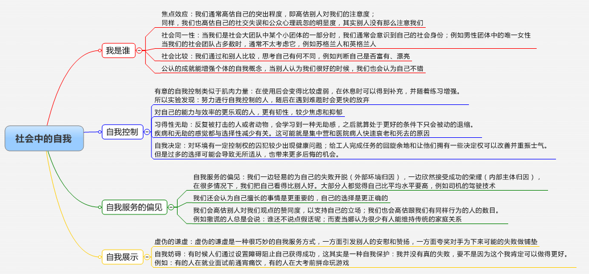
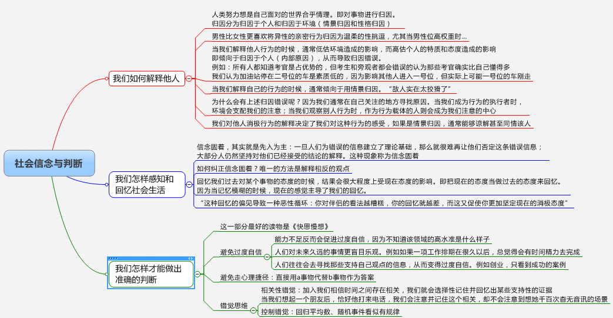
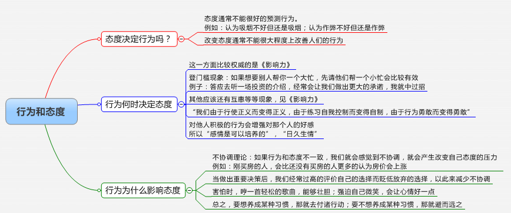
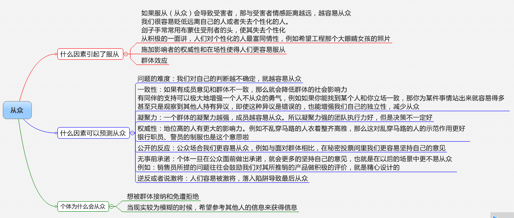
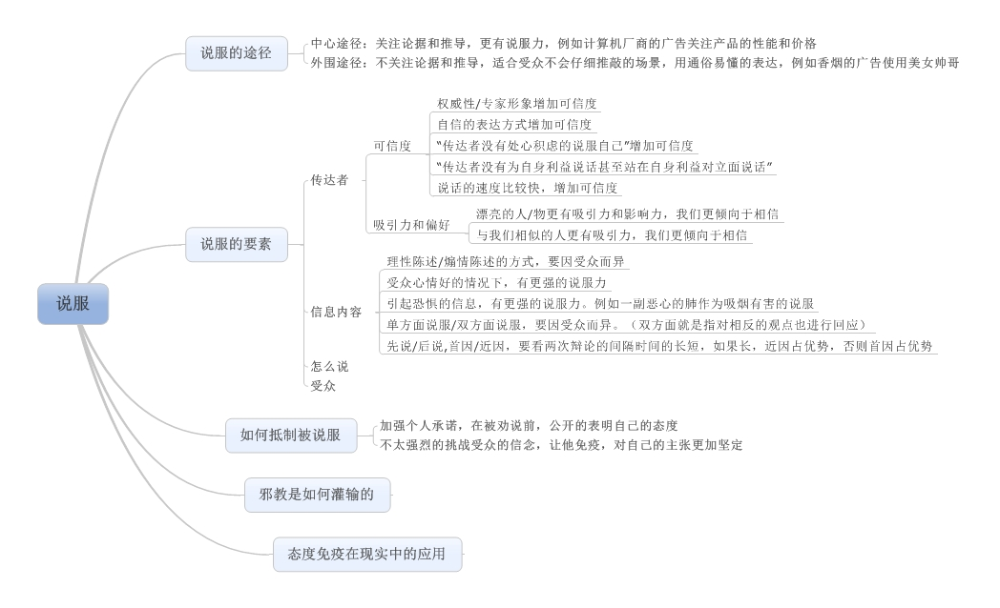
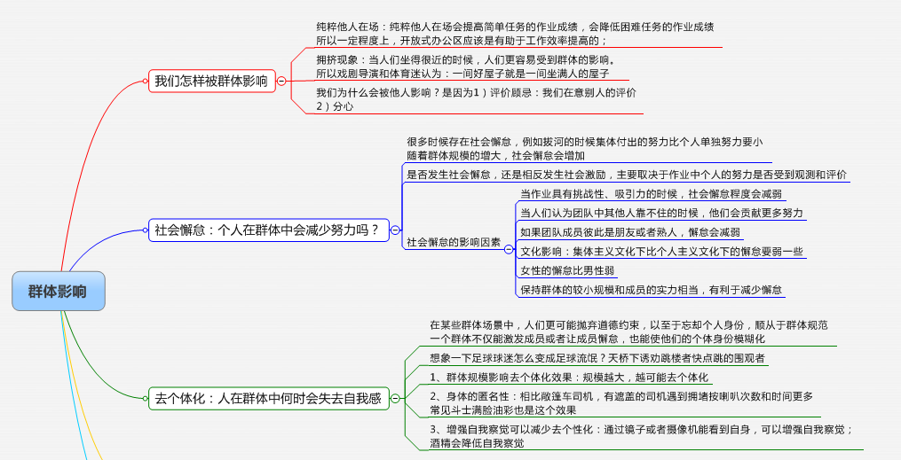
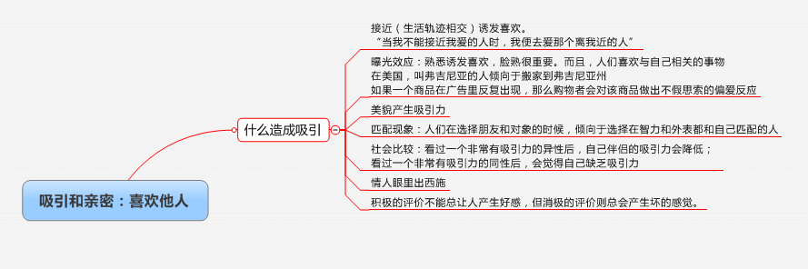
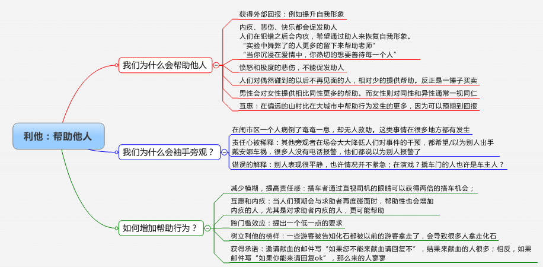
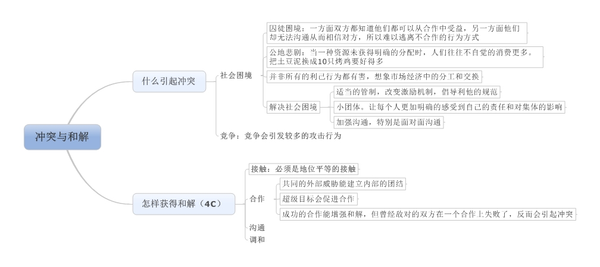
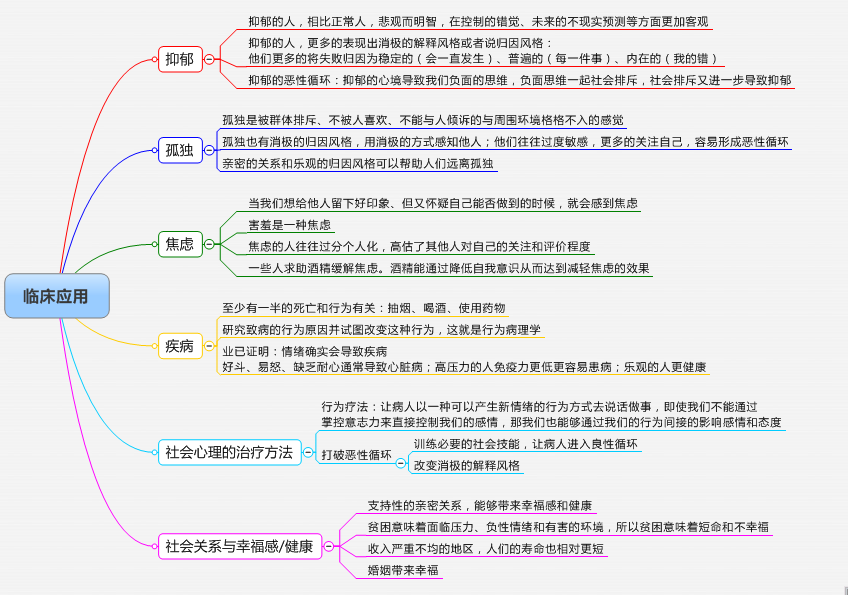

# 社会心理学读书笔记 #

挺有意思的一本书，其中有很多小故事小实验的结论很好玩，推荐大家看看。

例如：邀请公众献血的邮件应该怎么写才能获得更多的血液呢？

1、如果您本周日不能来参加献血，请回复不
2、如果您本周日能来参加献血，请回复ok

下面是一些章节的笔记，相比这些纲要，其实里面的小故事小实验更好玩更有启发性。

还有就是，我昨天被小区物业物理的人用心理学“摆了一道”。他一开始问我：您对于我们给电梯增加通风设备怎么看，我说很好，你们办了件好事。接着他拿出一张表格说：“我们需要动用物业维修基金，麻烦您签字”。我有点抵触，但是考虑到前面我的话，且看到表格里有几个邻居也签了，我也不好意思就签字了。这个小伎俩，书里面也有讲到。

提升幸福感： 

1、  认识到持久的幸福并不来自财富等保健因子（没有它不行，光有它也不行）

2、  控制你的时间，设立目标，将目标分解为每天的任务，感受到进展

3、  表现出幸福。假装幸福，体验快乐的情绪

4、  寻找合适的工作和休闲方式，使得自己的技能得以发挥，进入“心流”。奢侈的开游艇比起园艺、绘画，提供的心流模式要少得多

5、  参加运动

6、  保证足够的睡眠

7、  和关心你的人建立亲密的关系

8、  关注自我之外的事物，帮助他人

9、  记录感恩日记

10、              照顾你的精神自我