神经网络和深度学习的框架非常多，原理大同小异。该笔记除非明确说明，默认是在caffe框架下。

# 1.澄清几个概念

神经网络里，有几个概念：

- **batch\_size**：分训练的batch\_size和测试的batch\_size。训练/测试的时候，不是每次一个样本，也不是每次都把完整训练/测试集都拿来测试/训练，而是一次取batch\_size个样本，来进行一次传播（一次传播=一次前向传播+一次后向传播）。 batch\_size越大，效率越高，但占用内存越大。
- **前向传播**：取出batch\_size个样本，对每个样本输入**X**  , 经过与各层网络的weight、bias值乘加运算，得到**Y**，与样本标注的分类/回归值**YY** 对比获得差值**d** ，batch\_size个样本的差值**d** 加起来求均值，得到损失函数**L**
- **后向传播**：损失函数**L**是**Y**和**YY**的函数，而**Y**是最后一层weight和bias参数的函数，也就是说损失函数是最后一层weight和bias参数的函数，要使得损失函数最小，就求偏导的方式，找到损失函数的梯度，微调weight和bias参数； 同理，函数关系继续往上一层网络的weight和bias传播，可以用梯度下降的方式调整倒数第二层的weight和bias参数，如此反复，最后完成第一层网络的weight和bias参数的微调，这是一次后向传播。即：
  - 假设w1, w2,w3...是第一层的待学习的参数，O1是第一层的输出，O1 = f (w1,w2,w3...)。
  - 同理：O2是第二层的输出，O2 = h (O2)，以此类推：O3 = u (O2)。
  - 假设网络就只有三层，损失函数 L = g(O3, t)，其中 t 是标注的真值
  - 偏导连续的多元函数的梯度，就是对各自变量的偏导构成的向量，所以求L对w1,w2,w3...的偏导。根据链式求导法则有：
  -  ∂L/∂w1 =( ∂L / ∂O3 )* (∂O3 / ∂ O2) * (∂O2 / ∂O1) * (∂O1 / ∂w1) = **g' (O3) . u'(O2) . h'(O1) . f'(w1)**
- **iteration**: 输入batch\_size个训练样本，完成一次前向传播+后向传播，就是一次iteration。准确的说，做iter_size次前向传播后向传播才算一次iteration，只是我们经常把iter_size设置为1或者不设置取默认值1。当batch_size因为内存限制而比较小的时候，梯度下降的方向容易受到单个样本的影响导致道路曲折，这时候，将iter_size设置大一点，就可以在iter_size X batch_size个样本中间累计和平滑梯度/loss值，避免受到单个样本的影响。
- **epoch**： 执行n次iteration，将训练样本恰好全部的训练一次，叫做一次epoch，通常我们一次epoch就做一次测试，所以通常solver.prototxt文件里的test\_interval乘以训练的batch\_size就等于训练集的大小，而test\_iter乘以测试的batch\_size就等于测试集的大小
- **max\_iter**： 通过solver.prototxt文件里的max_iter参数，可以指定最多训练多少个iteration才终止
- **激活函数**: 如果不引入sigmoid这样的激活函数，那么网络中的多个层实际上等同于只有一层，因为最后层的某项输出就等于w1\*x1+w2\*x2+...+w0，各层的参数会发生退化与合并。 同时可以注意到：激活函数的引入，使得向后传播求变得复杂了，而且不同激活函数的导数值对后向传播效率有影响。
- **超参数：** 超参数就是学习率、梯度下降方法、网络结构等等这些定义在caffe的solver.prototxt和train_val.prototxt文件里的参数，为什么叫超参数（hyperparameters）呢？为了区分神经网络里的w和b这些参数，所以新创一个名字。
- **cost函数和loss函数：** loss函数是一个样本计算（分类/回归）的结果和标注之间的“损失”， cost函数是一个batch内batch_size个样本的loss函数的均值。后向传播的时候，是对loss函数求导。 

关于激活函数以及其对后向传播的影响，这里有篇文章写的比较好：

```
https://mp.weixin.qq.com/s?__biz=MzU4MjQ3MDkwNA==&mid=2247483977&idx=1&sn=401b211bf72bc70f733d6ac90f7352cc&chksm=fdb69fdecac116c81aad9e5adae42142d67f50258106f501af07dc651d2c1473c52fad8678c3&scene=21#wechat_redirect
```

摘取其中的几段：


激活函数的要求：

1. 非线性
2. 万能逼近定理
3. 处处可导：满足后向传播时候链式求导的需要
4. 导数绝对值不能太大，也不能太小，避免引起梯度消失和梯度爆炸


# 2.梯度下降法与计算图（computation graph）

## 2.1 梯度的简单试验

以一个线性回归问题为例:

N个实例组成的训练集(x1, x2， y)[N], 训练出一组参数a,b,c，使得输入x1,x2,  计算y'=a*x1 + b*x2 +c， y'与y误差尽量小。

定义损失函数为 J = 1/N * ∑(y-y')^2 ， 求使得损失函数最小的参数a,b,c， 可以使用梯度下降法：

1. 随机选取向量 **w(0)** = (w1, w2, w3)作为初始值
2. 根据梯度公式 **▽J(w)** = ( ∂J/∂w1, ∂J/∂w2, ∂J/∂w2) ，代入当前的(w1, w2, w3)值，即获得当前位置的梯度
3. 沿着梯度下降的方向前进一小步，计算得到新的**w**。即 **w(n+1)** = **w(n)** - step * **▽J(w)**
4. 如此反复，直到收敛。

下面用mathematica代码演示：

先构建一组训练集：

```mathematica
ClearAll["Global`*"];
a = 1;
b = 2;
c = 3;
NUM = 20;
y[x1_, x2_] = a*x1 + b*x2 + c;
x1arr = Table[RandomReal[{-5, 5}], {i, 1, NUM}];
x2arr = Table[RandomReal[{-10, 10}], {i, 1, NUM}];
trainset = Table[0, {i, 1, NUM}];
labels = Table[0, {i, 1, NUM}];
For[i = 1, i <= NUM, i++,
  labels[[i]] = y[x1arr[[i]], x2arr[[i]]] + RandomReal[{-0.1, 0.1}];
  trainset[[i]] = {x1arr[[i]], x2arr[[i]], labels[[i]] }
  
  ];
```

将参数都初始化为1，然后定义损失函数，并求梯度公式、代入参数计算当前的梯度值

```mathematica
w1 = 1;
w2 = 1;
w3 = 1;
stepsz = 0.001;
loss = Sum[(s1*x1arr[[i]] + s2*x2arr[[i]] + s3 - labels[[i]])^2 / 
    NUM, {i, 1, NUM}];
Do[
  g1 = D[loss, s1] /. {s1 -> w1, s2 -> w2, s3 -> w3};
  g2 = D[loss, s2] /. {s1 -> w1, s2 -> w2, s3 -> w3};
  g3 = D[loss, s3] /. {s1 -> w1, s2 -> w2, s3 -> w3};
  
  w1 = w1 - g1*stepsz;
  w2 = w2 - g2*stepsz;
  w3 = w3 - g3*stepsz
  ,
  {k, 1, 2000}];
Print[{w1, w2, w3}];
(*
在 Mathematica 中，/.{} 是一个替换操作符，用于将表达式中的某些部分替换为其他值。
g1 = D[loss, s1] /. {s1 -> w1, s2 -> w2, s3 -> w3} 这个语句的含义如下：

loss 对 s1 求偏导数，得到一个关于 s1、s2、s3 等变量的表达式。
/. {s1 -> w1, s2 -> w2, s3 -> w3}：将上一步得到的表达式中的 s1 替换为 w1，s2 替换为 w2，s3 替换为 w3。
*)
```

得到正确的输出为：

```
{1.01699,2.00054,2.90552}
```

## 2.2 动量的理解

据网上的资料：动量有利于加速收敛，是历史上梯度下降的累计。

下面一段代码演示对函数f = x*x +50 y *y使用梯度下降法求f的最小值。当函数gd的参数为0的时候，没有使用到动量，当参数为非零（小于1的正小数）时候，使用到了动量，同样的迭代次数，收敛效果更好。

```mathematica
ClearAll["Global`*"];
f[x_, y_] := x*x + 50*y*y;
dfx[x_, y_] := 2 x;
dfy[x_, y_] := 100 y;

gd[momen_] := Module[{x, y, lr, points, mx, my},(*花括号里是函数的局部变量*)
   x = 100;
   y = 100;
   lr = 0.016;
   points = {};
   mx = 0;
   my = 0;
   Do[
    mx = mx * momen + dfx[x, y]*lr;
    my = my * momen + dfy[x, y]*lr;
    x = x - mx ;
    y = y - my;
    z = f[x, y];
    AppendTo[points, {x, y, z}];
    ,
    {i, 1 , 400}
   ];
   points (*返回值*)
];
(*下面两个数组的最后10个点的z坐标对比，应该第一个数组的明显小*)
points = gd[0.7];
Print[points[[-10 ;; -1]] ];(*倒数10个点*)

points = gd[0];
Print[points[[-10 ;; -1]]];(*倒数10个点*) 

(* the whole plane in points2 *)
points2 =   Flatten[Table[ {x, y, f[x, y]}, {x, -100, 100}, {y, -100, 100}]];
len = Length[points2];
points2 = ArrayReshape[points2, {len/3, 3}];

ListPointPlot3D[{points2, points}]
```

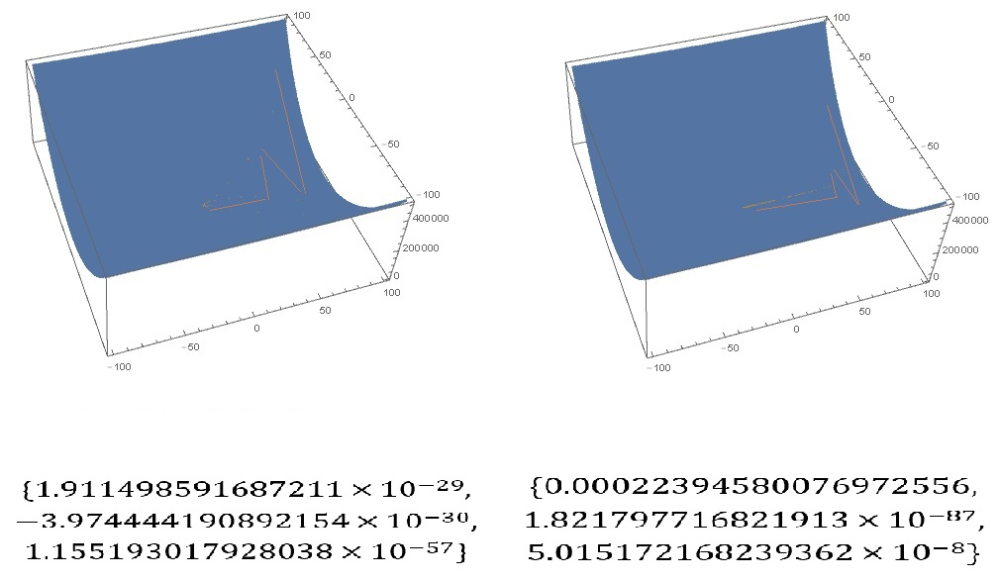

从图片的走势上看，黄点都向(0,0,0)坐标点收敛，但从打印的数值来看，使用动量情况下收敛的效果要好得多。

函数值：10^-57  **vs**  10^ -8

另，关于lr的一些经验：

1. 训练过程中，如果loss值不收敛，那么就逐步改小lr。对于有效的lr，loss值应该每次迭代都减小。
2. lr如果太小，梯度下降将会收敛得很慢

## 2.3 梯度下降的各种变种

除了标准的梯度下降法（SGD），深度学习中还有很多梯度下降的变种， 包括：Adagrad / Rmsprop / AdaDelta / Adam 等。

这些变种各有各的优势，例如下面这个非凸函数的例子，当起始点在（0,0,0)的时候，SGD收敛慢一点，但是拐弯能力更好，而Adagrad收敛快一点，但是方向控制不够好。

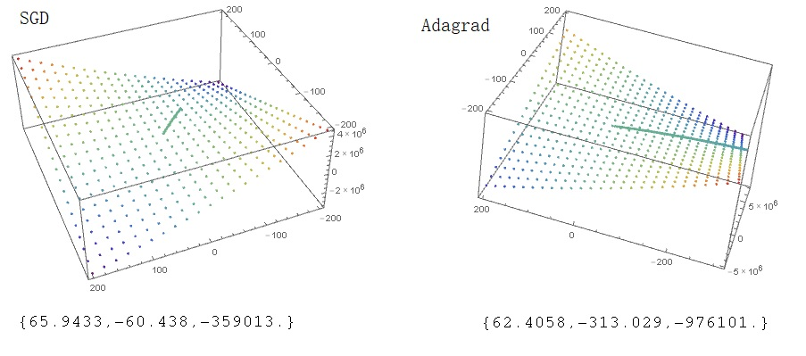

代码如下：

```mathematica
ClearAll["Global`*"];
f[x_, y_] := x*x - 2 x + 100 x*y + 10*y*y + 20 y;
dfx[x_, y_] := 2 x - 2 + 100 y;
dfy[x_, y_] := 100 x + 20 y + 20;

sgd[momen_] := Module[{x, y, lr, points, mx, my},
   x = 0;
   y = 0;
   lr = 0.000016;
   points = {};
   mx = 0;
   my = 0;
   Do[
    mx = mx * momen + dfx[x, y]*lr;
    my = my * momen + dfy[x, y]*lr;
    x = x - mx ;
    y = y - my;
    z = f[x, y];
    AppendTo[points, {x, y, z}];
    ,
    {i, 1 , 500}
    ];
   points
   ];

adagrad := Module[{x, y, lr, points, mx, my},
   x = 0;
   y = 0;
   lr = 1;
   points = {};
   sumx = 0;
   sumy = 0;
   epselon = 0.000001;
   Do[
    sumx = sumx +  dfx[x, y]*dfx[x, y];
    sumy = sumy +  dfy[x, y]*dfy[x, y];
    x = x - lr *  dfx[x, y] /(Sqrt[sumx] + epselon);
    y = y - lr *  dfy[x, y] /(Sqrt[sumy] + epselon);
    z = f[x, y];
    AppendTo[points, {x, y, z}];
    ,
    {i, 1 , 500}
    ];
   points
   ];
points = adagrad;
Print[points[[-10 ;; -1]] ];

(* the whole plane in points2 *)
points2 =   Flatten[Table[ {x, y, f[x, y]}, {x, -200, 200, 20}, {y, -300, 200, 20}]];
len = Length[points2];
points2 = ArrayReshape[points2, {len/3, 3}];

ListPointPlot3D[{points2, points}, PlotRange -> All,  ColorFunction -> "Rainbow"]
```

具体到caffe的实现中，Adam等各种变种都是继承自SGD的子类。caffe训练的日志显示会有点误导，以为改了type参数不能生效：

```
[sgd_solver.cpp:105] Iteration 27900, lr = 3.16e-05
```

实际上这是复用父类的方法导致显示为sgd_solver.cpp文件的代码。

改一下源代码，把实际用到的solver type显示出来：

```
void SGDSolver<Dtype>::ApplyUpdate() {
  Dtype rate = GetLearningRate();
  if (this->param_.display() && this->iter_ % this->param_.display() == 0) {
    LOG_IF(INFO, Caffe::root_solver()) << "Iteration " << this->iter_
        << ", lr = " << rate<<", solver type:"<<type();
  }
  //...
```

```
[sgd_solver.cpp:105] Iteration 27900, lr = 3.16e-05, solver type:Adam
```

## 2.4 computation graph

计算图就是指在前向传播和后向传播过程中的经由的网络拓扑。前向传播比较好理解，后向传播过程是怎样的呢？

这里引用吴恩达老师 [《神经网络和深度学习》](https://www.coursera.org/learn/neural-networks-deep-learning) 课程中的一个例子：

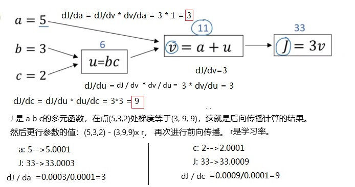

每一层的参数都记录最终的损失函数对自己的导数值，沿着图中的路径反向传播，每向前一步（往后一层），都乘以该层相应的导数值。就是链式求导的过程。

还有一个更直观的做法：将需要对其求导的参数例如a引入一个很小的变化值，其他参数和变量值都保持不变，进行一次前向传播，观察损失函数较上次的前向传播的结果变化多少，两个变化相除就是导数值。

这种方案理论上ok，但实际不可能如此操作，因为计算效率太低，一个深度神经网络多达几百万个几十亿的参数，每一个求导都来一次前向传播...

如果要更实际一点的例子，以逻辑斯蒂回归的损失函数求导为例：

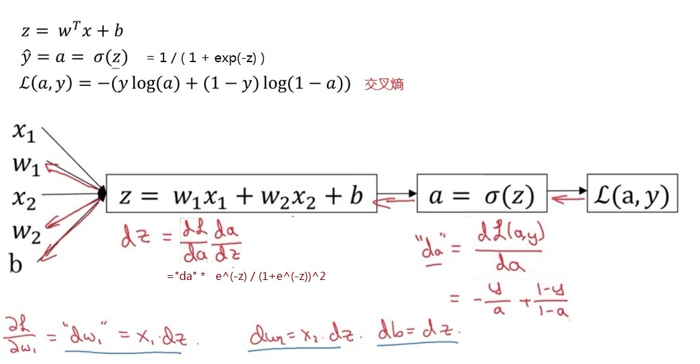

下面代码验证逻辑斯蒂回归的损失函数是w的凸函数（碗形的），并演示前向传播和后向传播训练出模型参数：

```mathematica
showConvex[] := Module[{i, points, c, dc},
   
   points = {};
   points2 = {};
   Do[
    initParam[];
    
    forward[];
    c = cost[a1[[1]], y[[1]]];
    
    backward[0];
    points = Join[points, {{w1[[1]][[1]], w1[[1]][[2]], c}}];
    points2 = 
     Join[points2, {{w1[[1]][[1]], w1[[1]][[2]], dw1[[1]][[1]]}}];
    ,
    {i, 1, 10000}
    ];
   
   Print[ListPlot3D[points]];
   Print[ListPlot3D[points2]];
   
   ];
fetchBatch[];
showConvex[];
```

上面的代码，

1. 先产生一个batch的样本数据（1000个样本，每个样本一列，共1000列，形成了矩阵a0，每列是x1,x2两个feature）。

2. 然后循环1万次：

   1. 随机初始化w和b
   2. 进行一次前向传播，计算得到a1，a1是1X1000的矩阵，每个样本计算得到一个分类
   3. 计算a1和标注的y之间的cost
   4. 这样的一组{w，cost}就形成了一个三维空间的点
   5. 进行一次后向传播，计算损失函数对w1的偏导数，形成一个点，放到points2列表中

3. 把点在空间中画出来，验证是否是凸函数、验证偏导数的正负与碗形状是否一致


如下：

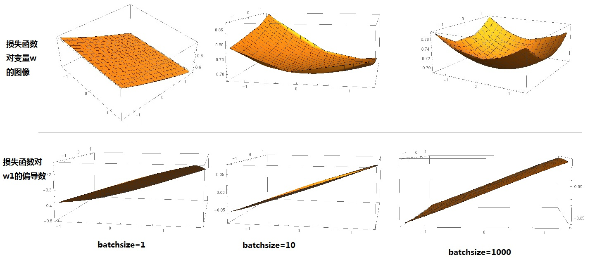

[详细的代码在这里](code/dnn_ml/lr_convex.md)

小结：

1. 如果batch size比较小，凸函数的形状会不明显。在训练过程中，设置较大的合适的batch size，可以避免单个样本“误导”梯度下降的方向，相当于多个样本一起来决定一个正确的方向。
2. 上面的损失函数，最小也是0.7左右，说明不收敛。训练数据是两个同心圆环上的点的坐标和分类，经其他成熟工具验证lr对这个模型确实不收敛，换一个模型的话损失函数可以降到0.
3. 用后向传播求得的偏导，与直接用求导公式求得的偏导是一致的。可以见详细代码中的showConvex2[]。详细代码中的train[]这个函数可以训练出最终模型参数。

深度神经网络会比这个更复杂，原因之一是：从损失函数到某个参数，求导的传播路径不只一条，有多条（千百条），需要做好图的路径管理。而这些路径求得的导数值，需要加起来作为该参数的最终导数值。

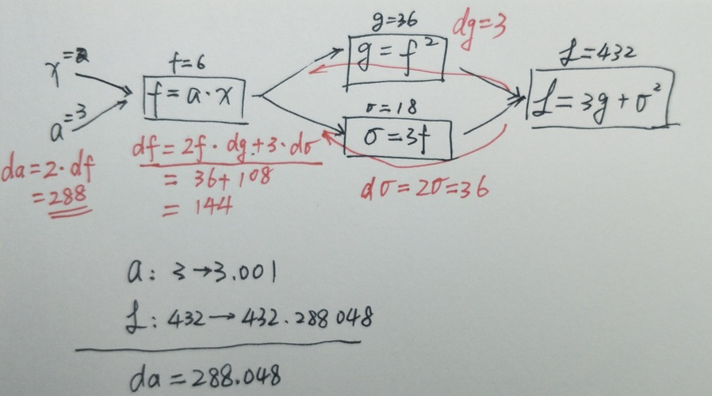

上面这个简单的例子，从L到f就会有两条路径，两条路径的导数要加起来。

后来看了吴恩达老师的课程，发现向量化后，前向传播和后向传播都会比较简单，不需要做 “复杂的图的路径管理”。

下面是全连接层网络、且输出层使用sigmoid函数和交叉熵做为损失函数的情况下的向量化的传播公式，有两个小地方我改了一下，我认为老师应该是笔误了：

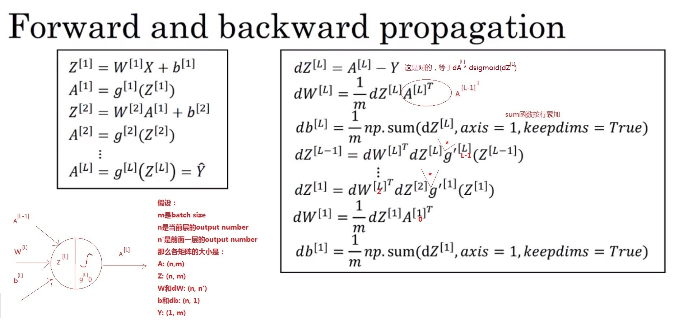

根据上面的公式，我用mathematica尝试写了个[带有2个隐含层的全连接深度神经网络demo](code/dnn_ml/dnn_demo.md)，训练一个分类模型。

用mathematica本身带的逻辑斯蒂回归是可以对这些训练数据训练处一个模型的，所以数据和模型设想本身没有问题。

## 2.5 梯度理解的反复练习

### 2.5.1 全连接层为例，理解后向传播的梯度计算


2.4上面这个图过上几年再去看，我看不懂了，然后我自己尝试推导了一下全连接层的梯度计算（暂未考虑激活函数）：


辅助代码以验证我的理解：

```mathematica
ClearAll["Global`*"];

initParam[] := Module[{w1, w2, w3, input, b1},
   (*随机生成参数和input*)
   w1 = Array[RandomReal[{-1.414, 1.414}] &, {2, 3}];
   b1 = Array[RandomReal[{-1.414, 1.414}] &, {2, 1}];
   w2 = Array[RandomReal[{-1.414, 1.414}] &, {4, 2}];
   w3 = Array[RandomReal[{-1.414, 1.414}] &, {1, 4}];
   input = {{1}, {2}, {3}};
   {w1, w2, w3, input, b1}
   ];

forward[] := Module[{},
   (*一次前向传播*)
   w3.w2.(w1.input + b1) 
   ];

{w1, w2, w3, input, b1} = initParam[];

(*验证最终输出对各层输入的梯度 = 各层w参数的矩阵乘*)
out1 = forward[];
inputDiff = Transpose[{{0.01, 0.02, 0.03}}]; (*输入的微小的变化*)

input = input +  inputDiff;
out2 = forward[];
outDiff = out2 - out1; (*输入变化前后，最终结果的变化值*)
Print["out diff:", outDiff];
Print["gradient * inputDiff:", w3.w2.w1.inputDiff]; (*直接用梯度乘以输入变化量，应该等于结果的变化值*)
Print["===================================="];
(*验证最终输出对各层参数w的梯度 = 对该层输出的梯度相关分量乘以该层输入的相关分量*)
dB = w3.w2;

dw12 = dB[[1, 1]] * input[[2, 1]]; (*w12的梯度*)

paramDiff = 0.001;(*参数的微小的变化*)
w1[[1, 2]] = w1[[1, 2]] + paramDiff;
out3 = forward[];
outDiff = out3 - out2;(*参数变化前后，最终结果的变化值*)
Print["out diff:", outDiff];
Print["dw12*paramDiff:", dw12*paramDiff];(*直接用梯度乘以参数变化量，应该等于结果的变化值*)

Print["===================================="];
(*验证最终输出对各层参数b的梯度 = 对该层输出的梯度*)
db1 = (w3.w2)[[1, 1]];(*b1的梯度*)
paramDiff = 0.001;(*参数的微小的变化*)
b1[[1, 1]] = b1[[1, 1]] + paramDiff;
out4 = forward[];
outDiff = out4 - out3;(*参数变化前后，最终结果的变化值*)
Print["out diff:", outDiff];
Print["db1*paramDiff:", db1*paramDiff];(*直接用梯度乘以参数变化量，应该等于结果的变化值*)

```

用pytorch也是可以验证的：

```python
import torch.nn as nn
import torch.jit

# 定义输入

input = torch.randn(1, 3,  requires_grad=True) #type:torch.Tensor
fc1 = nn.Linear(3, 2);
fc2 = nn.Linear(2, 4);
fc3 = nn.Linear(4, 1);

# 前向传播
B = fc1(input)#type:torch.Tensor
C = fc2(B)#type:torch.Tensor
D = fc3(C)
loss = D.sum()

B.retain_grad()
C.retain_grad()
D.retain_grad()

loss.backward()

print("verify the answer to first questions:")
# B层的梯度，就等于w3.w2
print(B.grad)
print(torch.mm(fc3.weight, fc2.weight)) # w3.w2

# A层的梯度，就等于w3.w2.w1
print(input.grad)
print(torch.mm(torch.mm(fc3.weight, fc2.weight), fc1.weight)) # w3.w2


print("\nverify the answer to second questions:")
print(fc1.weight.grad[1,2])
print(B.grad[0,1]*input[0, 2]) #下标0是batchsz中的第一个样本


```


再加上激活函数：

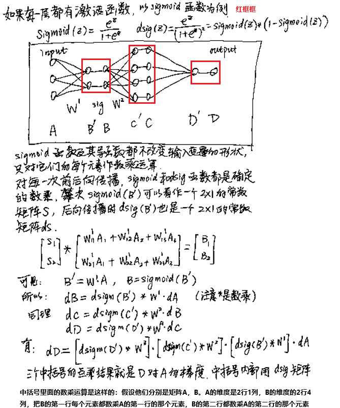

辅助以代码验证，执行结果输出的变化数据相同：

```mathematica
ClearAll["Global`*"];
BbeforeSig = {};
CbeforeSig = {};
DbeforeSig = {};
input = {};
w1 = {};
w2 = {};
w3 = {};
b1 = {};

initParam[] := Module[{},
   (*随机生成参数和input*)
   w1 = Array[RandomReal[{-1.414, 1.414}] &, {2, 3}];
   b1 = Array[RandomReal[{-1.414, 1.414}] &, {2, 1}];
   w2 = Array[RandomReal[{-1.414, 1.414}] &, {4, 2}];
   w3 = Array[RandomReal[{-1.414, 1.414}] &, {1, 4}];
   input = {{1}, {2}, {3}};
   
   ];

sigmoid[z_] := Module[{ret},
   ret = Table[1/(1 + Exp[-z[[i]]]), {i, 1, Length[z]}];
   Return[ret];
   ];

(*sigmoid函数的输出对输入z的导数 由高数的基础知识求导即可知道，很巧，导数=sigmoid x (1-sigmoid) \
输入输出都是 1行m列的矩阵*)
dsigmoid[z_] := Module[{f},
   f = sigmoid[z];
   f*(Array[1 &, Dimensions[z]] - f)
   ];

forward[] := Module[{BB, CC, DD},
   (*一次前向传播*)
   BbeforeSig = (w1.input + b1) ;
   BB = sigmoid[BbeforeSig];
   
   CbeforeSig = w2.BB;
   CC = sigmoid[CbeforeSig];
   
   DbeforeSig = w3.CC;
   DD = sigmoid[DbeforeSig];
   
   Return[DD];
   
   ];

gradientOfA[] := Module[{w11, w22, w33, columns},
  (*图中第一个中括号*)
   w11 = dsigmoid[BbeforeSig];
   columns = Length[w1[[1]]];
   w11 = KroneckerProduct[w11, ConstantArray[1, columns]];
   w11 = w11*w1;
   
    (*图中第二个中括号*)
   w22 = dsigmoid[CbeforeSig];
   columns = Length[w2[[1]]];
   w22 = KroneckerProduct[w22, ConstantArray[1, columns]];
   w22 = w22*w2;
   
    (*图中第三个中括号*)
   w33 = dsigmoid[DbeforeSig];
   columns = Length[w3[[1]]];
   w33 = KroneckerProduct[w33, ConstantArray[1, columns]];
   w33 = w33*w3;
   
   Return[w33.w22.w11];
   
   ];

initParam[];
out1 = forward[];

inputDiff = Transpose[{{0.001, 0.002, 0.003}}];
input = input +  inputDiff;

out2 = forward[];
outDiff = out2 - out1;
(*下面两者的值应该相等*)
Print["out diff:", outDiff];
Print["gradient * inputDiff:", gradientOfA[].inputDiff];
```

### 2.5.2 卷积层的梯度计算

我的理解：

pytorch中假设在第1层有一个 尺寸为5X5的单通道的二位卷积核，核的中间参数 kernel[2,2] 的梯度怎么计算？  假设在前向传播过程中 kernel[2,2]与 该层输入值的若干像素点进行了乘，这些像素点分别为 p1, p2, p3...p10，与每个像素点乘积会参与加和后得到该层输出的某些点， 假设得到 o1, o2,o3...o10，

那么kernel[2，2]这个参数的梯度就等于 o1,o2,o3...o10的梯度（在前向传播到第一层的时候还不知道实际值）与p1,p2,p3...p10像素值的成绩的和。

即 gradient of kernel[2,2] = o1的梯度 * p1像素值 +o2的梯度 * p3像素值 +...+o10的梯度 * p10像素值

当反向传播的时候，o1,o2...o10的梯度会逐步已知，所以kernel[2,2]的梯度也能算出来。


AI的详细解释：

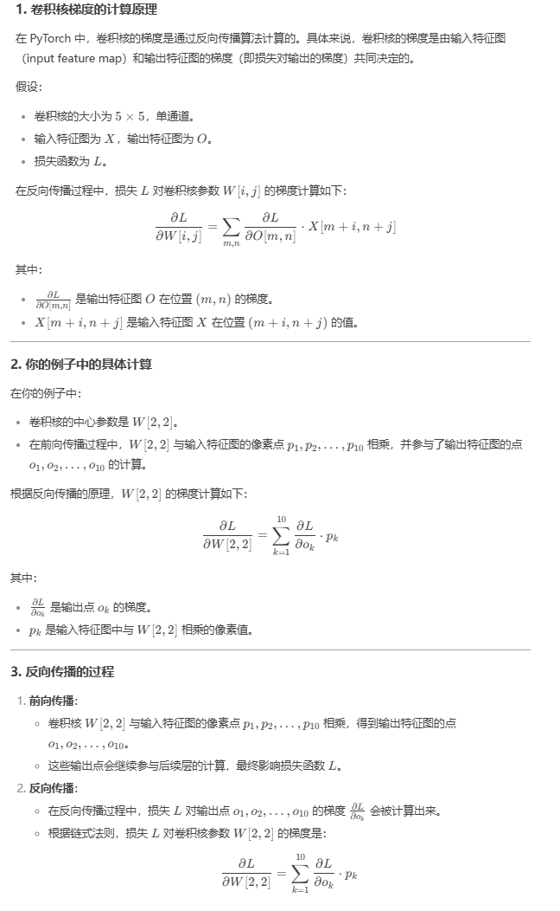

代码验证：

```python
import torch.nn as nn
import torch.jit

# 定义输入和卷积核
input = torch.randn(1, 1, 7, 7, requires_grad=True)  # 单通道输入，尺寸为 7x7，batchsz和通道数为1
conv = nn.Conv2d(1, 1, kernel_size=5, stride=1, padding=0, bias=False)  # 5x5 卷积核，输入通道和输出通道数都为1

# 前向传播
output = conv(input)

# 假设损失函数是输出的总和
loss = output.sum()

# 反向传播
loss.backward()

# 查看卷积核的梯度
#input中左上角3x3的区域，刚好是与conv[0,0]这个参数进行计算的input，
# output的梯度为1（因为就是损失函数本身）.
print('the two numbers are equal as expected:')
print(input[:, :, 0:3, 0:3].sum().item() )
print(conv.weight.grad[0,0, 0, 0].item())
print(input)
print(conv.weight.grad)
```


### 2.5.3 亚导数

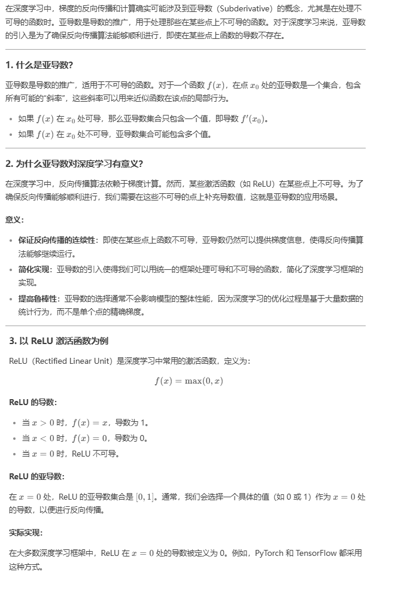

### 2.5.4 线性回归 

手搓线性回归的代码：

```python
import random
import torch.nn as nn
import torch.jit

true_w = [[1.3], [2.9]]
true_b = 0.7
epoch = 100
lr = 0.1

sample_num=10

def generate_samples():
    x = torch.randn(sample_num,2)
    y = torch.mm(x, torch.Tensor(true_w))
    y = y + ( true_b + random.random() / 1000.0)
    return x, y

x, y = generate_samples()

w = torch.randn(2, 1, requires_grad=True)
b = torch.randn(1, 1, requires_grad=True)

for i in range(epoch):
    diff =  y - (torch.mm(x, w) + b) #  shape is : sample_num x 1
    loss = torch.mm( diff.T, diff).sum() / sample_num
    print("loss=", loss)
    loss.backward()
    
    with torch.no_grad(): #下面的代码不需要pytorch追踪计算图、自动更新记录梯度
        w.data = w.data - lr * w.grad  #这里写成 w = w-lr*w.grad就会有问题，会生成新的w变量，里面没有梯度信息，然后报错
        b.data = b.data - lr * b.grad
        w.grad.zero_()
        b.grad.zero_()
        
print("w:", w, " b:", b)
```

### 2.5.5 交叉熵损失函数对输入的梯度


代码验证如下：

```python
import math
import random
import torch.nn as nn
import torch.jit

BATCHSZ=1
LEN = 3

#按照我自己的理解求解梯度
def my_cross_entropy_d(v:torch.Tensor, target:torch.Tensor):
    result=[]
    for sample_id in range(len(v)):
        tmp = v[sample_id]
        c = target[sample_id]

        total = 0;
        for i in range(len(tmp)):
            total += math.exp(tmp[i].item())

        grad = []
        for i in range(len(tmp)):
            d = math.exp(tmp[i].item()) / total
            if i == c:
               d = d - 1
            grad.append(d)
        result.append(grad)
    return result


yy = torch.randn(1, LEN, requires_grad=True) # batchsz为1，类的个数为LEN,yy是未经softmax处理的预测结果
y = torch.tensor([1], dtype=torch.long) #样本的标注，该样本应该分类为1

loss = nn.functional.cross_entropy(yy, y).sum() #交叉熵本身会对yy计算softmax
loss.backward()

#下面的两次print输出的值应该是相等的
print(yy.grad)
yy.detach()

with torch.no_grad():
    grad = my_cross_entropy_d(yy,y)

print(grad)
```


# 3.各种layer的理解

## 3.1卷积层

### 卷积的在视觉上的意义

根据数字信号处理学科的知识，卷积其实是一个滤波器，过滤出信号中的某个特征。在DNN中，一个卷积核可以识别图像中的一种特征，例如识别出一个拐角。

假设我们要识别的图像特征和卷积核如下：

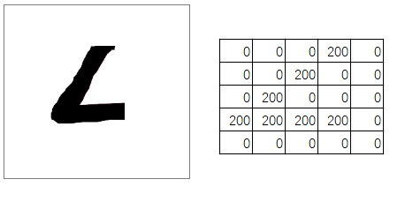

上面的卷积核在输入图像上滑动，每个位置都计算卷积值。当移动到图像的拐角线条区域的时候，卷积得到一个很大的值：


当移动到其他位置的时候，卷积得到的值比较小：


严格意义上来说，计算卷积的时候，卷积核还需要做左右和上下翻转，所以上面的例子只是示意。

在一副大图片里搜索一个局部小图片（例如在蒙娜丽莎图片里搜索/匹配蒙娜丽莎的眼睛），也可以用卷积的方法。

一个卷积层通常会配置有几十到几百个卷积核，提出几十上百种特征。

下面这段mathematica代码演示拐角的提取：

```mathematica
ClearAll["Global`*"];
img = Import["e:\\boat.bmp"];

img = ColorConvert[img, "Grayscale"];

imgdata = ImageData[img, "Byte"];
Print["原图：", img];
kernel = {{0, 0, 0, 0, 0, 1, 0}, 
          {0, 0, 0, 0, 1, 0, 0}, 
          {0, 0, 0, 1, 0, 0, 0}, 
          {0, 0, 1, 0, 0, 0, 0},
          {0, 1, 0, 0, 0, 0, 0},
          {1, 1, 1, 1, 1, 1, 1}, 
          {0, 0, 0, 0, 0, 0, 0}};
(*
kimg = Import["e:\\kernel.bmp"];
kimg = ColorConvert[kimg, "Grayscale"];
kernel = ImageData[kimg, "Byte"];
*)
edgesz = Floor[Length[kernel] / 2];
Print[edgesz];
rownum = Length[imgdata];
colnum = Length[imgdata[[1]]];
Print[rownum, ",", colnum];

result = Table[   Table[0, {j, 1, colnum - edgesz*2}], 
   	{i, 1, rownum - edgesz*2}];
Print[Length[result]];
Print[Length[result[[1]]]];
max = 0;
maxi = 1;
maxj = 1;
For[i = 1 + edgesz, i <= (rownum - edgesz), i++,
  	For[j = 1 + edgesz, j <= (colnum - edgesz), j++,
    	sum = 0;
    	For[k = -edgesz, k <= edgesz, k++,
     	For[m = -edgesz, m <= edgesz, m++,
       	 sum = 
         sum + imgdata[[i + k]][[j + m]] * 
           kernel[[1 + edgesz + k]][[1 + edgesz + m]];
       
       ];
     ];
    result[[i - edgesz]][[j - edgesz]] = sum;
    If[sum > max, max = sum; maxi = i; maxj = j, null];
    ];
  ];
Print[maxi, ",", maxj, ",", max];
result2 = result;
For[i = 1, i <= (rownum - edgesz*2), i++,
  	For[j = 1, j <= (colnum - edgesz*2), j++,
    	result[[i]][[j]] = Floor[result[[i]][[j]]/max * 255];
    	If[result2[[i]][[j]] != max, result2[[i]][[j]] = 0, null];
    ];
  ];

Print["卷积后的图像:", Image[result]];
Print[Image[result2]];
```

输出结果如下：

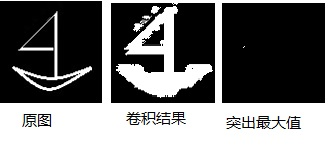

### 多通道数据的卷积

实际的DNN中的卷积层，输入和输出都是多通道的，例如下面这个网络中的一个卷积层，输入数据是96个通道，输出是256通道，那么怎么理解？

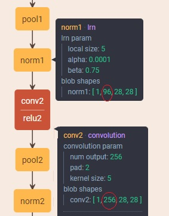

额外提一下：上面这个图是用一个web界面工具生成的，非常方便。url是：

```
http://ethereon.github.io/netscope/#/editor
```

我们在学习数字信号处理的时候知道：音频信号的卷积，是一维的，灰度图的卷积，是二维的。这里多通道数据的卷积，是三维的！也就是说上图中的卷积层的卷积核是一个三维的卷积核，尺寸是5 X 5 X 96，输入数据是28 X 28 X 96，每次卷积运算，是对立方体内各元素计算点积，得到一个浮点标量的结果。这个卷积层有256个这样的三维卷积核。所以该卷积层需要学习到的参数有5 X 5 X 96 X 256。

需要注意区分各层参数的尺寸与输出blob尺寸是两个不同的东东，以上面的卷积层conv2为例：

1. 该层的参数尺寸，就是256个卷积核的参数值，每个卷积核是一个长方体的魔方，有 5 X 5 X 96 个参数，这样的魔方有256个，所以该层参数的尺寸是 5 X 5 X 96 X256
2. 数据经过该层运算后输出，存放在BLOB里，维度依次是NCHW，即batchsz、通道个数、图片高度、图片宽度。上面例子中，blob尺寸是28见方的矩阵，有256层（通道数），每层对应一个卷积核的输出。所以是28 X 28 X 256。这个尺寸跟上一层的输出也就是该层的输入数据的尺寸有关，输入越大，得到的输出通常也越大。
3. fine tune的时候，有时候遇到参数尺寸不匹配而报错，通常是参数尺寸不匹配。


### 卷积层的计算代价

卷积层的计算代价，正比于卷积核的三维大小。实际操作中（例如Inception Network）会使用1X1XC的卷积核将channel降下来，类似Pooling层可以将H、W维度的尺寸降下来：

如下图左边，如果不引入中间的1X1X192的卷积层，那么一次前向传播的计算代价是120M次乘加（5X5X192 X 28X28X32）。

而引入中间的卷积层（在这种情形下也叫瓶颈层）后，计算代价降低到12.4M次乘加。

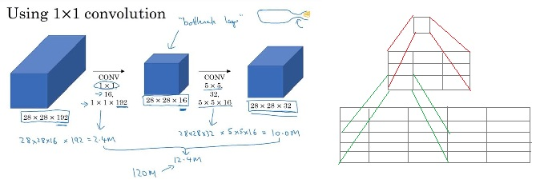

上图的右侧示意：两个3X3的卷积核串联，其感受野和一个5X5的卷积核是一样的。所以可以将5X5的卷积层拆解为两个3X3的卷积层的串联，效果等价，但参数量和计算代价都减少28%（5X5 vs 3X3X2）。

类似的，还有把nXn的卷积拆解为1Xn和nX1的卷积串联。

## 3.2全连接层

全连接层中的每一个神经元节点，都和上一层的每个数据有一个连接/参数。

全连接层相比卷积层，参数会特别多。例如下面fc6这个连接层，该层有512个节点，每个节点和输入的384X7X7个数据中的每一个数据都有一个连接和参数，所以总共有7 X 7 X 384 X 512=9.6M个参数，还没有算512个偏置参数b。一次前向传播的时候计算代价：512X (7X7X384)=9.6M次乘加。


也可以把全连接层当做卷积层来理解：fc6是一个卷积层，有512个卷积核，每个卷积核是大小为 7 X 7 X 384的3D卷积核。每个卷积核与上一层输出数据做卷积后，产生一个标量数据输出。

## 3.3 Pooling层和SPP层

Pooling层可以简单理解为下采样层，通常的取值方法有最大值、平均值、随机值。

SPP层可以理解为特殊的Pooling层，全称是Spatial Pyramid Pooling Layer。顾名思义，跟金字塔一样，将输入池化为逐渐变小的输出，多个输出摞在一起像个金字塔。

如下图所示，SPP层等价于并行3个Pooling层，将输入池化为4X4、2X2、1X1大小，然后一起输出到下一层。

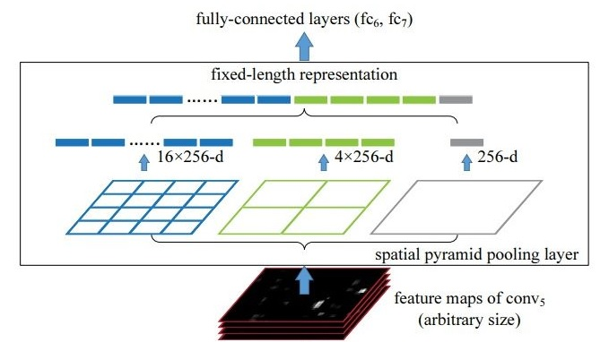

## 3.4 数据（输入）层

数据层解决的是将原始训练数据输入到网络里，有多种数据层的实现：

1. Image Data：支持读取图片文件

2. Database: 支持从lmdb/leveldb中读取数据

3. HDF5Input：支持从HDF5中读取。HDF5是一种跨平台的通用数据格式，注意区分hadoop的分布式文件系统HDFS，他们之间没有任何关系。

4. Input: 通常用于训练好的模型部署的时候输入数据，出现在deploy.prototxt中

   ```
   layer {
    name: "input"
     type: "Input"
     top: "data"
     input_param {
       shape { dim: 1 dim: 1 dim: 200 dim: 200 }
     }
   # or 
   input: "data"
   input_dim: 1 
   input_dim: 1 #channel
   input_dim: 200 #row
   input_dim: 200 #col
   ```

   值得注意的是，InputLayer输出的top blob的维度不是一定为4维的，例如在一次对结构化数据进行分类的实际应用中，InputLayer这样配置的：

   ```
   layer {
     name: "input"
     type: "Input"
     top: "data"
     top: "label"
     input_param {
       shape { dim: 1 dim: 4098  }
       shape { dim: 1 dim: 1 }
     }
   }
   ```

   

5. 其他WindowData/MemoryData什么的我没有用过。

详细可以见：

[caffe的关于layer的说明文档](http://caffe.berkeleyvision.org/tutorial/layers.html)

## 3.5 激活函数层

第6小节已经有提到了。

## 3.6 SOFTMAX层

max函数是返回多个值中最大的那个，soft max顾名思义，比较柔和比较柔性，根据多个值的大小，一定概率的返回某个值，值越大，返回的概率越大。且这些值返回的概率和等于1。适合用于分类问题中最后一层。softmax层通常出现在deploy.prototxt文件里，与之对应的，在train_val.prototxt文件里出现的是softmax loss层。

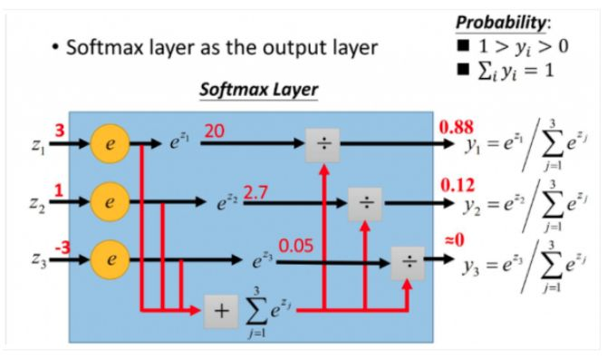

## 3.7  Softmax with Loss 层

### 先说交叉熵

我们知道，熵，也叫信息熵，就是编码一个随机事件的最短的平均bit数。H(p)=sum( P[i] * log2(1/P[i]))，其中 P[i]是该随机事件的各种状态的概率。 当我们对该事件的概率分布足够掌握，那么计算得到的熵是最优的（最短的）平均bit

数。

但是，如果我们对一个随机事件的概率分布掌握不够，估计为 Q [i]，而实际发生是P[i]，那么由此计算得到的熵叫做交叉熵。估计得越不准，交叉熵越大，越偏离信息熵。**这个就可以用来作为softmax_loss层的损失函数。**

交叉熵与信息熵之间的差值，叫做相对熵。

一个小例子：

如果随机事件有两个状态，一个状态A的概率为y，那么另外一个状态B的概率就为1-y。

我们对该随机事件进行估计，认为状态A的概率为x，状态B的概率为1-x。

所以交叉熵为 

```
y*Log[1/x] + (1 - y)*Log[1/(1 - x)]
```

我们看看这个函数的情况：

```
h[x_, y_] = y*Log[1/x] + (1 - y)*Log[1/(1 - x)];
Print[Plot3D[h[x, y], {x, 0.00001, 0.99999}, {y, 0.00001, 0.99999}]];
Print["when the possibility of state A is actually 0.2:"];
Print[Plot[h[x, 0.2], {x, 0.00001, 0.99999}]];
fs = Table[h[x, k], {k, 0.2, 0.8, 0.2}]
Print[Plot[fs, {x, 0.00001, 0.99999}]];
```


上面左图是交叉熵随 x，y变化的情况。

右图是当实际的概率为y=0.2的时候，交叉熵与估计概率x的关系，可见当x也等于0.2，即估计准确的时候，交叉熵才最小。

左下图中的曲线分别是当实际概率y为0.2，0.4，0.6，0.8的时候交叉熵随x变化的情况。

softmax loss层就是使用交叉熵作为损失函数的。

再举个例子：

假设一个5分类问题，一个样本的标签y=[0,0,0,1,0]，也就是说样本的真实标签是4。

假设模型预测的结果概率（softmax的输出）p=[0.1,0.15,0.05,0.6,0.1]，可以看出这个预测是对的，那么对应的损失L=-log(0.6)，也就是当这个样本经过这样的网络参数产生这样的预测p时，它的损失是-log(0.6)。

假设模型预测输出p=[0.15,0.2,0.4,0.1,0.15]，因为真实标签是4，而模型判断这个样本是4的概率只有0.1（远不如其他概率高，那么模型预测该样本属于类别3），对应损失L=-log(0.1)。

因为-log(0.6)  < -log(0.1)，所以预测错比预测对的损失要大，预测错得离谱比预测错得轻微的损失要大。

softmax层和softmax loss层似乎是对应出现的，一个出现在train_val.prototxt里，一个出现在对应的deploy.prototxt里。


举一个例子：

```
layer {
  name: "loss"
  type: "SoftmaxWithLoss"
  bottom: "score"
  bottom: "label"
  top: "loss"
  loss_param {
    ignore_label: 255
    #normalize: false
  }
}
```


## 3.8 SoftmaxCrossEntropyLoss层

SoftmaxCrossEntropyLoss层，要求两个bottom BLOB尺寸要一致，例如图片分割中，假设有313个分割语义，那么label和网络预测输出的BLOB都应该是[N, 313, H, W]大小。

而SoftmaxWithLoss，网络预测输出的BLOB尺寸是[N, 313, H, W]的话，label的尺寸是[N, 1, H, W]， 直接给出分类的编号。该层代码实现会检查预测输出的313个通道中最大值，其下标就是最终的分类，与label中的唯一通道中的数值比较。

Accuracy层，类似SoftmaxWithLoss，网络预测输出的BLOB尺寸是[N, 313, H, W]的话，label的尺寸是[N, 1, H, W]， 直接给出分类的编号。

这样更方便一些，例如即使有2000个类，datum结构里的label也只是一个整数，记录分类下标即可。

举一个例子：

```
layer {
  name: "loss8_313"
  type: "SoftmaxCrossEntropyLoss"
  bottom: "conv8_313_boost"
  bottom: "gt_ab_313"
  top: 'loss8_313'
  loss_weight: 1.0
}
```

还有个SigmoidCrossEntropyLoss层，这个层也是使用交叉熵作为损失函数，我理解它应对的是二分类问题，Softmax开头的是多分类问题。

## 3.9  多项逻辑斯蒂损失层

这一种损失函数层，也是使用的交叉熵作为损失函数。实际上，softmax with loss可以认为是softmax层后面跟一个多项逻辑斯蒂损失层。

二项逻辑斯蒂回归，用于二分类的情况，比较常见和熟悉；多项逻辑斯蒂回归则用于多分类问题。如下：


## 3.10 方差之和/欧式距离损失层

Sum-of-Squares / Euclidean Loss Layer

还算比较好理解，预测值和标注值之间的差的平方作为损失函数。我理解应该比较适合回归问题。

举个例子：

```
layer {
  name: "loss"
  type: "EuclideanLoss"
  bottom: "conv9_2"
  bottom: "label_uv"
  top: "loss"
}
```


## 3.11 slice层和concat层

concat层用于拼接多个bottom层的数据，摞在一起后输出，例如下面的cancat层：

```
layer {
  name: "data_all"
  type: "Concat"
  bottom: "data_classifier"
  bottom: "data_boundingbox"
  bottom: "data_facialpoints"
  top: "data_all"
  concat_param {
    axis: 1
    }
  }
```

假设data_classifier的blob尺寸是[N, 28,  128, 128]，data_boundingbox的blob尺寸是[N, 12,  128, 128]， data_facialpoints的blob尺寸是[N, 8,  128, 128]， 那么经过上面的concat层拼接后，输出的data_all的blob尺寸是：[N, 48,  128, 128]， 即[N, (28+12+8),  128, 128]。

axis指定在哪个维度进行拼接，0是第一个维度。默认为1，即在图片的通道维度进行拼接。要求除此维度外，其他三个维度的尺寸必须一致。

slice层刚好反过来，在某个指定的维度进行切割，例如下面这个slice层：

```
layer {
  name: "data_each"
  type: "Slice"
  bottom: "data_all"
  top: "data_classifier"
  top: "data_boundingbox"
  top: "data_facialpoints"
  slice_param {
    axis: 1
    slice_point: 28
    slice_point: 40
    }
  }
```

假设输入的blob尺寸是[N, 48,  128, 128]， 在维度1进行切割，该维度的切割结果的尺寸分别是：28-0=28， 40-28=12， 48-40=8，也就是说是一个前闭后开的区间：[0, 28)，[28, 40)，[40, 48) 。

从而输出三个blob的尺寸一次为：[N, 28,  128, 128]  [N, 12,  128, 128]  [N, 8,  128, 128]

slice_point参数的个数必须比top blob的个数小1。

## 3.12 scale层和BatchNorm层

scale层可以输入两个blob，并且按元素做乘，有点复杂，没有搞太明白：

```
Computes a product of two input Blobs, with the shape of the latter Blob "broadcast" to match the shape of the former. Equivalent to tiling the latter Blob, then computing the elementwise product.The second input may be omitted, in which case it's learned as a parameter of the layer.
```

也可以只输入一个blob，按元素乘以一个权重并加上一个偏移。甚至通过设置学习率为0，将这个权重和偏移固定的常数，例如下面的层，实现了数值中心的移动：0移动到-50：

```
layer { # 0-center data_l channel
  name: "data_l_meansub"
  type: "Scale"
  bottom: "img_l"
  top: "data_l" # [-50,50]
  propagate_down: false
  param {lr_mult: 0 decay_mult: 0}
  param {lr_mult: 0 decay_mult: 0}
  scale_param {
    bias_term: True
    filler {      type: 'constant'      value: 1    }
    bias_filler {      type: 'constant'      value: -50    }
  }
}
```

BatchNorm将输入值做归一化：使其分布符合均值为0、标准差为1，加速训练。

每个通道一组均值和方差。

use_global_stats：1使用保存的均值和方差，0使用滑动窗口不断迭代更新的均值和方差。默认：训练阶段为0，测试阶段为1。

## 3.13 Eltwise层

比较好理解：对输入的多个blob，按元素做 乘/加/取最大值 操作。例如下面的eltwise层实现了A-B

```
layer 
{
    name: "eltwise_layer"
    type: "Eltwise"
    bottom: "A"
    bottom: "B"
    top: "diff"
    eltwise_param {
        operation: SUM
        coeff: 1
        coeff: -1
	}
}
```


## 3.？ python layer

让用户可以自定义一个层，而不需要修改和编译caffe的核心代码。

# 4、正则化（Regularization）与过拟合

根据NG Andrew大神的课件，为了防止过拟合，希望学习到的参数绝对值不要太大，每个特征都贡献适当的力量。过拟合往往是某些特征用力过猛、曲线抖动厉害：

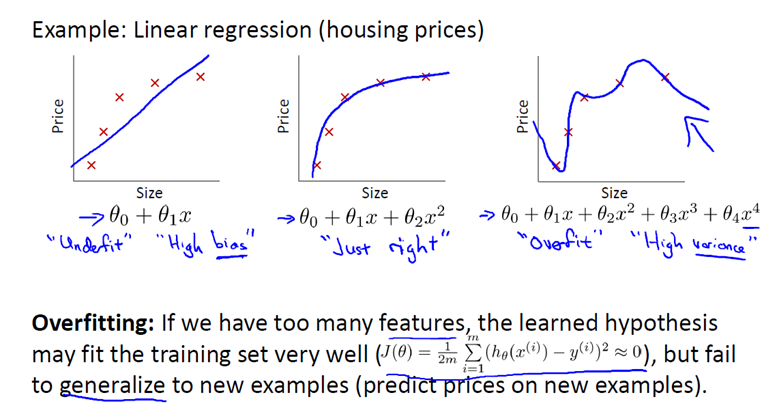

为了避免过拟合，方法有：

1. 减少特征的个数，只保留有用的特征
2. 正则化：在损失函数里加上这部分考虑，惩罚过大的参数绝对值。
3. dropout层：随机的丢弃上层的一些输出值（置0），避免某个特征影响过大（例如：穿格子衬衣的客户都有坏账）

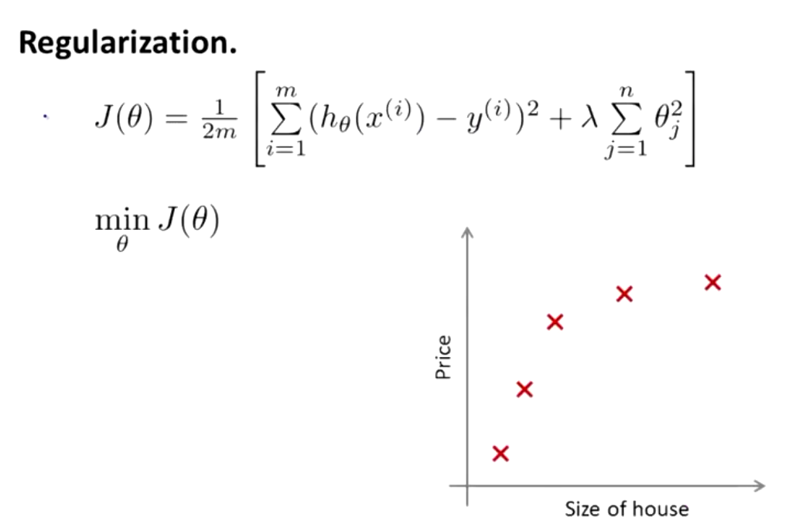

caffe支持两种正则化方法：L1和L2，即参数的1阶矩或2阶矩作为惩罚项，caffe默认是L2。

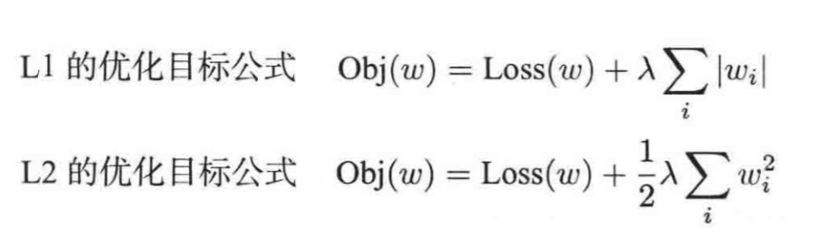

可以在solver.prototxt文件里设置：

```
regularization_type: "L1"
weight_decay: 0.005
```

weight_decay 就是乘在正则化向前面、控制正则化项在损失函数中所占权重的λ。

根据吴恩达老师的课件，再记录两个概念/状态：bias和variance，对应欠拟合和过拟合：

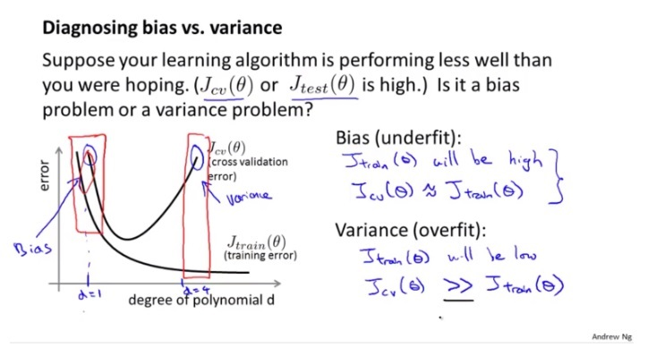


# 5、卷积网络的一些特殊情形

## 5.1 残差网络（Residual Network）

一般的理解，深度网络的深度越大，表现能力更好，准确率更高。但在一些情况下会观察到相反的情况：层数越多，由于梯度消失和爆炸，准确率反而退化（degradation），而残差网络可以很好的解决这个问题。

ResNet的思想在于让卷积网络去学习残差映射F(x)，而不是直接学习H(x)，ResNet的假设是：优化F(x)比优化H(x)更为容易：

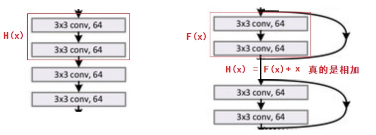

具体实现的时候，网络堆叠层不一定是两个3X3的卷积，可以参考网上的一些实现和论文：

```
https://github.com/KaimingHe/deep-residual-networks
```

pytorch实现的代码示例：

```python
import torch.nn as nn

class Bottleneck(nn.Module):
    def __init__(self, in_dim, out_dim, stride=1):
        super(Bottleneck, self).__init__()
        self.bottleneck = nn.Sequential(
                nn.Conv2d(in_dim, in_dim, 1, bias=False),
                nn.BatchNorm2d(in_dim),
                nn.ReLU(inplace=True),
                nn.Conv2d(in_dim, in_dim, 3, stride, 1, bias=False),
                nn.BatchNorm2d(in_dim),
                nn.ReLU(inplace=True),
                nn.Conv2d(in_dim, out_dim, 1, bias=False),
                nn.BatchNorm2d(out_dim),
            )
        self.relu = nn.ReLU(inplace=True)
        self.downsample = nn.Sequential(
                nn.Conv2d(in_dim, out_dim, 1, 1),
                nn.BatchNorm2d(out_dim),
            )


def forward(self, x):
    identity = x
    out = self.bottleneck(x)
    identity = self.downsample(x)
    out += identity
    out = self.relu(out)
    return out
```


## 5.2 InceptionNetwork

inception这个词好奇怪，不太了解它的深意。

解决的问题：

1. 图片中的关键信息的大小差别很大，例如一张狗的图片，图中的狗可能大小不一。所以难以选择合适的卷积核大小。
2. 简单的堆叠网络深度，容易过拟合，且梯度传输困难，容易出现梯度消失和爆炸。大的深度也意味着计算复杂度也非常大

GoogLeNet中，引入了Inception Network这一特色：在同一层运行多个尺寸的卷积核，拓展网络宽度而不是深度。

pytorch实现的代码示例：

```python
import torch
from torch import nn
import torch.nn.functional as F
class BasicConv2d(nn.Module):
    def __init__(self, in_channels, out_channels, kernel_size, padding=0):
        super(BasicConv2d, self).__init__()
        self.conv = nn.Conv2d(in_channels, out_channels, kernel_size, padding=padding)
    def forward(self, x):
        x = self.conv(x)
        return F.relu(x, inplace=True)

class Inceptionv1(nn.Module):
     def __init__(self, in_dim, hid_1_1, hid_2_1, hid_2_3, hid_3_1, out_3_5, out_4_1):
          super(Inceptionv1, self).__init__()
          self.branch1x1 = BasicConv2d(in_dim, hid_1_1, 1)
          self.branch3x3 = nn.Sequential(
               BasicConv2d(in_dim, hid_2_1, 1),
               BasicConv2d(hid_2_1, hid_2_3, 3, padding=1)
          )
          self.branch5x5 = nn.Sequential(
               BasicConv2d(in_dim, hid_3_1, 1),
               BasicConv2d(hid_3_1, out_3_5, 5, padding=2)
          )
          self.branch_pool = nn.Sequential(
               nn.MaxPool2d(3, stride=1, padding=1),
               BasicConv2d(in_dim, out_4_1, 1)
          )
     def forward(self, x):
          b1 = self.branch1x1(x)
          b2 = self.branch3x3(x)
          b3 = self.branch5x5(x)
          b4 = self.branch_pool(x)
          output = torch.cat((b1, b2, b3, b4), dim=1)
          return output
```

github: https://github.com/BVLC/caffe/tree/master/models/bvlc_googlenet

详细的解释可以阅读这个文章或者相关论文：

https://zhuanlan.zhihu.com/p/37505777

一图胜千言：

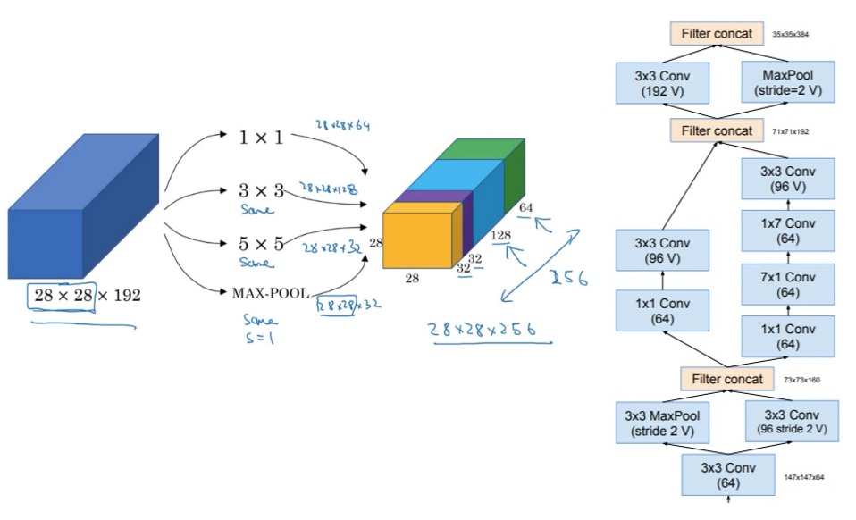

## 5.3 DenseNet

ResNet通过前层和后层的短路连接，加强了前后层之间的信息流通，在一定程度上缓解了梯度消失的现象，从而可以将神经网络搭建得很深。DenseNet进一步的，通过建立前面所有层与后面层的密集连接，实现了特征在通道维度上的复用，使得可以在参数量和计算量更少的情况下，实现比ResNet更好的性能。

在DenseNet的Block里，每一层都向后面所有层传递，在通道层面做concat操作：

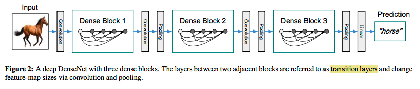

pytorch示例代码：

```python
import torch
from torch import nn
import torch.nn.functional as F

class Bottleneck(nn.Module):
    def __init__(self, nChannels, growthRate):
        super(Bottleneck, self).__init__()
        interChannels = 4*growthRate
        self.bn1 = nn.BatchNorm2d(nChannels)
        self.conv1 = nn.Conv2d(nChannels, interChannels, kernel_size=1,
                               bias=False)
        self.bn2 = nn.BatchNorm2d(interChannels)
        self.conv2 = nn.Conv2d(interChannels, growthRate, kernel_size=3,
                               padding=1, bias=False)
    def forward(self, x):
        out = self.conv1(F.relu(self.bn1(x)))
        out = self.conv2(F.relu(self.bn2(out)))
        out = torch.cat((x, out), 1)
        return out

class Denseblock(nn.Module):
    def __init__(self, nChannels, growthRate, nDenseBlocks):
        super(Denseblock, self).__init__()
        layers = []
        for i in range(int(nDenseBlocks)):
            layers.append(Bottleneck(nChannels, growthRate))
            nChannels += growthRate
        self.denseblock = nn.Sequential(*layers)
    def forward(self, x):
        return self.denseblock(x)
```

通过下面这段简单的PyTorch代码可以统计一下上面几个网络需要学习的参数的量：

```python
param_cnt = 0
for p in model.parameters():
    param_cnt += p.data.nelement()
print(param_cnt)
```

简单的对比一下几个网络的参数量：
```
AlexNet：62百万个
VGG16： 134百万个
inception：13百万个
ResNet：23百万个
DenseNet：6百万个
```

还有个内存占用量和计算量的问题，就不那么容易统计，但github上有相关工程，通过钩子的方式统计。

下面是来自网上一个博士的文章，有很详细的分析：

```
https://towardsdatascience.com/the-w3h-of-alexnet-vggnet-resnet-and-inception-7baaaecccc96
```

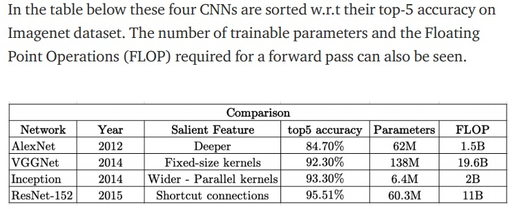

## 5.4 孪生网络

见[利用深度学习进行图片相似性比较](利用深度学习进行图片相似性比较.md)

## 5.5 空洞卷积

顾名思义，空洞卷积就是卷积核里有一些空洞，跳过一些元素进行卷积：

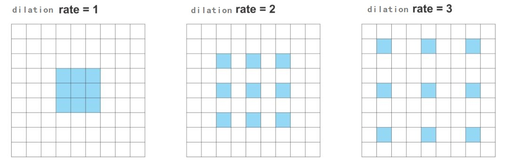

空洞卷积在不增加参数量的前提下，增大了感受野。

具体代码实现的时候，空洞卷积有一个额外的超参数，以PyTorch为例，dilation超参数默认为1：

```python
conv2 = nn.Conv2d(3, 256, 3, stride=1, padding=1, dilation=2)
```

## 5.6 逐通道卷积和分组卷积

与常规的卷积不一样，逐通道卷积是这样的：

输入 C X H X W，即C个通道，每个通道一个卷积核，假设为 3X3大小，那么每个卷积核是3X3个参数，这样的卷积核有C个。经过卷积后，输出结果有C个通道。

可以看出，输入与输出特征图的通道数相同，无法改变通道数。所以后续通常还接一个1X1的常规卷积，对通道间特征进行融合、并改变通道数。

假设输入为128个通道，输出为256个通道，3X3卷积的场景，对比一下与常规卷积的参数量：

```
常规卷积：128X3X3X256=294,912
逐通道卷积：128X3X3 + 1X1X128X256 = 33,920 相当于原来的1/9
```

具体实现，PyTorch的卷积层有一个groups的超参数，默认为1，即对输入的通道只分一个组，如果等于通道数，就是逐通道卷积了：

```python
nn.Conv2d(128, 128, 3, stride=1, padding=1, groups=128)
```


# 6、通过自定义layer扩展caffe

在利用孪生网络比较图片相似性的时候，没有合适的层来显示测试阶段的准确率，不直观。

所以我写了一个自定义的层，编译到caffe里，可以直观的展现孪生网络生成的两个特征摘要的欧式距离与标注比较后的准确率。

另外，caffe官方提供了一篇浅显易懂的好文章，来说明如何编写自定义层

[Simple Example: Sin Layer](https://github.com/BVLC/caffe/wiki/Simple-Example:-Sin-Layer)

## 6.1 修改proto文件

首先，修改caffe.proto文件，增加参数定义：

```
message ContrastiveAccuracyParameter {
  optional float margin = 1 [default = 1.0];
}
```

在LayerParameter这个消息体内增加一个成员：

```
optional ContrastiveAccuracyParameter contrastive_accuracy_param = 147;
```

注意修改LayerParameter消息体顶部的注释：

```
// LayerParameter next available layer-specific ID: 148 (last added: recurrent_param)
```

## 6.2 编写c代码

有这么几个关键的函数需要实现：

```c
//layer初始化，一般检查bottom top的形状、参数合法性，做一些必要的初始化工作
virtual void LayerSetUp(const vector<Blob<Dtype>*>& bottom,	const vector<Blob<Dtype>*>& top);
//设置 top、diff_等的形状
virtual void Reshape(const vector<Blob<Dtype>*>& bottom,const vector<Blob<Dtype>*>& top);
// layer的名字
virtual inline const char* type() const { return "ContrastiveAccuracyLayer"; }
// 输入和输出的blob的准确个数，如果是确定的个数的话，否则返回-1
virtual inline int ExactNumBottomBlobs() const { return 3; }
virtual inline int ExactNumTopBlobs() const { return 1; }
//前向传播与后向传播
virtual void Forward_cpu(const vector<Blob<Dtype>*>& bottom,const vector<Blob<Dtype>*>& top);
virtual void Backward_cpu(const vector<Blob<Dtype>*>& top,const vector<bool>& propagate_down, const vector<Blob<Dtype>*>& bottom) {};
```
这次的试验还比较简单，后续再继续深入：

1. 因为是在测试阶段显示准确率，不需要后向传播
2. 只考虑了在CPU上运行，没有考虑GPU

blob形状有五种情况：

1. 标量，例如Accuracy层的输出，这时候blob的num_axes()返回0，如果Reshape，应该这样写 vector<int> top_shape(0);  top[0]->Reshape(top_shape);
2. 一维数组，例如图片分类中的label，[N]， 即每张图片一个标量的分类值，该批次有N张样本，这时候blob的num_axes()返回1，如果Reshape，应该这样写 vector<int> top_shape(1); top_shape[0]=N;  top[0]->Reshape(top_shape);
3. 二维数组，例如全连接层的输出，[N, C]，即每个样本是C个output，该批次有N张样本。num_axes()和Reshape情况以此类推。
4. 三维数组，理论上存在，暂时没有遇到典型的应用
5. 四维数组，例如卷积层的输出，[N,C,H,W]，num_axes()返回4。

blob里的数据通过mutable_cpu_data()返回的头指针写，通过cpu_data() 返回的头指针读。需要访问的具体的那个值的偏移，根据blob的形状，有不同的计算方式，例如：

如果是标量，那么offset=0；

如果是卷积层输出的四维数组，第i个样本的第j个通道的第k行的第m列那个元素的偏移

```
offset=i * (CXHXW) + j * (HXW)+k * (W) + m
```

其他情况以此类推。

blob有很丰富的成员函数来访问数据，具体可以看blob类的头文件注释。

最后，记得使用两个宏来实例化这个层：

```C
INSTANTIATE_CLASS(ContrastiveAccuracyLayer);
REGISTER_LAYER_CLASS(ContrastiveAccuracy);
```
[详细代码在这里](code/dnn_ml)

## 6.3 运行效果

在图片相似度比较试验中测试，修改prototxt文件，加入一层：

```
layer {
  name: "accuracy"
  type: "ContrastiveAccuracy"
  bottom: "feat"
  bottom: "feat_p"
  bottom: "sim"
  top: "accuracy"
  contrastive_accuracy_param{
	margin:0.5 
  }
  include {
    phase: TEST
  }
}
```

然后开始训练，每隔1000个迭代测试一下，输出准确率：

```
I0507 16:13:56.415743  9436 solver.cpp:332] Iteration 14000, Testing net (#0)
I0507 16:14:06.840694  9436 solver.cpp:399]     Test net output #0: accuracy = 0.859375
I0507 16:14:06.840694  9436 solver.cpp:399]     Test net output #1: loss = 0.0463745 (* 1 = 0.0463745 loss)

I0507 16:15:58.749261  9436 solver.cpp:332] Iteration 15000, Testing net (#0)
I0507 16:16:06.020318  9436 solver.cpp:399]     Test net output #0: accuracy = 0.96125
I0507 16:16:06.020318  9436 solver.cpp:399]     Test net output #1: loss = 0.0151566 (* 1 = 0.0151566 loss)
```

## 6.4 加上对GPU的支持

caffe的各种layer使用GPU，与cuda编程环境并无特别的差异。熟悉cuda编程环境的话，那么给layer加上支持gpu就很容易。

在头文件中加入这两个函数：

```c
virtual void Forward_gpu(const vector<Blob<Dtype>*>& bottom, const vector<Blob<Dtype>*>& top);

virtual void Backward_gpu(const vector<Blob<Dtype>*>& top,
			const vector<bool>& propagate_down, const vector<Blob<Dtype>*>& bottom) {};
```

在源代码目录caffe-windows\src\caffe\layers下增加一个contrastive_accuracy_layer.cu文件，里面实现Forward_gpu函数，注意不要重复定义在contrastive_accuracy_layer.cpp里已有的函数：
```c
namespace caffe {

    //这个函数运行在GPU上，并行对batchsz个特征摘要做距离判断
	template <typename Dtype>
	__global__ void Calc_distance(int chn_num, int batchsz, 
		                 const Dtype* data1, const Dtype*data2, const Dtype*data3, 
		                 float margin, int*accuracy)
	{
		int id = blockDim.x * blockIdx.x + threadIdx.x;//我是哪个线程
		if (id >= batchsz)
		{
			return;
		}
        //计算两者的距离
		float distance = 0;
		int y;
		for (int j = 0; j < chn_num; ++j)
		{
			int index = id*chn_num + j;
			distance += (data1[index] - data2[index])*(data1[index] - data2[index]);
		}
		distance = sqrt(distance);
		if (distance < margin)
		{
			y = 1;
		}
		else
		{
			y = 0;
		}
		Dtype label = data3[id];
		if (y == label) // right!!
		{
			accuracy[id] = 1;
		}
		else
		{
			accuracy[id] = 0;
		}
	}
	template <typename Dtype>
	void ContrastiveAccuracyLayer<Dtype>::Forward_gpu(const vector<Blob<Dtype>*>& bottom, const vector<Blob<Dtype>*>& top)
	{
		int N = bottom[0]->num();
		int C = bottom[0]->channels();
		
		const Dtype* data1 = bottom[0]->gpu_data();
		const Dtype* data2 = bottom[1]->gpu_data();
		const Dtype* data3 = bottom[2]->gpu_data();
	   //在GPU上分配内存，用于保存每个样本正确与否的结果
		int * d_accuracy = NULL;
		cudaError_t  err = cudaMalloc((void **)&d_accuracy, N*sizeof(int));
		if (err != cudaSuccess)
		{
			LOG(FATAL)<<"Failed to allocate device memory for result!"<< cudaGetErrorString(err);
			return;
		}
		Calc_distance << <CAFFE_GET_BLOCKS(N), CAFFE_CUDA_NUM_THREADS >> > (C, N,
			data1, data2, data3,
			margin_, d_accuracy);
		//把GPU内存里的结果拷贝到主机内存，方便统计准确率
		int * h_accuracy = (int*)malloc(N * sizeof(int));
		if (h_accuracy == NULL)
		{
			cudaFree(d_accuracy);
			LOG(FATAL) << "Failed to allocate host memory for result!";
			return;
		}
		err = cudaMemcpy(h_accuracy, d_accuracy, N*sizeof(int), cudaMemcpyDeviceToHost);
		if (err != cudaSuccess)
		{
			cudaFree(d_accuracy);
			free(h_accuracy);
			LOG(FATAL) << "Failed to copy device memory for result!" << cudaGetErrorString(err);
			return;
		}
		
		int i;
		int total = 0;
		for (i = 0; i < N; ++i)
		{
			if (h_accuracy[i]) { total++; }
		}
		cudaFree(d_accuracy);
		free(h_accuracy);
	    //最终的准确率写入GPU内存
		Dtype result = total / (N*1.0);
		Dtype* top_data = top[0]->mutable_gpu_data(); 
		caffe_copy(1, &result, top_data);
	}

	INSTANTIATE_LAYER_GPU_FUNCS(ContrastiveAccuracyLayer);  
}
```


需要注意的是：

1. 使用gpu_data() ,mutable_gpu_data()函数获得blob在gpu内存里的数据的头指针，注意不要直接访问gpu内存，使用cudaMemcpy / caffe_copy这样的函数来访问
2. 注意一个核函数不要太“大”了，否则在windows下容易因为连续占用太久gpu而被杀掉
3. vc工程里直接添加*.cu文件，编译不了，搞起来比较复杂。而是在写好 *.cu文件后，重新运行cmake，更新vc的solution，然后重新编译就可以了。

## 6.5 实现反向传播

### 6.5.1 没有w/b参数的情形

没有w/b参数的情形，例如sigmoid等激活函数、损失函数、Slice层、concat层，以及Sin函数层等等，他们是bottom到top的某种确定的映射，映射关系不需要学习。

这种情形下的backward还是很好理解的：

每个blob有两类数据：data和diff，他们是同尺寸的。

每一层有四类数据：

1. 前向传播的输入：bottom blob中的data
2. 前向传播的输出：top blob中的data
3. 后向传播的输入：top blob中的diff（也是个数组，size同top blob data），里面保存了top blob这级数据对loss函数的梯度，不管来自怎样复杂的一个计算公式和传播过程，top diff里保存的就是最后计算的常数值，假设这个值为d，这个常数值表示：top这级数据变化1，那么loss函数值会变化d。top diff已经被顶层的后向传播过程计算好了。
4. 后向传播的输出：bottom blob中的diff（也是个数组，size同bottom blob data），这是该层后向传播需要求解的值，根据该层的前向运算属性和top diff值，经链式求导法则，计算出bottom diff，该层的后向传播就完成了。


前向传播的时候，当前层把 bottom data中的数据，经过一定的运算，输出到top data中。

后向传播的时候，当前层把top diff 中的数据，经过一定的运算，输出到bottom diff中。

以一个sin层为例，该层就是简单的把bottom的数据计算sin，输出到top，它的backward_cpu是这样实现的：

```c
template <typename Dtype>
void SinLayer<Dtype>::Backward_cpu(const vector<Blob<Dtype>*>& top,
                                    const vector<bool>& propagate_down,
                                    const vector<Blob<Dtype>*>& bottom) 
{ 
  if (propagate_down[0]) {
    const Dtype* bottom_data = bottom[0]->cpu_data();
    const Dtype* top_diff = top[0]->cpu_diff();
    Dtype* bottom_diff = bottom[0]->mutable_cpu_diff();
    const int count = bottom[0]->count();
    Dtype bottom_datum;
    for (int i = 0; i < count; ++i) {
      bottom_datum = bottom_data[i];
      bottom_diff[i] = top_diff[i] * cos(bottom_datum);
    }
  }
}
```

再看一个实际应用中的sigmoid层，我们知道sigmoid正向函数是 

```
f(x)=1/(1+e^(-x))
```

其导数是：

```
f'(x) = f(x) (1-f(x))
```

代码里正是把top diff乘以该层的导数：

```c
template <typename Dtype>
void SigmoidLayer<Dtype>::Backward_cpu(const vector<Blob<Dtype>*>& top,
    const vector<bool>& propagate_down,
    const vector<Blob<Dtype>*>& bottom) {
  if (propagate_down[0]) {
    const Dtype* top_data = top[0]->cpu_data();
    const Dtype* top_diff = top[0]->cpu_diff();
    Dtype* bottom_diff = bottom[0]->mutable_cpu_diff();
    const int count = bottom[0]->count();
    for (int i = 0; i < count; ++i) {
      const Dtype sigmoid_x = top_data[i];
      bottom_diff[i] = top_diff[i] * sigmoid_x * (1. - sigmoid_x);
    }
  }
}
```

这种bottom和top一一对应的映射都比较好办，涉及到卷积、交叉熵等复杂运算的层就会复杂一些。但其背后的思路是一致的。

例如MaxPool层，它的映射关系就比较奇葩，实现方案是额外开辟个mask数据结构，记录前向传播的时候，取了bottom里的哪个元素，后向传播的时候，被取值的bottom元素对应的diff的链式因子是1，其他是0。用这个因子去乘top diff即可。

而AvgPool层就不需要记录，直接乘以前向传播的时候求均值的除数。

```
 Blob<Dtype> rand_idx_;
 Blob<int> max_idx_;
```

### 6.5.2 有w/b参数的情形

这种最典型的就是全连接层、卷积层了。这种情形才是神经网络的典型情况。

这种情况除了像6.5.2一样，梯度要从top diff传递到bottom diff，还要解决一个问题：

梯度要从top diff传递到w 和b，计算w diff和b diff。

仔细看caffe全连接层的代码，其父类Layer有成员变量blobs\_[0]和blobs\_[1]，保存了w和b，可以认为全连接层除了显式的有一个bottom blob外，还有两个隐式的bottom blob，分别是w和b。 可以认为全连接层有三个bottom blob。

```c++
 /** The vector that stores the learnable parameters as a set of blobs. in Layer.hpp*/
  vector<shared_ptr<Blob<Dtype> > > blobs_;

 // Initialize the weights in InnerProductLayer LayerSetup()
    vector<int> weight_shape(2);
    if (transpose_) {
      weight_shape[0] = K_;
      weight_shape[1] = N_;
    } else {
      weight_shape[0] = N_;
      weight_shape[1] = K_;
    }
    this->blobs_[0].reset(new Blob<Dtype>(weight_shape));

template <typename Dtype>
void InnerProductLayer<Dtype>::Forward_cpu(const vector<Blob<Dtype>*>& bottom,
    const vector<Blob<Dtype>*>& top) {
  const Dtype* bottom_data = bottom[0]->cpu_data();
  Dtype* top_data = top[0]->mutable_cpu_data();
  const Dtype* weight = this->blobs_[0]->cpu_data();//weight

template <typename Dtype>
void InnerProductLayer<Dtype>::Backward_cpu(const vector<Blob<Dtype>*>& top,
    const vector<bool>& propagate_down,
    const vector<Blob<Dtype>*>& bottom) {
  if (this->param_propagate_down_[0]) {
    const Dtype* top_diff = top[0]->cpu_diff();
    const Dtype* bottom_data = bottom[0]->cpu_data();
    // Gradient with respect to weight
    if (transpose_) {
      caffe_cpu_gemm<Dtype>(CblasTrans, CblasNoTrans,
          K_, N_, M_,
          (Dtype)1., bottom_data, top_diff,
          (Dtype)1., this->blobs_[0]->mutable_cpu_diff());
```


在后向传播的时候，需要计算blobs\_[0]和blobs\_[1]的diff，即参数w和b的梯度值。

下面的mxnet代码，帮助理解卷积层的梯度的反向传递：

```python
from mxnet import nd
import mxnet.autograd as autograd

X = [ a+1 for a in range(25)]
X = nd.array(X)
X = X.reshape((1,1,5,-1)) # (batchsz channel h w)

k = nd.ones((3,3))

k.attach_grad()
X.attach_grad()
with autograd.record():
    Y = nd.Convolution(data=X, weight=k.reshape((1,1,3,3)), 
                       kernel=(3,3), num_filter =1,no_bias=True)
Y.backward()

print(Y)
print(k.grad)
print(X.grad)
```

从结果可以看出：

1. 从top传递到卷积核的每个w系数的梯度，就等于与该w系数相乘的bottom输入的数据的和
2. 从top传递到bottom的每个输入数据的梯度，就等于与该输入数据相乘的所有卷积核的w系数的和

下面这段代码更复杂一点，体现了卷积结果是多通道的情况：

```python
from mxnet import nd
import mxnet.autograd as autograd

X = [ a+1 for a in range(25)]
X = nd.array(X)
X = X.reshape((1,1,5,-1)) # (batchsz channel h w)

k1 = nd.ones((3,3))
k2 = nd.ones((3,3))*2

k1.attach_grad()
k2.attach_grad()
X.attach_grad()
with autograd.record():
    Y1 = nd.Convolution(data=X, weight=k1.reshape((1,1,3,3)), kernel=(3,3), num_filter =1,no_bias=True)
    Y2 = nd.Convolution(data=X, weight=k2.reshape((1,1,3,3)), kernel=(3,3), num_filter =1,no_bias=True)
    Y = nd.concat(Y1,Y2, dim=1)
Y.backward()

print(Y)
print(k1.grad)
print(k2.grad)
print(X.grad)
```

各层的Backward()函数只需要实现梯度传递，参数的更新是Solver.ApplyUpdate()来实现的，毕竟梯度的更新是复杂的，是各种solver的特色，要考虑动量什么的：

1. 各层每做一次前向传播+后向传播：
   1. 产生的梯度保存或者累加到blobs_[].diff里，具体是累加还是直接保存，取决于各层自己的实现。例如IP层和conv层就是累加的，scale层就不累加。
   2. top到bottom的传递的梯度是不累加的，直接保存在bottom的diff里
2. Solver::Step()函数每触发iter\_size次上述这样的ForwardBackward，都会把各层的wb参数的diff清0，各层的top bottom的梯度清理不清理都无所谓，因为每次计算是直接赋值，不是累加。
3. Solver::Step()函数调用ApplyUpdate()进行参数更新从而实现学习，主要步骤是ComputeUpdateValue()和net_.Update()
4. 第一步ComputeUpdateValue()将各层Backward()累计的w/b参数的diff值乘以学习率系数后更新到累加到w/b参数的diff值里，用于后面Update()更新data数据。SGDSolver之所以有个累加到history_ 变量的中间环节，是为了累计历史上的动量。caffe_cpu_axpby(const int N, const float alpha, const float* X,const float beta, float* Y)的作用就是Y=alpha * X +beta*Y
5. 第二步net_.Update()调用各个w/b参数的Update()函数（Blob的成员函数）, 将diff乘以-1后累加到data里。
6. 为什么类似conv层要将diff累加呢？ 因为iter_size可能大于1，iter_size次ForwardBackward后才Update参数的。这样使得内存有限导致batch_size很小的情况下，也可以使得每次迭代的方向不因个别样本而走弯路。

```c++
void SGDSolver<Dtype>::ApplyUpdate() {
  Dtype rate = GetLearningRate();
  ClipGradients();
  for (int param_id = 0; param_id < this->net_->learnable_params().size();
       ++param_id) {
    Normalize(param_id);
    Regularize(param_id);
    ComputeUpdateValue(param_id, rate);
  }
  this->net_->Update();
}

void SGDSolver<Dtype>::ComputeUpdateValue(int param_id, Dtype rate) {
  const vector<Blob<Dtype>*>& net_params = this->net_->learnable_params();//网络的各层的w和b
  const vector<float>& net_params_lr = this->net_->params_lr();//网络各层的lr_mult
  Dtype momentum = this->param_.momentum();//全局的动量
  Dtype local_rate = rate * net_params_lr[param_id];
  // 参数rate来自当前solver复杂的逻辑，在GetLearningRate()成员函数里实现
  switch (Caffe::mode()) {
  case Caffe::CPU: {
    caffe_cpu_axpby(net_params[param_id]->count(), local_rate,
              net_params[param_id]->cpu_diff(), momentum,
              history_[param_id]->mutable_cpu_data());
    caffe_copy(net_params[param_id]->count(),
        history_[param_id]->cpu_data(),
        net_params[param_id]->mutable_cpu_diff());
    break;
  }
  
void Net<Dtype>::Update() {
  for (int i = 0; i < learnable_params_.size(); ++i) {
    learnable_params_[i]->Update();
  }
}

void Blob<Dtype>::Update() {
  // We will perform update based on where the data is located.
  switch (data_->head()) {
  case SyncedMemory::HEAD_AT_CPU:
    // perform computation on CPU
    caffe_axpy<Dtype>(count_, Dtype(-1),
        static_cast<const Dtype*>(diff_->cpu_data()),
        static_cast<Dtype*>(data_->mutable_cpu_data()));
    break;
```

各层在Backward函数里对wb参数的梯度是累加还是直接保存，caffe的代码不容易看清楚。

所以我写了些代码来检查各层的策略：

```c++
for (it = 0; it < 2; ++it)//迭代
{
	for (int k = 0; k < 5; ++k) 
    {
		caffe_forward(net, (float*)data_input, (float*)label_input);
		net->Backward();
	
		boost::shared_ptr<Blob<float> > blob = net->layer_by_name("scale")->blobs()[0];
		const float * diff = blob->cpu_diff();
		int cnt = 0;
		for (int j = 0; j < blob->count()&& cnt < 10; ++j)
		{
			if (abs(diff[j]) > 0)
			{
				printf("%d:%f ", j, diff[j]);
				cnt++;
			}
		}
		printf("\n");	
	}
	printf("\n");
}
```


分别获取conv、fc、scale类型的层的每次梯度数据时候，可以看到他们有的是累加，有的是直接保存：

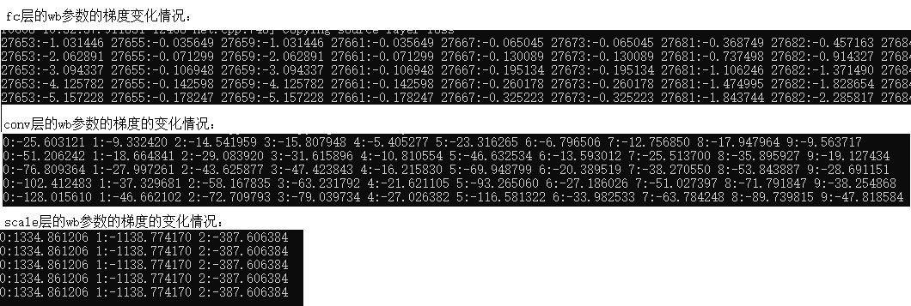

# 7、输入为什么要减去均值、取值范围规范化

### 7.1 先说减去均值

图片输入到网络里之前，为什么要减去均值？  但似乎又不是一定的？例如超分辨率网络中就不减均值。

看过有三种解释：

1. 参考PCA主成分分析，输入的数据都做标准化处理，做到均值为0方差为1，消除不同特征在数值上的范围差异带来的影响。对于图像而言，每个像素都是0-255，方差是基本一致的，所以需要做均值平移到0

2. 消除图像的共性，突出个体差异，类似一条海拔6000m-8000m之间波动的山脉，都减去6000米的话，就只剩下山脉的波动信息了。

3. 构造0中心的数据分布，使得梯度下降算法能够有效运作。激活函数是0中心分布的，如果输入不是0中心分布的，那么各层的激活输出值也为正，反向传播的各层梯度也会全为正或者全为负，导致梯度下降呈现Z字形，不够有效收敛。（没看太懂）

**对于sigmoid这样的激活函数，如果z的绝对值比较大，那么sigmoid的导数很小，导致反向传递经过sigmoid层的时候，梯度消失。这个有血的教训，我在试验逻辑斯蒂回归的时候，X取值范围较大，wX+b的绝对值比较大，调试半天也搞不定。输入经过标准化处理后，逻辑斯蒂回归就收敛了。**

类似的关于数据分布的标准化，有个BatchNorm层，BN层的基本思想也是把数据强制拉回均值0方差1的分布，避免梯度消失或者梯度爆炸。

某一层的输出值如果太大，那么下一层的W参数的梯度就会很大，导致梯度爆炸。

而对于sigmoid这样的激活函数，该层的输出值如果太大，那么反向传播的时候，sigmoid层的梯队就会很小，导致梯度消失。ReLU激活层没有这样的问题，但是它没有把输出值拉回0-1范围，可能导致前面的梯度爆炸问题。

caffe提供了compute_image_mean这样的工具，遍历输入的图片，相同位置的像素累加再求平均，形成一张平均值图片（caffe Blob形态，不是Mat形态），类似 eigenface 中的平均脸。然后将该BLOB message序列化写入文件。就是我们常见到的mean.binaryproto文件。

这个文件也不是要求绝对精确的，有时候用一下别人计算好的mean.binaryproto文件（尺寸要一致），或者干脆给每个通道估计一个经验的均值设置到网络里面，也ok。

摘要简单的代码如下：

```c
  BlobProto sum_blob;
  int count = 0;
  // load first datum
  Datum datum;
  datum.ParseFromString(cursor->value());

  DecodeDatumNative(&datum);

  sum_blob.set_num(1);
  sum_blob.set_channels(datum.channels());
  sum_blob.set_height(datum.height());
  sum_blob.set_width(datum.width());
  const int data_size = datum.channels() * datum.height() * datum.width();
  int size_in_datum = std::max<int>(datum.data().size(),
                                    datum.float_data_size());
  for (int i = 0; i < size_in_datum; ++i) {
    sum_blob.add_data(0.);
  }
  LOG(INFO) << "Starting Iteration";
  while (cursor->valid()) {
    Datum datum;
    datum.ParseFromString(cursor->value());
    DecodeDatumNative(&datum);//如果是jpg等编码压缩的图片，要解码

    const std::string& data = datum.data();
    size_in_datum = std::max<int>(datum.data().size(),
        datum.float_data_size());
   
    if (data.size() != 0) {//图片数据在data字段里
      for (int i = 0; i < size_in_datum; ++i) {
        sum_blob.set_data(i, sum_blob.data(i) + (uint8_t)data[i]);
      }
    } else {//图片数据在float_data字段里
      for (int i = 0; i < size_in_datum; ++i) {
        sum_blob.set_data(i, sum_blob.data(i) +
            static_cast<float>(datum.float_data(i)));
      }
    }
    ++count;
  
    cursor->Next();
  }
  //均值
  for (int i = 0; i < sum_blob.data_size(); ++i) {
    sum_blob.set_data(i, sum_blob.data(i) / count);
  }
  // Write to disk
  if (argc == 3) {
    WriteProtoToBinaryFile(sum_blob, argv[2]); //sum_blob.SerializeToOstream(argv[2])
  }
```

### 7.2 取值范围规范化(feature scaling)

根据吴恩达老师的课程，如果输入的各特征的取值范围相差很大，那么梯度下降的路径不会高效率，训练收敛会很慢。需要对输入数据做预处理，使得各特征的取值范围大致相当（不要求非常精确）。

下图是利用线性回归建模房价与房子建筑面积、卧室个数、建设年代等特征之间的关系。其中房子建筑面积和卧室个数两个特征在取值范围上有很大的差异。


下面的mathematica代码以线性回归   

```
 y = 3 + 7 * x1 - 13 * x2
```

   为例，演示Feature Scaling的效果：

```mathematica
ClearAll["Global`*"];
x = {};
y = {};
createData[] := Module[{x1, x2, x0, y0, i},
   Do[
     x1 = RandomReal[{0, 1}];
     x2 = RandomReal[{10, 200}];
     x0 = 1;
     y0 =  3*x0 + 7 * x1 - 13 * x2 ;
     y0 = y0 + RandomReal[{-0.05, 0.05}];
     AppendTo[x, {x0, x1, x2}];
     AppendTo[y, y0];
     ,
     
     {i, 1 , 100}
     ];
   ];
featureScale[x_, s1_, s2_, s3_] := Module[{ i, l},
   l = Length[x];
   result = x;
   Do[
    
    result[[i, 1]] = x[[i, 1]] / s1;
    result[[i, 2]] = x[[i, 2]] / s2;
    result[[i, 3]] = x[[i, 3]] / s3;
    
    ,
    {i, 1, l}
    ];
   result
   ];
linearRegression[lr_, x_, y_] := 
  Module[{ a, b, c, m, loss, i, iter, d1, d2, d3},

   a = 1;
   b = 1;
   c = 1;
   m = Length[x];
   Do[
    d1 =  
     Sum[   (x[[i, 1]] * a + x[[i, 2]]*b + x[[i, 3]]*c - y[[i]] )*
        x[[i, 1]], {i, 1, m}] / m;
    d2 =  
     Sum[   (x[[i, 1]] * a + x[[i, 2]]*b + x[[i, 3]]*c - y[[i]] )*
        x[[i, 2]], {i, 1, m}] / m;
    d3 =  
     Sum[   (x[[i, 1]] * a + x[[i, 2]]*b + x[[i, 3]]*c - y[[i]] )*
        x[[i, 3]], {i, 1, m}] / m;
    a = a - lr * d1;
    
    b = b - lr * d2;
    
    c = c - lr * d3;
    loss = 
     Sum[   (x[[i, 1]] * a + x[[i, 2]]*b + x[[i, 3]]*c - 
          y[[i]] )^2, {i, 1, m}] / (2*m);
    ,
    {iter, 1, 1000}
    
    ];
   Print["after 1000 iterations, a=", a, "\tb=", b, "\tc=", c, 
    "\tloss=", loss];
   ];
createData[];
linearRegression[0.0001, x, y];
x = featureScale[x, 1, 1, 200];
linearRegression[1, x, y];
```

运行输出如下：

```shell
after 1000 iterations, a=1.01054	b=1.06058	c=-12.9627	loss=4.43972
after 1000 iterations, a=3.00989	b=6.98233	c=-2600.	loss=0.000410797
```

可以看出：

1. 同样的迭代次数，feature scaling处理后的训练，学习到的参数更接近真值（3, 7, -13），损失函数值也更小。c=-2600没有问题，刚好等于-13 * 200, 200是feature scale的时候除以的值。
2. 不同特征取值范围差异很大的话，取值范围大的特征的参数更接近真值（-12.9627 vs -13），取值范围小的特征由于对损失函数的影响较小，其参数不能得到有效的学习，距离真值差距较大（1.06 vs 3）

在feature scaling的基础上，我再将x1， x2分别减去均值0.5， 同样的学习率和迭代次数，我发现效果是一样的。

```mathematica
subMean[x_, m2_, m3_] := Module[{ i, l},
   l = Length[x];
   result = x;
   Do[
    result[[i, 2]] = x[[i, 2]]  -  m2;
    result[[i, 3]] = x[[i, 3]] - m3;
    ,
    {i, 1, l}
   ];
   result
   ];

createData[];
x = featureScale[x, 1, 1, 200];
linearRegression[1, x, y];
x = subMean[x, 0.5, 0.5];
linearRegression[1, x, y];
```

输入如下：

```
after 1000 iterations, a=2.98802	b=6.99509	c=-2599.98	loss=0.00035901
after 1000 iterations, a=-1293.5	b=6.99509	c=-2599.98	loss=0.00035901
```

可以看到a的值不一样，没有问题，因为x1，x2移动了，但y没有移动，所以常数a负责对这个进行补偿。

# 8、大集群并行计算

训练的时候，通常只是装载batchsz个实例到内存中进行前向和后向传播计算。通过调整batchsz大小适配机器内存/显存大小。

batchsz尽量大一点，太小的话，会导致梯度下降的路径很曲折，每次梯度下降的方向受到个别样本的影响，可能不是最优的方向。如果batchsz较大，多个样本平均指向的方向是比较靠谱的。

另外，batchsz大一点，也利于充分利用GPU或者CPU多核的特性。

但是如果训练集数据太大，一台机器硬盘装不下怎么办？或者训练计算量太大，如何用多个机器加速？

使用mapreduce可以较好的解决这个问题。

得益于机器学习的前向传播、损失函数的计算、梯度的计算、后向传播都是样本相关数据的和的形式，所以天然适合mapreduce并行计算，以线性回归为例：

1. 四百个样本，放在4台机器上，每台机器100个样本。假设训练的时候batchsz等于总样本数。
2. 每个机器分别计算各自存储的100个样本的前向传播h(x)、梯度中间结果
3. 中心化combine计算400个样本的最终梯度（四个机器上的梯度的均值），更新参数
4. 每个机器使用更新后的参数继续下一次迭代


对于深度学习，会复杂一点，每一层都要做combine计算梯度，然后更新该层的参数和相关数据，涉及到大量的数据测传输和同步，一般采取有损方法，例如只传输均值什么的。

上面的思路也可以应用在同一台机器的多个cpu核上。

这类并行计算框架叫做AllReduce，主要有：

1. 英伟达的闭源的NCCL：https://developer.nvidia.com/nccl
2. 百度开源的Baidu-AllReduce: https://github.com/baidu-research/baidu-allreduce
3. ChainerMN：https://github.com/chainer/chainermn
4. 基于MPI的各种实现版本：https://www.open-mpi.org/

这里有一篇相关的综述：

```
https://preferredresearch.jp/2018/07/10/technologies-behind-distributed-deep-learning-allreduce/
```

caffe2、tensorflow、mxnet这些框架也支持多机多GPU的并行计算，例如mxnet：

```
https://gluon.mxnet.io/chapter07_distributed-learning/training-with-multiple-machines.html
```


# 9、mathematica对机器学习的支持

mathematica也能方便的进行机器学习：

1. Classify[]函数进行分类，包括逻辑斯蒂回归、SVM、朴素贝叶斯、最近邻居、神经网络等等分类算法
2. Predict[]函数进行回归，包括线性回归、最近邻居、随机森林、神经网络等等回归算法
3. FindClusters[]函数进行聚类

还包括很多对数据的预处理、降维等数据相关的算法，详细可以见mathematica的帮助文档，非常丰富的功能：

```
guide/MachineLearning
```
11.3版本开始支持下面的功能：

```
https://reference.wolfram.com/language/tutorial/NeuralNetworksOverview.html
https://reference.wolfram.com/language/guide/NeuralNetworks.html
```

下面这段代码演示一下：

```
ClearAll["Global`*"];
geneData[] := Module[{result, i, angel, rad, x1, x2},
   result = {};
   For[i = 0, i < 50, i = i + 1,
    angel = RandomReal[2 Pi];
    rad = RandomReal[3];
    x1 = rad*Cos[angel];
    x2 = rad*Sin[angel];
    If[Mod[i, 13] == 0, AppendTo[result, {x1, x2} -> 0], 
     AppendTo[result, {x1, x2} -> 1]];
    ];
   For[i = 0, i < 50, i = i + 1,
    angel = RandomReal[2 Pi];
    rad = RandomReal[{5, 7}];
    x1 = rad*Cos[angel];
    x2 = rad*Sin[angel];
    If[Mod[i, 13] == 0, AppendTo[result, {x1, x2} -> 1], 
     AppendTo[result, {x1, x2} -> 0]];
    ];
   result
   ];
data = geneData[];

c = Classify[data, Method -> "LogisticRegression"];
ClassifierMeasurements[c, data,  "Accuracy"]
c = Classify[data, Method -> "SupportVectorMachine"];
ClassifierMeasurements[c, data,  "Accuracy"]
```

输出为：

```
0.54
0.92
```

如果代码稍微改一下，增加两个特征：x1*x1,x2 *x2，那么逻辑斯蒂回归也能达到和SVM一样的准确率。

其实SVM内部也是通过核函数增加了类似的特征从而提升分类效果的。

# 10、卷积网络可视化和理解

物体识别用到的卷积分类网络到底是怎么“认识”图片中的物体的特征的，是否类似人类视觉这样直观的理解？

业界有一些研究，主要是两种方案：

### 10.1 方案一：构造卷积网络的【逆网络】

下图来自网友的文章：

```
来源：https://www.cnblogs.com/hellcat/p/7149348.html
```

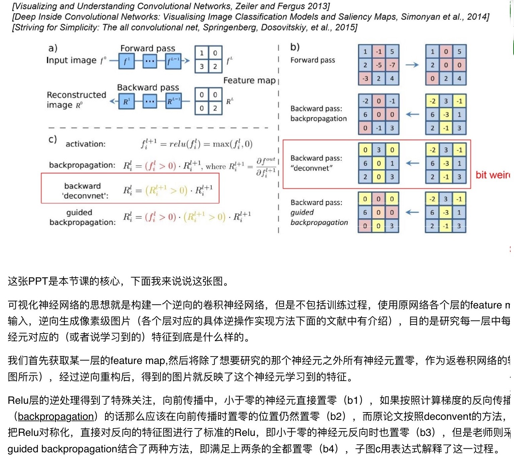

### 10.2 方案二：通过训练，梯度更新获得最优输入

还有一种方案是，输入一张随机图片或者全0图片到已经训练好卷积网络，根据loss函数计算随机图片各像素点的梯度，然后更新图片的像素点的值，如此反复，最后学习到一张图片，这张图片满足feature map特征。

网友的一张图，来源：

```
https://www.cnblogs.com/hellcat/p/7149348.html
```

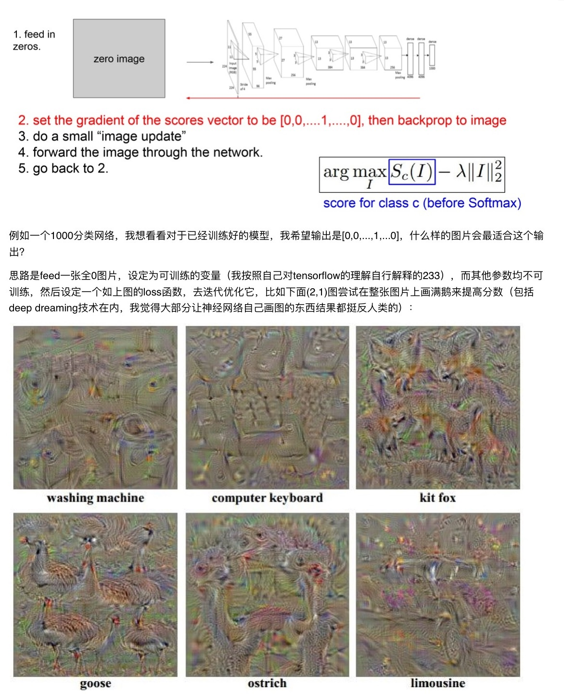

### 10.3 实践一： 直观感受一下卷积的feature map

使用caffe model zoo里的一个识别性别和年龄的卷积网络模型，编码调用该模型，看看隐藏层里feature map的输出是什么样子。

```
https://talhassner.github.io/home/publication/2015_CVPR
```

主要代码如下：

```c
//每个卷积核输出一张小图，把这些小图拼接成一张大图
void paste_img(Mat & big, Mat & small, int row, int col)
{
	int ch = small.channels();
	int height = small.rows;
	int width = small.cols;
	if (big.channels() != ch || ch != 3 && ch != 1)
	{
		fprintf(stderr, "channel mismatch!\n");
		return;
	}
	for (int c = 0; c < ch; c++)
	{
		for (int h = 0; h < height; h++)
		{
			for (int w = 0; w < width; w++)
			{
				int hh = row * height + h;
				int ww = col * width + w;
				if (ch == 3)
				{
					*(big.ptr<Point3_<uchar>>(hh, ww)) = *(small.ptr<Point3_<uchar>>(h, w));
					
				}
				else if (ch == 1)
				{
					big.at<char>(hh, ww) = small.at<char>(h, w);
				}
			
			}
		}
	}
}
//显示某个卷积层输出的blob里feature map
void check_conv_blob(boost::shared_ptr<Blob<float> > blob)
{
	int ch = blob->channels();
	int height = blob->height();
	int width = blob->width();
	const float * ptr = blob->cpu_data();
	if (blob->num() != 1)
	{
		fprintf(stderr, "num in blob should be 1! %d\n", blob->num());
		return;
	}

	int cnt = ceil(sqrt(ch));
	Mat big = cv::Mat::zeros(cnt*height, cnt*width, CV_8UC1);
	
	for (int c = 0; c < ch; c++)
	{
		cv::Mat img = cv::Mat::zeros(height, width, CV_8UC1);
		
		for (int h = 0; h < height; h++)
		{
			for (int w = 0; w < width; w++)
			{
				img.at<uchar>(h, w) = ptr[c*width*height + h * width + w];
				if (c == 0 && h == 13)
				{
					printf("%.2f ", ptr[c*width*height + h * width + w]);
				}
			}
			if (c == 0 && h == 13)
			{
				printf("\n");
			}	
		}
		paste_img(big, img, c / cnt, c%cnt);
	}
	cv::namedWindow("blob");
	cv::imshow("blob", big);
	cv::waitKey(0);
}
//调用方法：
int index1 = get_blob_index(net, "pool1");
check_conv_blob(net->blobs()[index1]);
```

输出如下（为了看得更清楚，右边的feature map提亮了），似乎看不出什么直观的特征来：

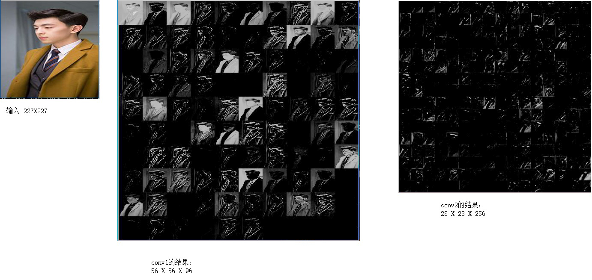

### 10.4 实践二：根据输出学习出一张最优输入图片

还是使用已经训练好的性别分类网络模型。

主要代码如下：
```c
void visulization(boost::shared_ptr<Net<float> > net)
{
	float data_input[input_channel][input_size][input_size];
	
	//初始输入图片是全1的黑图
	int width, height, chn;
	cv::Mat img = cv::Mat::ones(input_size, input_size, CV_8UC3);
	for (height = 0; height < input_size; ++height)
	{
		for (width = 0; width < input_size; ++width)
		{
			cv::Point3_<uchar>* p = img.ptr<cv::Point3_<uchar> >(height, width);
			
			data_input[0][height][width] = p->x ;//B
			data_input[1][height][width] = p->y;//G
			data_input[2][height][width] = p->z ;//R
		}
	}
	
	int it;
	float loss = 1;
	for (it = 0; it < 100 && loss > 0.001; ++it)//迭代100次，或者直到loss小于0.001
	{
		float label = 1.0;
		caffe_forward(net, (float*)data_input, label);
		net->Backward();
	
		//取巧，Scale层的bottom blob的梯度，就是输入图片的梯度
		int index1 = get_blob_index(net, "data");
		boost::shared_ptr<Blob<float> > blob = net->blobs()[index1];
		const float * diff = blob->cpu_diff();//梯度保存在这里
	
		//计算这次迭代的loss值
		index1 = get_blob_index(net, "loss");
		blob = net->blobs()[index1];
		unsigned int num_data = blob->count();
		loss = blob->cpu_data()[0];
		printf("iter %d, loss=%f\n", it, loss);
	
		//根据梯度更新输入，其他参数不更新
		update_input(&data_input[0][0][0], diff);
	}
	
	//显示输入的“图片”，保存到文件用于分类验证
	show_input(&data_input[0][0][0]);
	save_input(&data_input[0][0][0]);
}
```

[使用的train_val.prototxt在这里](code/dnn_ml/visualization/gender_train_val.prototxt)

[训练的c代码在这里](code/dnn_ml/visualization/TrainedModel.cpp)

train_val.prototxt文件有一些细微改动：

1. 插入一个scale层以获得输入图片的像素上的梯度。scale层的前向传播效果是X1，即不改变输入图片的值和尺寸
2. 因为标注的label的尺寸要求是[1]，插入flatten层，将Input类型的四维输入转化为1维
3. 网络有两个输入blob，分别输入图片像素和标注
4. 使用layer而不是layers来表示各层参数，layers是被废弃的老版本参数表示方法

如下面所示：

```
layer {
  name: "input"
  type: "Input"
  top: "data1"
  top: "label1"
  input_param {
    shape { dim: 1 dim: 3 dim: 227 dim: 227 }
    shape { dim: 1 dim: 1 dim: 1 dim: 1 }
  }
}
layer {
name: "flat" 
type: "Flatten"
bottom: "label1"
  top: "label"
}
layer { 
  name: "scale"
  type: "Scale"
  bottom: "data1"
  top: "data" 
  param {lr_mult: 1 decay_mult: 0}
  param {lr_mult: 1 decay_mult: 0}
  scale_param {
    bias_term: True
    filler {      type: 'constant'      value: 1    }
    bias_filler {      type: 'constant'      value: 0    }
  }
}
```

运行效果不错，很快收敛（lr=4000）：

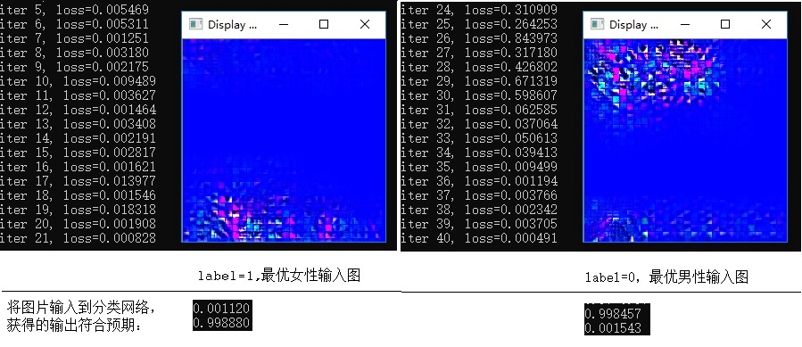

将上面学习到的图片输入到分类网络里，分类准确且置信度很高。但不符合直观的人类视觉对性别的理解。

**关于lr_mult的理解，要小心：**

lr_mult不只是影响本层参数更新的梯度，还可能导致本层的Backward_cpu/gpu函数完全不被调用。

有这样一个递归的规律：

1. 通常，Input层、 Data层这些读取输入数据的层不需要做backward计算
2. 如果从第0层到第n层，都不需要backward计算，且第n+1层的lr_mult参数为0，那么第n+1层也不需要backward计算。从0到n+1层的backward_cpu/gpu函数都不会被调用。

另外还遭遇了一个奇怪问题，折腾了半天。

编译vc工程来调用训练好的模型的时候，layer.hpp里vector类型的loss_成员变量的size()总是会在继承者例如InputLayer初始化后变得很大：1065320319，而正确的值应该是0.

网上也有网友遇到类似的问题（搜索1065320319即可）。后来我检查include目录，include的目录有这么几个：

```
caffe-windows\build\install\include
caffe-windows\build\include
caffe-windows\include
```

感觉第一行目录是重复的，就去掉它并删除了目录下的所有内容。然后就好了。可能有头文件没有更新，导致内存踩踏乱了。

### 10.5 将照片艺术化（art style transfer）

受上面的启发，可以实现照片艺术化渲染：

1. 准备一个已经训练好的卷积神经网络，例如AlexNet和它的caffemodel
2. 将一张艺术作品输入到alexnet，前向传播，保存好网络中某一层（假设是conv5）的feature map，用作标注数据（ground truth）
3. 将一张照片和上一步保存的标注数据输入到修改过的alexnet，经前向传播，照片也会在conv5产生feature map，该feature map与标注（艺术品的feature map）的欧式距离作为损失函数，通过反向传播，获得输入层的梯度。
4. 修改输入的照片的像素，使得损失函数变小，如此反复迭代，照片因此具备艺术作品的风格。

alexnet的官网：

```
https://github.com/BVLC/caffe/tree/master/models/bvlc_alexnet
```

[训练用的网络prototxt在这里](code/dnn_ml/art/train_val.prototxt)

[训练用的c代码在这里](code/dnn_ml/art/TrainModel.cpp)

[获得标注的的c代码在这里](code/dnn_ml/art/GetGroundTruth.cpp)

用梵高的星空作为目标艺术作品，渲染的照片前后对比如下图右侧：

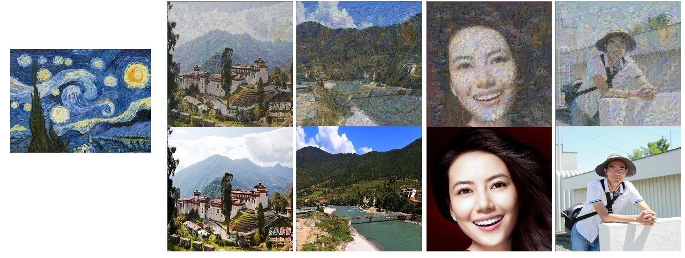

训练过程中，损失函数也是单向递减的：

```
iter 0, loss=1408387.000000
iter 113, loss=195777.046875
iter 226, loss=112064.039063
iter 339, loss=80029.789063
iter 452, loss=64950.152344
...
iter 9492, loss=5543.076172
iter 9605, loss=5503.452637
iter 9718, loss=5466.431641
iter 9831, loss=5430.252441
iter 9944, loss=5395.689453
```

# 11 、循环神经网络（RNN）、生成型对抗网络（GAN）等

关于RNN和GAN的原理介绍，网上资料很多，这里不誊抄了。caffe的突出优势在CNN网络，RNN和GAN的相关试验代码我是用mxnet的gluon接口完成的，[详细见这里](https://github.com/bisonliao/daydayup/tree/master/mxnet)

下面这张是GAN试验输入随机数据，生成的手写数字图片：

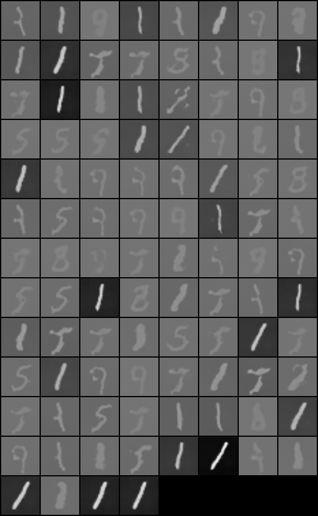


下面这张是训练得到GAN网络，输入地图，输出卫星图片，反过来也是可以的：

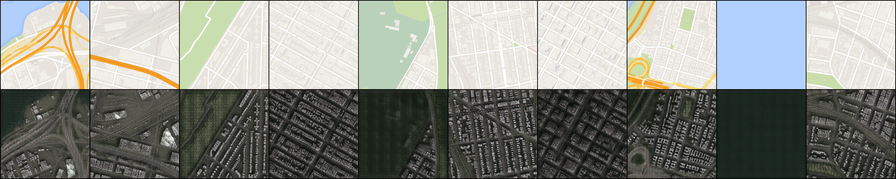

# 12、最大似然估计与KL散度

如果某个随机变量的采样满足某种分布，就可以根据这组采样对该分布的参数（例如均值、标准差等）进行估计。我们希望该分布的参数能够以最高的概率产生这些样本，这就是最大似然估计。

如果观察到的数据是D1,D2,D3,...,Dn，那么最大似然估计的目标是：

$$
max P(D1, D2, D3,...., Dn)
$$

为了方便计算联合概率，我们引入一个假设，即独立同分布（independent and identically distributed)，

简称i.i.d.。所以最大似然估计的目标变换为：
$$
max ∏ P(Di)
$$

进一步的，为了方便求极值，对上式取对数，将连乘变换为连加：
$$
max ∑ log(P(Di))
$$
以伯努利分布为例， 假设P(x=1) = p, P(x=0)=1-p，即
$$
P(X)= p^(X) *  (1-p)^(1-X)
$$

现有观察到的样本 D1, D2, D3, ..., Dn，求参数p。

用最大似然估计，求目标式子的极值，也就是导数为0的点，可得：
$$
p=1/N * ∑Di
$$
KL散度是信息论中描述两个概率分布P和Q差异的一种方法，两个分布越接近，KL散度就越小。跟交叉熵有点类似哈。

离散概率分布的情况下：
$$
K(P||Q) = ∑(P(Xi) log(P(Xi)/Q(Xi)))
$$
连续概率分布的情况下，是两个分布的概率密度函数的函数的导数：
$$
K(P||Q) = ∫P(x) log(P(x)/Q(x)) dx
$$
这些奇怪的概念和机器学习有什么关系呢？

# 13 、关于人脸识别

人脸识别是计算机视觉方面最重要的一个领域，专门拿出来说一下。

平时说的人脸识别，准确的说包括两方面：

1. 人脸验证：输入身份ID和一张人脸图片，输出该ID和图片是否一致，1 vs 1的比对
2. 人脸识别：输入人脸图片，输出对应的身份ID， 1 vs n 的对比


用来实现人脸验证和人脸识别的深度网络主要是两类：

1. 对于身份ID个数比较有限的情况，可以训练一个CNN分类网络，每个分类对应一个身份ID
2. 训练孪生网络，输入两张图片，输出他们是否相似的判断；通过提取孪生网络的隐含层，间接得到一个网络，输入一张图片，输出一个特征码。两张图片对应的特征码之间的距离，表示了他们的相似度。


上面两类网络，孪生网络的优点是：

1. 新加入人ID，不需要重新训练模型；
2. 对训练数据的数量要求较少，1两张图片就可以满足


孪生网络如何解决人脸识别这样的1：N需求呢？

一种方法是对图片的特征码进行聚类，距离较近的为同一个聚类。假设对已有的图片聚类为十万个聚类：

1. 输入一张图片，提取特征码，跟十万个聚类的质心计算距离，取距离最小的 t 个质心代表的聚类，认为输入的图片可能和这t个聚类中的图片相似度比较高
2. 将输入的图片与这t个聚类中的每张图片计算相似度，取最相似的若干图片，这些图片对应的身份就是输入图片识别出来的身份

这个方法也用来实现视频指纹、以图搜剧、相似图片搜索等产品特性


除了深度网络，使用传统的特征算法也可以提取人脸或者图片的特征，例如eigenface， 可以见另外一篇文章：

```
https://github.com/bisonliao/goodgoodstudy/blob/master/%E7%BA%BF%E6%80%A7%E4%BB%A3%E6%95%B0%E8%AF%BB%E4%B9%A6%E7%AC%94%E8%AE%B0.md#eigenface
```

# 14、轻量化模型

实现模型的加速和瘦身，有多种方法：

1. 轻量化设计，采取分组卷积、空洞卷积、1X1卷积等方式降低模型的参数量和计算量
2. BN层合并，将BN层的计算合并到卷积层
3. 网络剪枝，对于大量接近于0的参数，去掉这些参数（我理解是直接置为0吧?）
4. 参数量化，将网络的高精度参数使用低精度表示方式，例如float32量化为float16
5. 张量分解，利用PQ分解、SVD分解等方法，将原始张量分解为低秩的若干张量运算

对于轻量化模型设计，主要有

1. SqueezeNet
2. MobileNet
3. ShuffleNet

## 14.1 SqueezeNet

主要思想是，先通过1X1卷积减少卷积核参数同时，对通道数进行降维，减少后续卷积层引入的参数，然后使用多个尺寸的卷积核进行计算，以保留更多的信息，提升分类准确性。

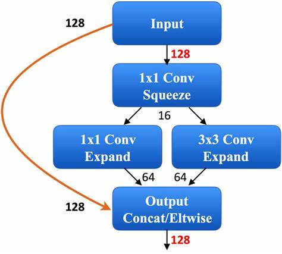

上图的结构，与直接使用3X3的卷积核相比，需要学习的参数量为：

```
3X3卷积核： 128X3X3X128=147,456
squeeze: 128X1X1X16+16X1X1X64+16X3X3X64=12,288   十分之一不到
```

一段PyTorch示例代码：
```python
import torch
from torch import nn

class Fire(nn.Module):

    def __init__(self, inplanes, squeeze_planes, expand_planes):
        super(Fire, self).__init__()
        self.conv1 = nn.Conv2d(inplanes, squeeze_planes, kernel_size=1, stride=1)
        self.bn1 = nn.BatchNorm2d(squeeze_planes)
        self.relu1 = nn.ReLU(inplace=True)
        self.conv2 = nn.Conv2d(squeeze_planes, expand_planes, kernel_size=1, stride=1)
        self.bn2 = nn.BatchNorm2d(expand_planes)
        self.conv3 = nn.Conv2d(squeeze_planes, expand_planes, kernel_size=3, stride=1, padding=1)
        self.bn3 = nn.BatchNorm2d(expand_planes)
        self.relu2 = nn.ReLU(inplace=True)
    
    def forward(self, x):
        x = self.conv1(x)
        x = self.bn1(x)
        x = self.relu1(x)
        out1 = self.conv2(x)
        out1 = self.bn2(out1)
        out2 = self.conv3(x)
        out2 = self.bn3(out2)
        out = torch.cat([out1, out2], 1)
        out = self.relu2(out)
        return out
```

## 14.2 MobileNet

MobileNet主要是采用逐通道卷积作为基本单元，逐通道卷积，在前面第5章节有详细介绍。

这里有一段MobileNet的示例代码：

```python
from torch import nn

class MobileNet(nn.Module):
    def __init__(self):
        super(MobileNet, self).__init__()

        def conv_bn(dim_in, dim_out, stride):
            return nn.Sequential(
                nn.Conv2d(dim_in, dim_out, 3, stride, 1, bias=False),
                nn.BatchNorm2d(dim_out),
                nn.ReLU(inplace=True)
            )
    
        def conv_dw(dim_in, dim_out, stride):
            return nn.Sequential(
                nn.Conv2d(dim_in, dim_in, 3, stride, 1, groups= dim_in, bias=False),
                nn.BatchNorm2d(dim_in),
                nn.ReLU(inplace=True),
                nn.Conv2d(dim_in, dim_out, 1, 1, 0, bias=False),
                nn.BatchNorm2d(dim_out),
                nn.ReLU(inplace=True),
            )
        self.model = nn.Sequential(
            conv_bn(  3,  32, 2), 
            conv_dw( 32,  64, 1),
            conv_dw( 64, 128, 2),
            conv_dw(128, 128, 1),
            conv_dw(128, 256, 2),
            conv_dw(256, 256, 1),
            conv_dw(256, 512, 2),
            conv_dw(512, 512, 1),
            conv_dw(512, 512, 1),
            conv_dw(512, 512, 1),
            conv_dw(512, 512, 1),
            conv_dw(512, 512, 1),
            conv_dw(512, 1024, 2),
            conv_dw(1024, 1024, 1),
            nn.AvgPool2d(7),
        )
        self.fc = nn.Linear(1024, 1000)
    
    def forward(self, x):
        x = self.model(x)
        x = x.view(-1, 1024)
        x = self.fc(x)
        return x
```

## 14.3 通道混洗（ShuffleNet）

前面的MobileNet使用逐通道卷积 ，并使用 1X1的卷积对通道信息融合、改变通道数。但是1X1的卷积参数太多，还不够轻量。

为此，ShuffleNet不使用1X1卷积来对通道信息进行融合，而是通过把输出的feature map在通道维度进行洗牌，改变通道顺序的方式来融合。

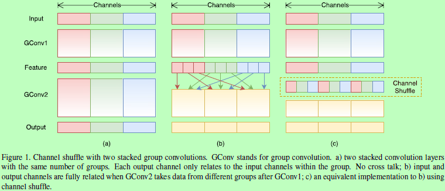

通道混洗，通过Transpose() / Flatten() / Reshape()等常规张量操作即可实现：

```python
def channel_shuffle(x, groups):
    batchsz, num_chn, height, width = x.data.size()
	chn_per_grp = num_chn / groups
	x = x.view(batchsz, groups, chn_per_grp, height, width)
	x = torch.transpose(x, 1, 2).contiguous()
	x = x.view(batchsz, -1, height, width)
	return x
```

