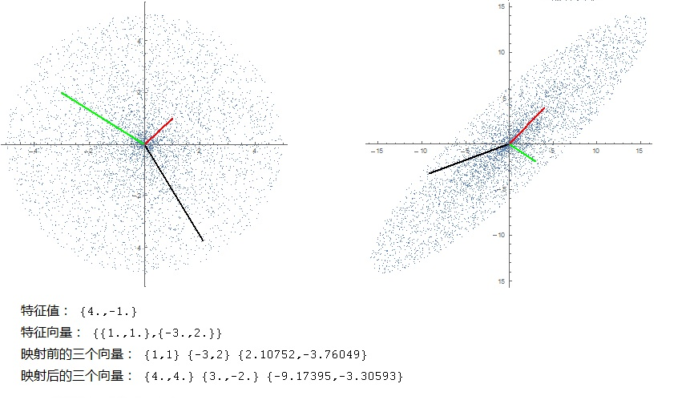
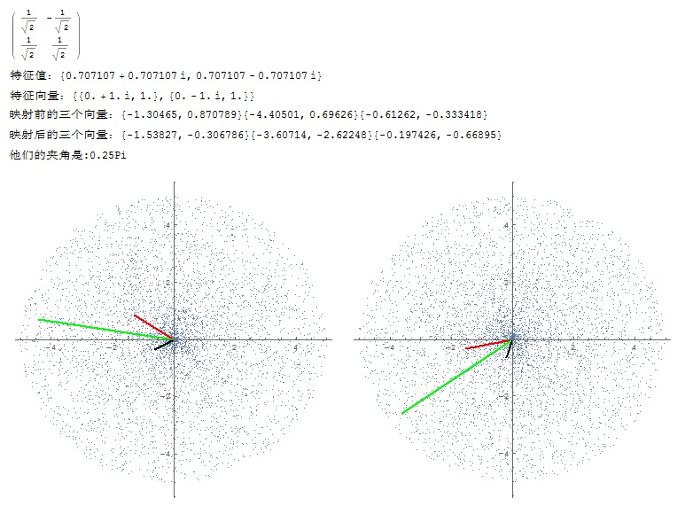
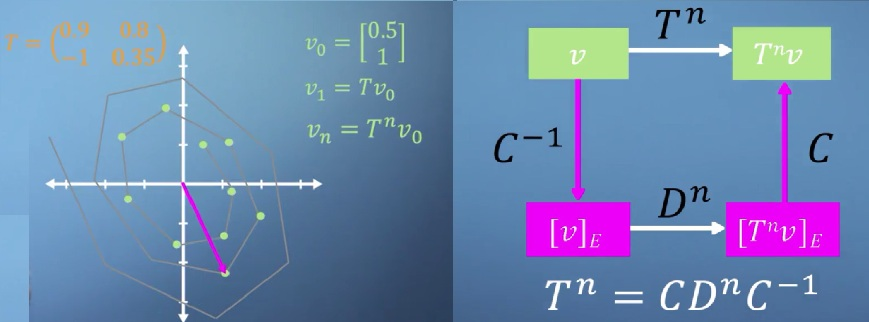
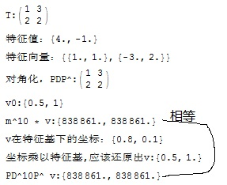
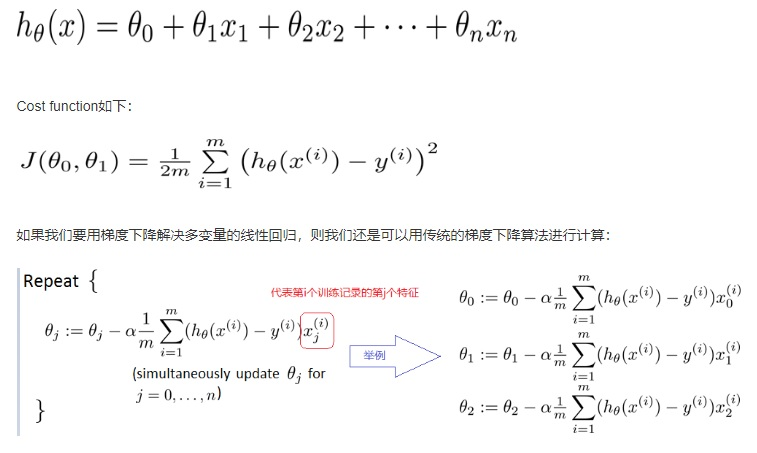
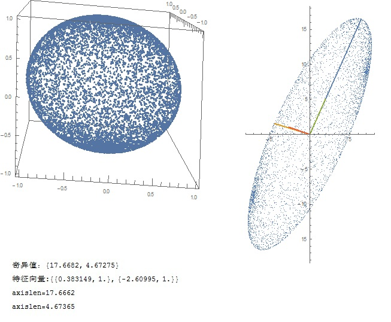
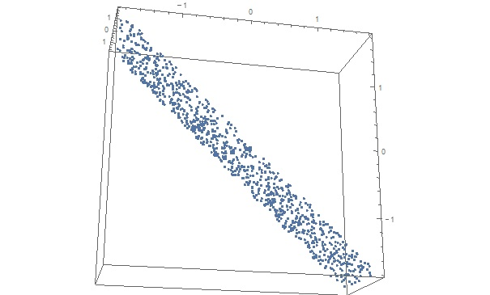
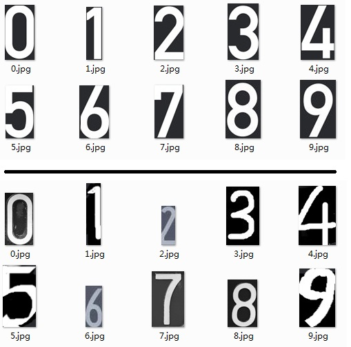

先尝试浅显的说明线性代数是研究什么鬼的。

根据coursera上的一门伦敦帝国大学的线性代数课程：

1. 向量是一种在空间里到处移动的对象，有方向、长度这样的属性，定义在其上面的有标量乘、点积、加法、线性组合、基变换等等运算
2. 矩阵是作用在向量上的一种映射，将向量从一个空间的某位置，映射到另外一个空间的另外位置。
3. 特殊的：方阵不改变映射前后的空间的维度，它作用于向量，包括旋转与拉伸。对于某些向量，方阵在将其映射的过程中，保持方向不变（或者完全反向），这就是特征值和特征向量的几何意义
4. 一般的：矩阵A将m维空间的一个单位超球，映射到n维空间的一个超椭球，椭球的各个半轴的长度，就等于该矩阵的奇异值。椭球的轴的方向由A'.A这个对称矩阵的特征向量指示
5. 进一步的，线性代数还会研究映射的更多的性质：对于像y，映射是否一定可以找到原像x （方程组相容）？有几个解？ 可逆的矩阵对应的是单射且满射，对称矩阵又有哪些性质，如果没有解，可否有近似解...

线性代数解决的实际问题：

1. 解线性方程组
2. 求线性方程的近似解
3. 向量在某个超平面或者某个向量上的投影
4. 坐标变换、构造正交基
5. 主成分分析
6. 图片的线性变换、图片的有损压缩


# 第一章：线性方程组


# 第二章：矩阵代数


# 第三章：方阵的行列式


# 第五章：方阵的特征值和特征向量


nXn方阵的特征值，如果允许为复数，一定存在有n个。但实的特征值不是一定存在的。

下面这段代码演示特征值与特征向量的意义：

```
ClearAll["Global`*"];
m = {
   {1, 3},
   {2, 2}
   };

(*矩阵m的特征值特征向量*)
eigenvalue = Eigenvalues[m];
eigenvect = Eigenvectors[m];
Print["特征值：", N[eigenvalue]];
Print["特征向量：", N[eigenvect]];
data = {};
num = 10000;
(*圆形区域上的num个点,data前面两个点是特征向量*)
data = Join[data, {eigenvect[[1]]}];
data = Join[data, {eigenvect[[2]]}];
Do[
  alpha = RandomReal[3.14159265*2];
  r = RandomReal[5];
  x = r*Cos[alpha];
  y = r*Sin[alpha];
  
  data = Join[data, {{x, y}}];
  ,
  {i, 1, num}
  
  ];

Show[ListPlot[data, AspectRatio -> 1],
 ListLinePlot[{{0, 0}, data[[1]]}, PlotStyle -> {Red}],
 ListLinePlot[{{0, 0}, data[[2]]}, PlotStyle -> {Green}],
 ListLinePlot[{{0, 0}, data[[3]]}, PlotStyle -> {Black}]
 ]
Print["映射前的三个向量：", data[[1]], data[[2]], data[[3]]];

data2 = m.Transpose[data];
data2 = Transpose[data2];
Print["映射后的三个向量：", data2[[1]], data2[[2]], data2[[3]]];
Show[ListPlot[data2, AspectRatio -> 1],
 ListLinePlot[{{0, 0}, data2[[1]]}, PlotStyle -> {Red}],
 ListLinePlot[{{0, 0}, data2[[2]]}, PlotStyle -> {Green}],
 ListLinePlot[{{0, 0}, data2[[3]]}, PlotStyle -> {Black}]]

```

输出如下：



可以看到，矩阵m对输入的区域做了拉伸和旋转，圆形区域变成了椭圆区域。

其中观察红、绿、黑三个向量，红色和绿色向量是两个特征向量，映射后方向不变，只发生了拉伸，拉伸的倍数等于特征值；黑色的向量被拉伸和旋转了。

### 特殊的情况

有的方阵是没有（实数）特征值的，例如下面这个将输入旋转一定度数的矩阵：



有的方阵，所有的输入向量都是它的特征向量，例如把向量只做拉伸的方阵：

```C
{ {2,0},
  {0,2} }
```

可惜的是，mathematica的Eigenvectors[m] 不能很好的反应这种矩阵的特征向量的特征。

### 对角化的意义

对角化是为了能够快速计算A^k，k比较大。



如上图所示，对角化可以理解为将v转换到特征基下的空间，然后乘以对角矩阵的n次方，然后在转换回原空间。

一个实际的典型例子是搜索用到的PageRank。web世界存在数亿计的网页，网页之间存在跳转，那么可以表示为一个巨大转移矩阵A，它非常稀疏。要计算最终各个网页的权重，就是计算A^n，n->无穷大。

下面这段代码演示和验证：

```
ClearAll["Global`*"];
m = {
   {1, 3},
   {2, 2}
   };
Print["T:", MatrixForm[m]];
(*矩阵m的特征值特征向量*)
eigenvalue = Eigenvalues[m];
eigenvect = Eigenvectors[m];
Print["特征值：", N[eigenvalue]];
Print["特征向量：", N[eigenvect]];
p = Transpose[eigenvect];

d = DiagonalMatrix[eigenvalue];
Print["对角化，PDP^:", MatrixForm[p.d.Inverse[p]]];
x = {0.5, 1};
Print["v0:", x];
Do[
  x = m.x;
  ,
  {i, 1 , 10}
  ];
Print["m^10 * v:", x];
x = {0.5, 1};

Print["v在特征基下的坐标：", Inverse[p].x];
Print["坐标乘以特征基,应该还原出v:", Transpose[eigenvect].(Inverse[p].x)];
x = {0.5, 1};
x = Inverse[p].x;
Do[
  x = d.x;
  ,
  {i, 1 , 10}
  ];
x = p.x;
Print["PD^10P^ v:", x];
```

输出如下：



# 第六章：正交性与最小二乘法


下面这段代码可以求Ax=b的最优解：

```
f[A_, b_] := Module[{nullspacebase, aa, colnumofa},
   nullspacebase = NullSpace[Transpose[A]];

   aa = Join[Transpose[A], nullspacebase];
   aa = Transpose[aa];

   colnumofa = Last[Dimensions[A]];
   LinearSolve[aa, b][[1 ;; colnumofa]]
   ];
```

求Ax=b的最优解，还有个办法，就是机器学习中的线性回归：



# 第七章：对称矩阵和奇异值分解


这本书读到第6章的时候我还觉得他写得挺好，但是到第七章的时候，让人大失所望。奇异值分解、特征值分解应该是线性代数最重要的事情，作者讲得语焉不详。第七章的标题居然是：对称矩阵与二次型！

他妈的，我帮着改了个更好的标题。

### 奇异值的几何意义

矩阵A将m维空间的一个单位超球，映射到n维空间的一个超椭球，椭球的各个半轴的长度，就等于该矩阵的奇异值。椭球的轴的方向由A'.A这个对称矩阵的特征向量指示。

下面的代码演示：

```
ClearAll["Global`*"];
data = {};
num = 10000;
(*球面上的1万个点*)
Do[
  alpha = RandomReal[3.14159265];
  beta = RandomReal[3.14159265*2];
  x = Sin[alpha]*Cos[beta];
  y = Sin[alpha]*Sin[beta];
  z = Cos[alpha];
  data = Join[data, {{x, y, z}}];
  ,
  {i, 1, num}
  
  ];
ListPointPlot3D[data, AspectRatio -> 1]
m = {
   {1, 3, 7},
   {-5, 13, 9}
   };
(*矩阵m的奇异值和m'.m的特征向量*)
singular = SingularValueList[m];
eigenvect = Eigenvectors[m.Transpose[m]];
Print["奇异值：", N[singular]];
Print["特征向量:", N[eigenvect]];
(*经m映射后的椭球*)
data2 = m.Transpose[data];
data2 = Transpose[data2];

(*扫描椭球中的所有点，与特征向量夹角为0的点是轴上的点*)
axislen = 0;
axis1points = {};

Do[
  u = data2[[i]];
  v = eigenvect[[1]];
  If[u.u == 0 || v.v == 0, Continue[], null];
  cosvalue = u.v/(Sqrt[u.u]*Sqrt[v.v]);
  ulen = Sqrt[u.u];
  If[ cosvalue > 0.999 && ulen > axislen, axislen = ulen; 
   axis1points = Join[{{0, 0}}, {u}], null];
  ,
  {i, 1, num}
  ];
Print["axislen=", axislen];
(*扫描椭球中的所有点，与特征向量夹角为0的点是轴上的点*)
axislen = 0;
axis2points = {};

Do[
  u = data2[[i]];
  v = eigenvect[[2]];
  If[u.u == 0 || v.v == 0, Continue[], null];
  cosvalue = u.v/(Sqrt[u.u]*Sqrt[v.v]);
  ulen = Sqrt[u.u];
  If[ cosvalue > 0.999 && ulen > axislen, axislen = ulen; 
   axis2points = Join[{{0, 0}}, {u}], null];
  ,
  {i, 1, num}
  ];
Print["axislen=", axislen];
line1 = {{0, 0}, eigenvect[[1]]*5};
line2 = {{0, 0}, eigenvect[[2]]*1};
Show[ListPlot[data2, AspectRatio -> 2],
 ListLinePlot[{axis1points, axis2points, line1, line2}, 
  AspectRatio -> 2]]
```

输出如下：



### 为什么要将矩阵做特征值分解和奇异值分解呢？

类似对一个自然数做因式分解，可以更好的理解一个矩阵对应的线性变换有什么性质。

对角矩阵作用于一个向量x，相当于将x沿着坐标轴方向进行了拉伸；

对称矩阵作用于一个向量x，相当于将x沿着某些方向进行了拉伸；

一般的矩阵作用于一个向量x，对x既有拉伸，也有旋转。

这里我还是没有搞懂。。。

### 奇异值分解的实际用途：

特征值分解的局限性：

1. 只能对方阵进行处理
2. 有的方阵有不一定能进行三角化，不能进行特征值分解

相比之下，奇异值分解是一定可以进行的。

#### 图像有损压缩

下面的代码演示了奇异值分解用于图像有损压缩：

```
ClearAll["Global`*"];

svdCompress[A_, qnum_] := 
  Module[{u, w, v, result, m, n, i, j, u1, v1, q},
   {u, w, v} = SingularValueDecomposition[A];
   m = Length[A];
   n = Length[A[[1]]];
   q = qnum;
   If[q > Min[m, n], q = Min[m, n], null];
   result = Table[ Array[0*#1 &, n], {i, 1, m}];
   Print["datasize:", q * (m + n)];
   Print["singular values:", Table[w[[i, i]], {i, 1, q}]];
   Do[
      u1 = Table[{u[[j, i]]}, {j, 1, m}];
      v1 = {v[[;; , i]]};
      result = result + (u1.v1)*w[[i, i]];
      ,
      {i, 1, q}
   ];

   result
   ];

img = Import["e:\\reba.jpg"];
img = ColorConvert[img, "Grayscale"];
data = ImageData[img];
Print["original datasize:", Length[data]*Length[data[[1]]]];
compresseddata = svdCompress[data, 20];
Image[compresseddata]
compresseddata = svdCompress[data, 50];
Image[compresseddata]
compresseddata = svdCompress[data, 1000];
Image[compresseddata]
```

执行输出如下：


前50个奇异值如下：

```
singular values:{321.442,54.0135,46.6778,33.4076,31.1938,26.5388,25.1744,23.123,20.0867,19.9147,18.4442,17.3813,15.2275,14.171,13.8541,13.2777,12.5815,12.1304,11.7502,11.6244,10.6624,10.4412,10.2138,9.96321,9.83099,9.34661,9.12183,8.89255,8.6118,8.35397,8.31457,8.01118,7.96017,7.74558,7.51425,7.33778,7.2599,6.96847,6.87614,6.72356,6.63304,6.43412,6.2804,6.17545,5.98587,5.92536,5.84698,5.64526,5.56161,5.45043}
```

#### 主成分分析

wiki里面，主成分分析，等价于对矩阵X的奇异值分解、对X'.X的特征值分解：

> > > Depending on the field of application, it is also named the discrete Karhunen–Loève transform (KLT) in signal processing ,  singular value decomposition (SVD) of **X**, eigenvalue decomposition  (EVD) of **X**T**X** in linear algebra.
> >
> > >  PCA can be done by eigenvalue decomposition of a data covariance  matrix or singular value decomposition of a data matrix , usually after a normalization step of the initial data. 
> > >
> > > PCA defines a new orthogonal coordinate system  that optimally describes variance in a single dataset.This is done by using only the first few principal components so that the dimensionality of the transformed data is reduced.

主成分分析的时候，数据集组织成这样一个矩阵X：X的每一列是一个数据样本，共有n个数据样本；X每行表示一个样本的feature（中文叫特征，但与特征值容易混淆，改用feature），假设有m个feature。

通常m<<n。

feature之间可能存在冗余度，例如吴恩达老师课上举了个形象的例子：每个样本有两个feature，一个是用英寸表示的身高，另外一个是用厘米表示的身高。由于测量过程中的误差扰动、且feature通常成百上千，不容易直观发现这种冗余，而主成成分分析就是要去掉这种冗余度，降维，减少feature的个数。

某种意义上说，是对数据feature进行分析，发现主要的自由度，去除次要的自由度。上面身高的例子，实际上只有一个自由度，而表面上有两个自由度，导致了维度灾难。

下面例子中的data，是1000个样本，每个样本包括三个feature：

```
ClearAll["Global`*"];
data = {};
num = 1000;
Do[
  x = RandomReal[{-100, 100}];
  y = 100 -x + RandomReal[{-10, 10}];
  z = RandomReal[{-100, 100}];
  data = Join[data, {{x, y, z}}];
  ,
  {i, 1, num}
  
  ];
ListPointPlot3D[data, AspectRatio -> 1]

```


从上图可以看出，虽然每个样本都有三个feature，实际上存在很大的冗余，自由度受到了限制，分布在三维空间中的 y=100-x这样一个平面上，有效的feature数更接近2。

在进行主成分分析前，一定要对数据做标准化处理：每个feature都减去该feature的均值，并除以标准差。

我们的数据伪随机产生的，是均匀分布，所以处理上比较简单，直接做归一化处理，映射到[-1,1]：

```
Do[
  data[[i]][[1]] = (data[[i]][[1]] - 0)/100;
  data[[i]][[2]] = (data[[i]][[2]] - 100)/100;
  data[[i]][[3]] = (data[[i]][[3]] - 0) /100;
  ,
  {i, 1, num}

  ];
data = Transpose[data];
```

或者，也可以这样标准化，会发现输出有同样的结论：

```
mv = Mean[data];
std = StandardDeviation[data];

Print["mean values:", mv];
Print["std values:", std];
Do[
  data[[i]][[1]] = (data[[i]][[1]] - mv[[1]])/std[[1]];
  data[[i]][[2]] = (data[[i]][[2]] - mv[[2]])/std[[2]];
  data[[i]][[3]] = (data[[i]][[3]] - mv[[3]]) /std[[3]];
  ,
  {i, 1, num}

  ];
data = Transpose[data];
```

求三个feature的协方差矩阵S，并分析协方差矩阵的特征值。

可以看出：这个过程实际上是对协方差矩阵做对角化，由于协方差矩阵是对称的，对角化的矩阵是正交的，所以PCA也是将原数据变换到正交基下的正交线性变化过程。

因为S=A.A'，所以S的特征值就是A的奇异值的平方（S多除了num）：

```
S = data.Transpose[data]/ num;
eigval = Eigenvalues[S];
eigvect = Eigenvectors[S];
Print["特征值：", eigval];
Print["特征向量:", eigvect];
Print["特征向量的大小：", Sqrt[eigvect[[1]].eigvect[[1]]]];
Print["特征向量的大小：", Sqrt[eigvect[[2]].eigvect[[2]]]];
Print["特征向量的大小：", Sqrt[eigvect[[3]].eigvect[[3]]]];
u1 = Normalize[eigvect[[1]]];
y1 = u1.data; （*行向量u1分别与data的各列点积,[1X3] X [3Xn] = [ 1Xn] *)

u2 = Normalize[eigvect[[2]]];
y2 = u2.data;

u3 = Normalize[eigvect[[3]]];
y3 = u3.data;

data2 = {y1, y2, y3};
Print["data2的前5个采样:", MatrixForm[data2[[;; , 1 ;; 5]]]];
Print["data的第一个采样:", MatrixForm[data[[;; , 1 ;; 1]]]];
Print["特征向量乘以data2的第一个采样:", 
  MatrixForm[Transpose[eigvect].data2[[;; , 1 ;; 1]]]];
ListPointPlot3D[Transpose[data2], AspectRatio -> 0.1]

data3 = {y1, y2};
ListPlot[Transpose[data3]]
```


可以看到

1. 三个特征值，其中两个特征值的绝对值较大，另外一个较小；
2. 三个特征向量，分别指示的方向：y=-x方向（数据标准化后就从y=100-x移动到y=-x了）、z轴方向，y=x方向，三个方向是正交的。
3. 三个特征向量都是单位向量，即 ||v|| = 1，且相互正交，这三个特征向量形成单位正交基A，形成一个新的坐标系。A是可逆矩阵，满足A的转置等于A的逆
4. 原数据data映射到新数据data2，是乘以A的逆，也就是A的转置（每个特征向量作为相乘矩阵的行向量）；data2转换回data，是乘以A（每个特征向量作为相乘矩阵的列向量）。
5. 按照公式计算出新的样本矩阵data2，检视它的前5个采样，他们的第三个feature绝对值也比较小，数据几乎散落在一个平面内
6. data2的样本的feature值，就是原样本data在新的坐标系下的坐标。可以验证 三个特征向量按data2的第i列的各元素的线性组合，等于data的第i列
7. 因为data2的每个样本的第三个坐标（第三成分）都很小，对数据进行降维，抛弃第三成分y3，得到data3，将数据投射到二维面屏上
8. 协方差矩阵S的计算，可以不用那么多的采样，例如只需要100个采样，计算[3X100].[100X3]这样的矩阵乘法


小结：

1. 主成分析将采样数据转化到特征向量为坐标的新的坐标系下，特征值的大小标示新的坐标各元素的绝对值大小；
2. 新坐标下，某些成分（坐标）非常小，可以认为数据在这个维度上变化很小，可能是噪声，可以忽略，从而降维去掉这个维度。

我们尝试从降维后的data3恢复一下原数据看看：

```
data3 = Join[data3, {Table[0, {i, 1, num}]}];
data4 = Transpose[eigvect].data3;
ListPointPlot3D[Transpose[data4], AspectRatio -> 1]
```

输出的图形如下，是原data标准化后的数据分布，符合预期：



完整代码如下：

```
ClearAll["Global`*"];
data = {};
num = 1000;
Do[
  x = RandomReal[{-100, 100}];
  y = 100 - x + RandomReal[{-10, 10}];
  z = RandomReal[{-100, 100}];
  data = Join[data, {{x, y, z}}];
  ,
  {i, 1, num}
  
  ];
ListPointPlot3D[data, AspectRatio -> 1]
Do[
  data[[i]][[1]] = (data[[i]][[1]] - 0)/100;
  data[[i]][[2]] = (data[[i]][[2]] - 100)/100;
  data[[i]][[3]] = (data[[i]][[3]] - 0) /100;
  ,
  {i, 1, num}
  
  ];
data = Transpose[data];
S = data.Transpose[data]/ num;
eigval = Eigenvalues[S];
eigvect = Eigenvectors[S];
Print["特征值：", eigval];
Print["特征向量:", eigvect];
Print["特征向量的大小：", Sqrt[eigvect[[1]].eigvect[[1]]]];
Print["特征向量的大小：", Sqrt[eigvect[[2]].eigvect[[2]]]];
Print["特征向量的大小：", Sqrt[eigvect[[3]].eigvect[[3]]]];
u1 = Normalize[eigvect[[1]]];
y1 = u1.data;
u2 = Normalize[eigvect[[2]]];
y2 = u2.data;
u3 = Normalize[eigvect[[3]]];
y3 = u3.data;
data2 = {y1, y2, y3};
Print["data2的前5个采样:", MatrixForm[data2[[;; , 1 ;; 5]]]];
Print["data的第一采样:", MatrixForm[data[[;; , 1 ;; 1]]]];
Print["特征向量乘以data2的第一个采样:", 
  MatrixForm[Transpose[eigvect].data2[[;; , 1 ;; 1]]]];
ListPointPlot3D[Transpose[data2], AspectRatio -> 0.1]

data3 = {y1, y2};
ListPlot[Transpose[data3]]

data3 = Join[data3, {Table[0, {i, 1, num}]}];
data4 = Transpose[eigvect].data3;
ListPointPlot3D[Transpose[data4], AspectRatio -> 1]
```

[主成分析的wiki](https://en.wikipedia.org/wiki/Principal_component_analysis)

实际上，mathematica提供了一个函数，一步到位的输出PCA：PrincipalComponents[m]。

需要注意的是，m的组织是每行一个采样，行优先。

### eigenface

详细见https://en.wikipedia.org/wiki/Eigenface

下面是试验代码，由于mathematica限制，矩阵不能太大，所以图片resize到64X64：

```
ClearAll["Global`*"];
filelist = {"E:\\jaffe\\KA.AN1.39.tiff",
   "e:\\jaffe\\KL.AN1.167.tiff",
   "e:\\jaffe\\KM.AN1.17.tiff",
   "e:\\jaffe\\KR.AN1.83.tiff",
   "e:\\jaffe\\MK.AN1.125.tiff",
   "e:\\jaffe\\NA.AN1.211.tiff",
   "e:\\jaffe\\NM.AN1.104.tiff",
   "e:\\jaffe\\TM.AN1.190.tiff",
   "e:\\jaffe\\UY.AN1.146.tiff",
   "e:\\jaffe\\YM.AN1.61.tiff"
   };
num = 10;
sz = 64;
imgs = {};
Do[
  img = Import[filelist[[i]]];
  img = ImageResize[img, {sz, sz}];
  img = ColorConvert[img, "Grayscale"];
  data = ImageData[img];
  data = Flatten[data];
  AppendTo[imgs, data];
  ,
  {i, 1, num}
  ];
Print[Dimensions[imgs]];
mv = Mean[imgs];(* each feature a mean value, 65536 mean values*)

Do[
 imgs[[i]] = imgs[[i]] - mv;
 (*
 img = Image[Partition[imgs[[i]],256]];
 Print[img];
 *)
 ,
 {i, 1, num}
 ];

cov = Transpose[imgs].imgs/num;

eigenval = Eigenvalues[cov];
eigenvec = Eigenvectors[cov];

Print[Dimensions[eigenvec]];
Print[eigenval[[1 ;; 10]]];
total = Total[eigenval];
L = 0;
sum = 0;
Do[
  sum = sum + eigenval[[i]];
  L = L + 1;
  If[sum > total*0.9, Break[], null];
  ,
  {i, 1, sz * sz}
  ];
Print[L, " eigen values will be kept!"];
cm = eigenvec[[1 ;; L]];
imgs2 = Transpose[cm.Transpose[imgs]];
Export["e:\\imgs2.txt", imgs2, "Table"];
Export["e:\\mean.txt", mv, "List"];
Export["e:\\cm.txt", cm, "Table"];
```

上面代码建立了特征库，下面的代码在该库中查找一张图片：

```
ClearAll["Global`*"];
sz = 64;
img = Import["e:\\jaffe\\NM.HA3.97.tiff"];
img = ImageResize[img, {sz, sz}];
img = ColorConvert[img, "Grayscale"];
data = ImageData[img];
data = Flatten[data];
mv = Import["e:\\mean.txt", "List"];
cm = Import["e:\\cm.txt", "Table"];
imgs2 = Import["e:\\imgs2.txt", "Table"];
data = data - mv;
data = cm.data;
Print[Dimensions[data]];
num = First[Dimensions[imgs2]];
minDis = EuclideanDistance[data, imgs2[[1]]];
index = 1;
Do[
  distance = EuclideanDistance[data, imgs2[[i]]];
  If[distance < minDis, minDis = distance; index = i, null];
  ,
  {i, 2, num}
  ];
Print["index:", index];
```

简单测试发现符合预期。我用的图片是一组日本女性头像（http://www.kasrl.org/jaffe.html）

头像需要做一些预处理，例如光照条件相同、两个眼睛的位置固定。

矩阵很大无法求协方差矩阵、无法计算大矩阵的特征值分解的问题，wiki里给出一个方法：

- X是d * n的数据矩阵，每列是一个样本，供n个样本。
- 协方差矩阵covariance(X) = X.X'/n，其中X'是X的转置
- 对X做奇异值分解，X=U.W.V' 
- 协方差矩阵的特征向量，就是U的各列并正规化
- 协方差矩阵的特征值，是奇异值的平方除以样本数n

问题是当X比较大的时候，对X做奇异值分解开销也很大，mathematica也没有反应。

类似的，也可以用来识别车牌上的数字（类别不多、字体比较固定、颜色单一）。

图片需要做一定的预处理，尽量去除数字的边缘空白，让字尽量铺满整个图片；通过二值化后再转灰度图，避免明暗、颜色的影响。

```
img = Import[filelist[[i]]];
img = Binarize[img];
img = ColorConvert[img, "Grayscale"];
img = ImageResize[img, {sz, sz}];
data = ImageData[img];
data = Flatten[data];
AppendTo[imgs, data];
```

下面的图片，上部分是用来提取特征的10个数字，下部分是用来被是别的，都可以正确识别。




# 线性代数库：

mathematica、matlab

scilab：https://www.scilab.org/

alglib：http://www.alglib.net/

lapack：http://www.netlib.org/lapack/

OpenBLAS：http://www.openblas.net/

更多可见wiki：https://en.wikipedia.org/wiki/List_of_numerical-analysis_software

# mathematica的bugs

这次发现了mathematica 10.3.1.0三个bug：

1. 我有一个对称矩阵，矩阵里的元素是分数表示的有限有理数，Head函数检查显示元素类型是Rational，计算特征值特征向量一直“运行中”，不能输出结果，用N[]将该矩阵的元素转换为Real，就可以很快得到特征值特征向量
2. Import[]读取记录有上面对称矩阵数据的文本文件，已经指明了"Table"，如果文件里的数字用分数（有理数）表示，读出来的矩阵的元素类型有时候是String！这个时候如果对其求特征值特征向量，一直“运行中”得不出结果。用N[]转换不了类型，要用ToExpression[]转换类型，然后就好了。

这两个bug折腾了我半个星期不得其解。反正当出现奇奇怪怪的问题的时候，多检查一下数据类型，必要的话，把有理数转换为浮点数。

# 更好的教材

后来看过Gilbert Strang写的线性代数和他在网易公开课上的32集教学视频，发现讲得非常好，让人理解更加深入直观。