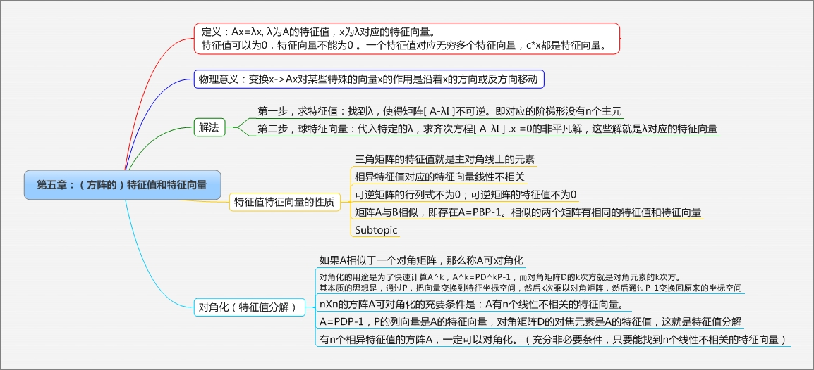
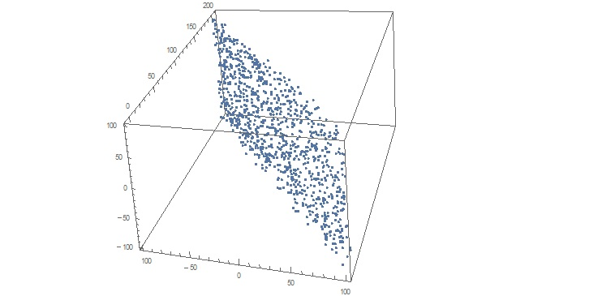
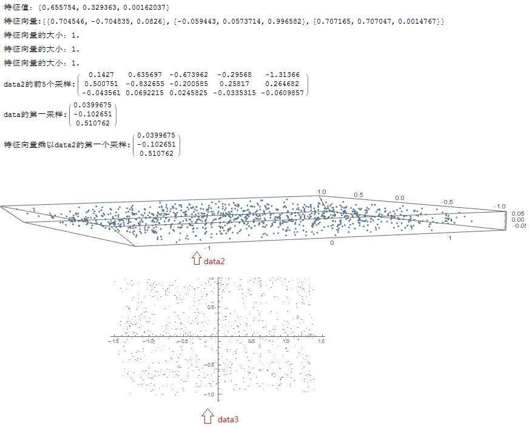

nXn方阵的特征值，如果允许为复数，一定存在有n个。但实的特征值不是一定存在的。


下面这段代码可以求Ax=b的最优解：

```
f[A_, b_] := Module[{nullspacebase, aa, colnumofa},
   nullspacebase = NullSpace[Transpose[A]];

   aa = Join[Transpose[A], nullspacebase];
   aa = Transpose[aa];

   colnumofa = Last[Dimensions[A]];
   LinearSolve[aa, b][[1 ;; colnumofa]]
   ];
```


这本书读到第6章的时候我还觉得他写得挺好，但是到第七章的时候，让人大失所望。奇异值分解、特征值分解应该是线性代数最重要的事情，作者讲得语焉不详。第七章的标题居然是：对称矩阵与二次型！

他妈的，我帮着改了个更好的标题。

### 为什么要将矩阵做特征值分解和奇异值分解呢？

类似对一个自然数做因式分解，可以更好的理解一个矩阵对应的线性变换有什么性质。

对角矩阵作用于一个向量x，相当于将x沿着坐标轴方向进行了拉伸；

对称矩阵作用于一个向量x，相当于将x沿着某些方向进行了拉伸；

一般的矩阵作用于一个向量x，对x既有拉伸，也有旋转。

这里我还是没有搞懂。。。

### 奇异值分解的实际用途：

特征值分解的局限性：

1. 只能对方阵进行处理
2. 有的方阵有不一定能进行三角化，不能进行特征值分解

相比之下，奇异值分解是一定可以进行的。

#### 图像有损压缩

下面的代码演示了奇异值分解用于图像有损压缩：

```
ClearAll["Global`*"];

svdCompress[A_, qnum_] := 
  Module[{u, w, v, result, m, n, i, j, u1, v1, q},
   {u, w, v} = SingularValueDecomposition[A];
   m = Length[A];
   n = Length[A[[1]]];
   q = qnum;
   If[q > Min[m, n], q = Min[m, n], null];
   result = Table[ Array[0*#1 &, n], {i, 1, m}];
   Print["datasize:", q * (m + n)];
   Print["singular values:", Table[w[[i, i]], {i, 1, q}]];
   Do[
      u1 = Table[{u[[j, i]]}, {j, 1, m}];
      v1 = {v[[;; , i]]};
      result = result + (u1.v1)*w[[i, i]];
      ,
      {i, 1, q}
   ];

   result
   ];

img = Import["e:\\reba.jpg"];
img = ColorConvert[img, "Grayscale"];
data = ImageData[img];
Print["original datasize:", Length[data]*Length[data[[1]]]];
compresseddata = svdCompress[data, 20];
Image[compresseddata]
compresseddata = svdCompress[data, 50];
Image[compresseddata]
compresseddata = svdCompress[data, 1000];
Image[compresseddata]
```

执行输出如下：


前50个奇异值如下：

```
singular values:{321.442,54.0135,46.6778,33.4076,31.1938,26.5388,25.1744,23.123,20.0867,19.9147,18.4442,17.3813,15.2275,14.171,13.8541,13.2777,12.5815,12.1304,11.7502,11.6244,10.6624,10.4412,10.2138,9.96321,9.83099,9.34661,9.12183,8.89255,8.6118,8.35397,8.31457,8.01118,7.96017,7.74558,7.51425,7.33778,7.2599,6.96847,6.87614,6.72356,6.63304,6.43412,6.2804,6.17545,5.98587,5.92536,5.84698,5.64526,5.56161,5.45043}
```

#### 主成分分析

主成分分析的时候，数据集组织成这样一个矩阵X：X的每一列是一个数据采样，共有n个数据采样；X每行表示一个采样的feature（中文叫特征，但与特征值容易混淆，改用feature），假设有m个feature。

通常m<<n。

feature之间可能存在冗余度，例如吴恩达老师课上举了个形象的例子：每个采样有两个feature，一个是用英寸表示的身高，另外一个是用厘米表示的身高。由于测量过程中的误差扰动、且feature通常成百上千，不容易直观发现这种冗余，而主成成分分析就是要去掉这种冗余度，降维，减少feature的个数。

某种意义上说，是对数据feature进行分析，发现主要的自由度，去除次要的自由度。上面身高的例子，实际上只有一个自由度，而表面上有两个自由度，导致了维度灾难。

下面例子中的data，是1000个采样，每个采样包括三个feature：

```
ClearAll["Global`*"];
data = {};
num = 1000;
Do[
  x = RandomReal[{-100, 100}];
  y = 100 -x + RandomReal[{-10, 10}];
  z = RandomReal[{-100, 100}];
  data = Join[data, {{x, y, z}}];
  ,
  {i, 1, num}
  
  ];
ListPointPlot3D[data, AspectRatio -> 1]

```



从上图可以看出，虽然每个采样都有三个feature，实际上存在很大的冗余，自由度受到了限制，分布在三维空间中的 y=-x这样一个平面上，有效的feature数更接近2。

在进行主成分分析前，一定要对数据做标准化处理：每个feature都减去该feature的均值，并除以标准差。

我们的数据伪随机产生的，是均匀分布，所以处理上比较简单：

```
Do[
  data[[i]][[1]] = (data[[i]][[1]] - 0)/100;
  data[[i]][[2]] = (data[[i]][[2]] - 100)/100;
  data[[i]][[3]] = (data[[i]][[3]] - 0) /100;
  ,
  {i, 1, num}

  ];
data = Transpose[data];
```

求三个feature的协方差矩阵S，并分析协方差矩阵的特征值：

```
S = data.Transpose[data]/ num;
eigval = Eigenvalues[S]
eigvect = Eigenvectors[S]

u1 = Normalize[eigvect[[1]]];
y1 = u1.data;
u2 = Normalize[eigvect[[2]]];
y2 = u2.data;
u3 = Normalize[eigvect[[3]]];
y3 = u3.data;

data2 = {y1, y2, y3};
MatrixForm[data2[[;; , 1 ;; 5]]]
ListPointPlot3D[Transpose[data2], AspectRatio -> Full]

data3 = {y1, y2};
ListPlot[Transpose[data3]]
```

可以看到

1. 三个特征值，其中两个特征值的绝对值较大，另外一个较小；y1,y2,y3分别对应三个成分；
2. 按照公式计算出新的代换变量data2，检视它的前5个采样，他们的第三个feature绝对值也比较小，数据几乎散落在一个平面内
3. 对数据进行降维，抛弃第三成分y3，得到data3，将数据投射到二维面屏上




完整代码如下：

```
ClearAll["Global`*"];
data = {};
num = 1000;
Do[
  x = RandomReal[{-100, 100}];
  y = 100 - x + RandomReal[{-10, 10}];
  z = RandomReal[{-100, 100}];
  data = Join[data, {{x, y, z}}];
  ,
  {i, 1, num}

  ];
ListPointPlot3D[data, AspectRatio -> 1]
Do[
  data[[i]][[1]] = (data[[i]][[1]] - 0)/100;
  data[[i]][[2]] = (data[[i]][[2]] - 100)/100;
  data[[i]][[3]] = (data[[i]][[3]] - 0) /100;
  ,
  {i, 1, num}

  ];
data = Transpose[data];
S = data.Transpose[data]/ num;
eigval = Eigenvalues[S]
eigvect = Eigenvectors[S]
u1 = Normalize[eigvect[[1]]];
y1 = u1.data;
u2 = Normalize[eigvect[[2]]];
y2 = u2.data;
u3 = Normalize[eigvect[[3]]];
y3 = u3.data;
data2 = {y1, y2, y3};
MatrixForm[data2[[;; , 1 ;; 5]]]
ListPointPlot3D[Transpose[data2], AspectRatio -> 0.1]

data3 = {y1, y2};
ListPlot[Transpose[data3]]
```


```


```

