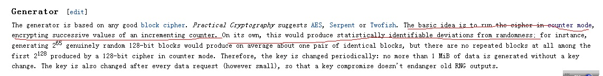

# 浅谈随机数发生器 #

（2013年）

最近我研究了一下随机数，并在这里笔记的方式记录下来，鉴于水平有限，不很深入。

参考资料

主要是几个wiki文章（是的，比较粗浅，我的学习是基于wiki的）

http://en.wikipedia.org/wiki/Random_number_generation

http://en.wikipedia.org/wiki/List_of_random_number_generators

http://en.wikipedia.org/wiki/Fortuna_(PRNG)

http://en.wikipedia.org/wiki/Random_number_generator_attack

http://en.wikipedia.org/wiki/Cryptographically_secure_pseudorandom_number_generator

然后是看一下几个开源常用的密码学库：

1.Openssl，妇孺皆知：http://www.openssl.org/

2.TomCrypt，妇孺皆不知：http://libtom.org/

3.Csrp，一个小型的srp协议实现库：https://code.google.com/p/csrp/，不要用srp官网也就是斯坦福网站上的库，那个贼难用

## 相关概念 ##

密码协议中，需要用到随机数，做到我知贼不知，例如RSA密钥生成过程中的p q两个素数、DH密钥交换中的双方保密的a b。 无疑这些信息的是否足够随机，直接关乎密码协议的安全。

**抛几个概念：**

1.随机数发生器(RNG)：产生随机数的东西咯

2.伪随机数发生器（PRNG）:计算机里状态绝大多数是确定的，状态的转换也是确定的，所以通过计算产生的随机数，不能算真的随机，是伪的

3.真随机数发生器（TRNG）：通过物理装置产生真随机的数，例如骰子、掷硬币、大气噪音、洗牌等等，想象一下簸箕里1024个从0到1023编号的硬币被你从2楼抖落（是的，抖落）下来的场景

4.密码安全的伪随机数发生器（CSPRNG）：伪随机发生器，但是满足密码学安全要求

5.熵（entropy）: 土一点的理解就是衡量信息的不确定性。举两个例子：1）如果抛硬币3次，组成一个信息bit序列，那么熵是3；2）如果用2013年元旦那天在linux下用time()函数返回32bit时间，虽然是32bit的时间，但因为是元旦那天调用的，熵也就蜕化为16bit （log(24*60*60)=16）

**密码协议中，通常用CSPRNG来生成随机数。可以这么说吧：**

1.CSPRNG和AES/TEA/SHA256这些对称密码算法、摘要算法一样，是密码协议的基础

2.CSPRNG的设计，和AES/TEA/SHA256一样复杂，也充满了破解和反破解的腥风血雨的持续斗争。

## 典型的PRNG为什么不适合密码学安全 ##

我们很多人都了解一个最常用的PRNG：c语言里的rand()/srand()函数族，它通常是基于线性同余算法的，简单的说，下一次的随机值，是这一次随机值的函数:

而则是种子，通过srand设置。

我们看看它为什么不适合密码学安全。

问题一：首先它的种子的位数不够：16bit，决定了简单穷举即可暴力破解。而种子一旦被破解，后面产生的所有随机数都被破解了。不管你用什么真随机的方法来作为种子，因为只有可怜的16bit，所以完全没有秘密可言。

问题二：该PRNG产生的随机数的位数不够，只有16bit，不足以满足密码学中密钥等宽度的需要。有人会说，密码协议中，我用的密钥是256bit的，我搞16次rand() 不就位数很多了么?  看上面的公式可知：除了第一次rand()获得的16bit，后面反复调用rand()获得的随机数，都是与第一次直接相关的，根本不是随机的。黑客只需要穷举前面16bit，后面的240bit都是确定性计算出来的，没有复杂度。

问题三：对抗破解的机制上的强度不够。最简单的一种情况：如果黑客某种方式获得了某次产生的随机数，那下一次随机数也就确定了

关于线性同余随机数的详细信息，可见

http://en.wikipedia.org/wiki/Linear_congruential_generator

## 硬件TRNG为什么不适合密码学安全 ##

最典型的TRNG是/dev/random文件。

懵懂的我，以前以为openssl在产生随机密钥等场景下，都是反复读取/dev/random文件的，后来看代码才发现，只是在初始化ssleay  RNG（openssl默认的RNG）的时候，用来作为种子。

硬件的TRNG，是足够安全和随机，但是有个明显的问题是：产生真随机的速度可能不够，会导致阻塞，影响效率。学术一点的说法就是：收集熵的效率太低了。

/dev/random文件，如果读取很频繁的话，会发现阻塞，用dd命令测试一下，带宽在3.2MB/s左右。用/proc/sys/kernel/random下的几个文件可以检查该TRNG的一些活动，例如通过entropy_avail看当前可用的熵的量，这些文件具体的意义可以网上搜一下

另外，直接用TRNG作为密码学里大量使用的随机数，可能使得本来不多的熵更少，导致公共资源的匮乏，最后影响了密码学应用系统的安全。

所以，通常TRNG是用于作为CPRNG 的种子

但是，对于一些长期使用的密钥（例如kerberos协议里的各方与KDC长期共享的密钥），或者有些信息曝露在外的密钥（例如RSA的公钥经常要公开发布出去），建议用/dev/random这样的TRNG而不是CSPRNG产生。

硬件的TRNG，其实也有很多，例如一种叫做Entropy Key的东东：

## CSPRNG的设计 ##

**CSPRNG一般要求：**

1、 产生的随机数，在统计学上是足够“随机”的，即分布比较均匀

2、 能够对抗密码学上的攻击，即使在生成器的一些状态被黑客获悉，也能够工作。最简单的一种情况：如果黑客某种方式获得了某次产生的随机数，那么不能够预测下一次调用CSPRNG会得到什么随机数。

最典型的CSPRNG就是/dev/urandom了，它利用/dev/random读取到的随机值作为种子，然后使用一定的算法，产生CSPRN。

就像AES，sha256等算法一样，CSPRNG里也有几个很基本的算法，一个是yarrow，一个是fortuna，后者是前者的升级版，更安全，但都是同一个叫布鲁斯的家伙设计的。

CSPRNG通常是基于AES、sha2等算法设计的。基本思想是，使用一个密钥，依次对0、1、2...进行加密，每次对一个整数进行加密，就输出一个随机值，然后将整数递增。过程中使用了sha2算法进行混杂，以确保变化的bit足够多和乱。

密钥和整数的初始值都来自种子，该种子是CSPRNG初始化的时候用TRNG设置进来的。

下面摘自wiki:

从tomcrypt库的fortuna实现来看，一开始是，并将变量IV初始化为0，后面每次读取随机值，都是用skey对IV进行ecb的加密作为输出，并将IV加1

可见：只要种子相同，就产生相同的序列，这个在密码学上有另外一个用途，常用的token卡，双方共享保密的种子，会自动产生相同的数字序列，用于做动态密码。

**安全性的思考**

以fortuna为例，假设seed是真随机的256bit，用做密钥，IV一开始为0，后面每进行一次随机数生成，都是对IV加密并递增IV的过程。

我们试着回答两个问题：

**问题一**：每次从中取一次2048位的随机值，熵是多少？

我觉得不会超过256bit。因为虽然有2048bit，但实际上是由256bit的真随机seed经过确定的计算而来的。

**问题二**：连续从中取两次随机值，假设第一次取到的值已经被黑客窃听到，那么第二次的值是不是黑客经过简单计算就可以获得？

我觉得第二次的随机值黑客获取不了。因为虽然是确定的状态迁移，但这个状态取决于最初的seed的取值。 Seed有2^256种取值，黑客破解不了。

用下面这个图也许可以更形象的说明：

黑客窃听了上面某次输出的随机值，要推导出下一次或者后续所有的输出，必须知道密钥的取值，而密钥的取值有2^256种，这样的复杂度，在密码学上是安全的。

## 针对随机数发生器的攻击 ##

针对随机数发生器的攻击和对抗，无论是硬件的TRNG还是软件的CSPRNG，都没有停止过。而且这里面水很深，即使是netscape、microsoft、openssl这样的专业的做浏览器、操作系统、密码算法的公司/软件，都在这里面栽过跟斗。详细可见：

http://en.wikipedia.org/wiki/Random_number_generator_attack

**这个给我们启示就是：密码学上用的随机数，和加密算法、摘要算法一样复杂，不要自己随便设计，而是要使用成熟的随机数发生器，**例如fortuna、yarrow、openssl里的RAND_bytes函数族。建议在我们的应用程序中直接tomcrypt openssl等开源库。

文章最后写一些好玩的东西：

熵是香农提出来的，信息论之父，有人这样描述香农：贝尔实验室和MIT很多人将香农和爱因斯坦相提并论，而其他人则认为这样对比是不公平的----对香农是不公平的

有一些网站提供随机数的下载，例如下面这个网站（亮点在note:xxx里）

