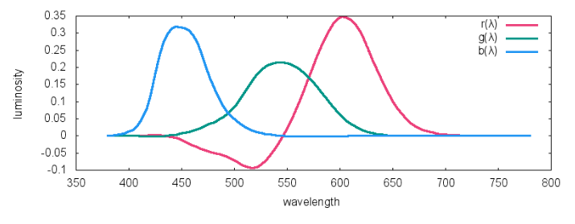

**提前致谢和声明：**
因为是笔记，有的文字是直接摘抄的网友的文章，有的图片是直接借用的网友的图片，而整个知识，都是来自于他人，而我只是搬运一下。

## 1、颜色是什么 ##

颜色是三个参与物导致的一种现象：

1. 光源
2. 反射光源光线的物品
3. 人眼

光源发射一些波长组合的光，照射在反射物上，部分波长的光被吸收，部分波长的光被折射，部分波长的光被反射，反射的光进入人眼。人眼的三类锥状细胞分别对短波（蓝色）、中波（绿色）、长波（红色）敏感，感受到三段波长的刺激后，形成一种主观感受。  所以颜色是人的主观感受，而不是物体的客观属性。换了猫看到的同一个物体，颜色可能就是不一样的。

### 光源的显色性和色温 ###
光源重要的属性是显色性，取决于光源的光波组成。频率（波长）单一的单色光显色性就很差，因为物体本来可以反射的某个波长的光线，光源里没有，那自然是看不到物体反射的那个光线（颜色）的。

通常日光、白炽灯的光显色性是比较好的，光谱连续。

还经常听到一个概念，叫做白光的色温。

色温和黑体有关：

1. 黑体是不反光只发光的东西，例如白炽灯、太阳，就近似黑体
2. 黑体发光，和一般物体反光不同，其发光的光谱，不取决于黑体材质，而取决于黑体本身的温度。黑体在5000开尔文温度下发射的光谱，其色温就是5000K
3. 色温，是颜色的另外一种等同概念，即发光体的光谱（颜色）

### 人眼特性 ###

人眼能看到的波长范围是390nm到700nm

下面是人眼的对波长敏感的曲线：

不同的光谱分布的混合光射入人眼，可能形成相同的三类锥状细胞的刺激，看到的是相同的颜色，这个过程是有损且不可逆不可还原的过程。这种现象叫做**同色异谱**。

人眼对不同波长的光，亮度的敏感程度也是不同的，如下图所示，横轴是波长，纵轴是敏感程度：

也就是说，同样功率的两束单色光，一束是550nm，一束是400nm，人眼会觉得550nm的那一束更亮。

多说一点：光通量的单位是流明，单位面积的光通量（即亮度）是尼特，也叫坎特拉/平方米，即每平方米多少只蜡烛的等同亮度。亮度应该是考虑了人眼对不同波长光线感受差异之后的度量。

### 物体的特性 ###

下图是菠菜叶子反射的光线的波长分布，可以看到，在人眼可见光范围内，主要反射绿光：

## 2、配色实验和三刺激值 ##

CIE（国际照明委员会）在1931年左右，通过混合波长为700nm, 546.1nm 和435.8nm的红绿蓝三种单色光，来获得想要的人眼视觉上某种颜色的光。

实验的方法很简单，例如想要获得波长为610nm的光，通过调节三原色的混合比例，人眼观察比对，视觉上一致，就记录下来三原色的比例， 记录下来的三个值，叫做三刺激值：

对各种波长的目标单色光做实验，绘制出三刺激值的如下曲线：

红色曲线有的部分取值负数，怎么理解？

说明通过简单的混合，怎么都不能完美匹配出目标颜色，这个时候，通过给实验右侧的目标颜色上叠加一点红光，发现两边的颜色能过做到完美匹配，所以记录为负值，如下图所示：

## 3、颜色空间和坐标 ##

三刺激值，在绘制颜色空间图的时候，因为是个三维的，不方便绘制，就进一步做了坐标变换：

    RGB是三刺激值
    r = R/(R+G+B) 
    g = G/(R+G+B) 
    b = B/(R+G+B) 
    r g b叫色度坐标，且满足r + g + b = 1

因为色度坐标r g b满足r+g+b=1，所以只需要考虑两个变量r和g，转化为二维空间图了：

上图有如下属性：

1. 马蹄的上部边界上的点，是可见光谱的单色光或者叫单频率光
2. 马蹄内部的点和下部的边界，是非单色光
3. 马蹄外部的点，是人眼不可见部分
4. 马蹄上（包括边界和内部）任意不在同一直线上的三点（三种光），围成一个三角形区域；三角形区域内的任意一点（任意一种光）可以通过三角形顶点的三种光混合出来，而三角形外部的点，是不能通过这些光混合出来的
5. 三个坐标点(0,0),(1,0),(0,1)分别对应了三原色，根据4可以看出，三原色能够混合出来的光分布在比较小的一个三角形区域内，三角形外面还有大把的光是他们混合不出来的，所以有前面提到的负值。
6. 坐标点（1/3, 1/3)是白光

考虑到亮度、坐标负值等问题，为了方便起见，对r g b色度坐标进一步做坐标变换，变换到XYZ坐标：

    [X]   | 2.768 1.751 1.130|   [r] 
    [Y] = | 1.000 4.590 0.060| * [g] 
    [Z]   | 0     0.056 5.594|   [b]

背后的原理可以用这张图来直观展示（这里数学推导我没有搞清楚）：

变换到XYZ坐标后的色域图如下：

依然满足Ｘ＋Ｙ＋Ｚ＝１

限于显示器、相机等设备的物理特性，实际应用中用到的色域不是整个马蹄的范围，而是小得多的三角形区域，例如sRGB，Adobe RGB。我们常见的颜色值例如rgb(31,157,167)，也不再是1931年配色实验的三原色的三刺激值，具体怎么理解这个颜色值、不同的颜色空间上的颜色值如何转换，是实际应用中的重点

## 4、不同颜色空间之间的颜色值变换 ##

#### sRGB颜色空间的定义 ###

每定义一个颜色空间，都必须明确两点：

1. R、G、B三点在XYZ空间的坐标
2.  白色点在XYZ空间的坐标

以sRGB颜色空间为例，它的RGB点的XYZ坐标是：

    R:(0.64, 0.33, 0.03)
    G:(0.3,  0.6,  0.1)
    B:(0.15, 0.06, 0.79)

待续，好几个疑点：

1、sRGB空间下的坐标(r,g,b)每个分量是什么意义？ (1,0,0)，（0.5，0，0）（1，1，1）在马蹄上的位置怎么确定？ 是否合理？

## 参考资料 ##

[A Beginner’s Guide to (CIE) Colorimetry](https://medium.com/hipster-color-science/a-beginners-guide-to-colorimetry-401f1830b65a)

