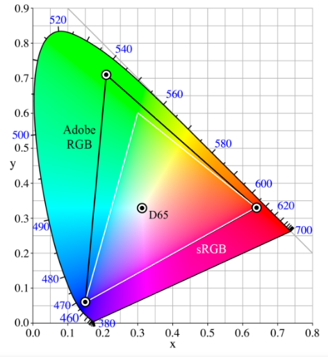

**提前致谢和声明：**
因为是笔记，有的文字是直接摘抄的网友的文章，有的图片是直接借用的网友的图片，而整个知识，都是来自于他人，而我只是搬运一下。

## 1、颜色是什么 ##

颜色是三个参与物导致的一种现象：

1. 光源
2. 反射光源光线的物品
3. 人眼

光源发射一些波长组合的光，照射在反射物上，部分波长的光被吸收，部分波长的光被折射，部分波长的光被反射，反射的光进入人眼。人眼的三类锥状细胞分别对短波（蓝色）、中波（绿色）、长波（红色）敏感，感受到三段波长的刺激后，形成一种主观感受。  所以颜色是人的主观感受，而不是物体的客观属性。换了猫看到的同一个物体，颜色可能就是不一样的。

### 光源的显色性和色温 ###
光源重要的属性是显色性，取决于光源的光波组成。频率（波长）单一的单色光显色性就很差，因为物体本来可以反射的某个波长的光线，光源里没有，那自然是看不到物体反射的那个光线（颜色）的。

通常日光、白炽灯的光显色性是比较好的，光谱连续。

还经常听到一个概念，叫做白光的色温。

色温和黑体有关：

1. 黑体是不反光只发光的东西，例如白炽灯、太阳，就近似黑体
2. 黑体发光，和一般物体反光不同，其发光的光谱，不取决于黑体材质，而取决于黑体本身的温度。黑体在5000开尔文温度下发射的光谱，其色温就是5000K
3. 色温，是颜色的另外一种等同概念，即发光体的光谱（颜色）

### 人眼特性 ###

人眼能看到的波长范围是390nm到700nm

下面是人眼的对波长敏感的曲线：

不同的光谱分布的混合光射入人眼，可能形成相同的三类锥状细胞的刺激，看到的是相同的颜色，这个过程是有损且不可逆不可还原的过程。这种现象叫做**同色异谱**。

人眼对不同波长的光，亮度的敏感程度也是不同的，如下图所示，横轴是波长，纵轴是敏感程度：

也就是说，同样功率的两束单色光，一束是550nm，一束是400nm，人眼会觉得550nm的那一束更亮。

多说一点：光通量的单位是流明，单位面积的光通量（即亮度）是尼特，也叫坎特拉/平方米，即每平方米多少只蜡烛的等同亮度。

### 物体的特性 ###

下图是菠菜叶子反射的光线的波长分布，可以看到，在人眼可见光范围内，主要反射绿光：

## 2、配色实验和三刺激值 ##

CIE（国际照明委员会）在1931年左右，通过混合波长为700nm, 546.1nm 和435.8nm的红绿蓝三种单色光，来获得想要的人眼视觉上某种颜色的光。

实验的方法很简单，例如想要获得波长为610nm的光，通过调节三原色的混合比例，人眼观察比对，视觉上一致，就记录下来三原色的比例， 记录下来的三个值，叫做三刺激值：

对各种波长的目标单色光做实验，绘制出三刺激值的如下曲线：

红色曲线有的部分取值负数，怎么理解？

说明通过简单的混合，怎么都不能完美匹配出目标颜色，这个时候，通过给实验右侧的目标颜色上叠加一点红光，发现两边的颜色能过做到完美匹配，所以记录为负值，如下图所示：

说到这一步，要纠正一下， 我们常说某个颜色的RGB分量都为255的时候，就是白色。实际上并不表示三基色的绝对量比例是1：1：1。真相如下：

1. 当使用三基色配成白光的时候，RGB三者的光通量比例为 1：4.5907：0.0601
2. 为了便于计算，故定义了每种基色的单位光通量：红色是1流明；绿色是4.5907流明；蓝色是0.061流明
3. 通过2，就使得三者在数量上对齐了，常说的（255，255，255）就是白光了

## 3、颜色空间和坐标 ##

三刺激值，在绘制颜色空间图的时候，因为是个三维的，不方便绘制，就进一步做了坐标变换：

    RGB是“数量对齐”后的三刺激值
    r = R/(R+G+B) 
    g = G/(R+G+B) 
    b = B/(R+G+B) 
    r g b叫色度坐标，且满足r + g + b = 1

因为色度坐标r g b满足r+g+b=1，所以只需要考虑两个变量r和g，转化为二维空间图了：

上图有如下属性：

1. 马蹄的上部边界上的点，是可见光谱的单色光或者叫单频率光
2. 马蹄内部的点和下部的边界，是非单色光
3. 马蹄外部的点，是人眼不可见部分
4. 马蹄上（包括边界和内部）任意不在同一直线上的三点（三种光），围成一个三角形区域；三角形区域内的任意一点（任意一种光）可以通过三角形顶点的三种光混合出来，而三角形外部的点，是不能通过这些光混合出来的
5. 三个坐标点(0,0),(1,0),(0,1)分别对应了三原色，根据4可以看出，三原色能够混合出来的光分布在比较小的一个三角形区域内，三角形外面还有大把的光是他们混合不出来的，所以有前面提到的负值。
6. 坐标点（1/3, 1/3)是白光
7. 越靠近中间的白点，颜色的饱和度越低，因为混入了更多的白光。

### 坐标变换到 CIE XYZ ###

考虑到亮度、坐标负值等问题，为了方便起见，对r g b色度坐标进一步做坐标变换，变换到xyz坐标：

    [X]   | 2.768 1.751 1.130|   [r] 
    [Y] = | 1.000 4.590 0.060| * [g] 
    [Z]   | 0     0.056 5.594|   [b]

	x = X / (X+Y+Z)
    y = Y / (X+Y+Z)
    z = Z / (X+Y+Z)

背后的原理可以用这张图来直观展示（这里数学推导我没有搞清楚）：

依然满足x＋y＋z＝１，大写X，Y，Z中的Y表示亮度。

可以看一下rgb坐标下的几个点：

    红点(1,0,0)， 绿点(0,1,0), 蓝点(0,0,1)，白点(0.33, 0.33, 0.33)

根据上面公式变换到xyz坐标下后，依次为

    红点(0.7346,0.2654,0)，绿点(0.2737,0.7175,0.0088)，蓝点(0.1666,0.0088,0.8246)，白点(0.33,0.33, 0.33)

对照上图看，位置确实不差。

变换到xyz坐标后的色域图如下：

实际上还有CIE xyY坐标空间，是专门把亮度信息Y提取出来，外加CIE XYZ里的xy两个色度变量（z那个变量是冗余的信息，因为xyz相加等于1）。

限于显示器、相机等设备的物理特性，实际应用中用到的色域不是整个马蹄的范围，而是小得多的三角形区域，例如上图里面的sRGB，Adobe RGB。我们常见的颜色值例如rgb(31,157,167)，也不再是1931年配色实验的三原色的三刺激值，具体怎么理解这个颜色值、不同的颜色空间上的颜色值如何转换，是实际应用中的重点。

多一句嘴：由于设备的物理特性，为了保证跨设备的颜色稳定，也就有了web安全色这个概念。

## 4、不同颜色空间之间的颜色值变换 ##

有好多颜色空间， sRGB、AdobeRGB、BT.609, BT.709, BT.2020，他们都是CIE XYZ的颜色子集；在视频图像的编解码中，经常需要在不同的颜色空间中做转换，是通过CIE XYZ作为桥梁，即从A颜色空间到B颜色空间的转换，是先从A转到CIE XYZ，再从CIE XYZ转到B。

我们以sRGB为例来说明颜色值的变换

#### sRGB颜色空间的定义 ###

每定义一个颜色空间，都必须明确两点：

1. R、G、B三点在XYZ空间的坐标
2.  白色点在XYZ空间的坐标

以sRGB颜色空间为例，它的RGB点的xyz（小写）坐标是：

    R:(0.64, 0.33, 0.03)
    G:(0.3,  0.6,  0.1)
    B:(0.15, 0.06, 0.79)

sRGB中的一个点坐标为(a,b,c)，对应一种颜色，直观的理解，应该是坐标的三个分量直接乘以上面RGB三个点（sRGB空间的三个基）并相加，就得到CIE XYZ空间里的坐标。大的方向没有错，但需要稍作调整：

1. sRGB空间的基，是上面RGB三个点校准过后的
2. 计算得到的XYZ坐标，需要归一化

具体为什么要有上述两步，我不是很懂，先照葫芦画瓢再说。

(a,b,c)各个分量的取值范围是[0, 1]，至于我们常见的8bit颜色[0,255]，或者12bit颜色色深，其实是一种计算机里数字信号处理的的量化方案，色深越大，量化越精确，画面越细腻，但这些背后其实是数学和物理范畴的[0, 1]。

先看怎么校准，就是要满足当(a,b,c)为（1，1，1）的时候，正好落在坐标XYZ（大写）为W(0.9505, 1.0000, 1.0890)的白点，即找到三个系数，满足方程：

用matlab很容易解出：[0.6445; 1.1919; 1.2029]

为什么sRGB坐标(1,1,1)要对应XYZ坐标(0.9505, 1.0000, 1.0890),可以通过下面这个立体的CIE XYZ空间来理解，我猜最高处顶点就是白点：

我们尝试计算sRGB坐标(a,b,c)在CIE XYZ里的坐标：

给一下matlab代码：

    R=[0.64;0.33;0.03];
    G=[0.3;0.6;0.1];
    B=[0.15;0.06;0.79];
    white=[0.95047;1;1.08883];
    w=[R,G,B]^(-1) * white;

    %sRGB空间里的红点
    abc=[1; 0; 0];
    XYZ=[R,G,B]*[w(1),0,0;  0,w(2),0; 0, 0, w(3)]*abc;
    XYZ
    %归一化
    xyz=XYZ/( XYZ(1) + XYZ(2) + XYZ(3))

尝试几个特殊点以验证上述过程， 令变量abc依次为：
    
    红(1, 0, 0)，绿(0, 1, 0), 蓝(0, 0, 1), 白(1, 1, 1), 暗红(0.5, 0, 0)

计算得到xyz坐标为：

    红(0.64, 0.33, 0.03), 绿(0.3,0.6,0.1), 蓝(0.15,0.06, 0.79), 白(0.31,0.32,0.35) ,暗红(0.64, 0.33, 0.03)

可以看到, 红绿蓝白四个点在CIE XYZ马蹄图上位置都ok，但是暗红似乎不对，跟红点重合，我理解是因为马蹄图只有色相和饱和度信息，上述matlab代码里的XYZ向量的第二维标量Y包含有明度信息，这个变量是不一样的。(0.5, 0, 0)与(1, 0, 0)相比，确实色相和饱和度都是一样的，只是明度不同。

从CIE XYZ空间到sRGB也是一样的，无非是上述矩阵（[R,G,B]*[w(1),0,0;  0,w(2),0; 0, 0, w(3)]）的逆。需要注意的是，两个空间不是一一对应，XYZ空间更大，转化为sRGB的时候可能会溢出。

## 5、YUV和HSB颜色编码 ##

YUV是视频编码里常见的概念，HSB（明度、饱和度、色相 ）也经常被提到。

YUV和HSB有时候也被称为 color space，颜色空间。这其实是不准确的。

YUV和HSB，应该称为颜色的编码，它们不定义颜色空间或者不定义色域，CIE xyY、sRGB、bt.709这些才叫颜色空间或者叫色域。YUV和HSB并没有定义一个颜色集合或者规定颜色范围的大小，它们只是一种颜色的编码方式。

但是YUV在与RGB编码进行变换的时候，为什么还需要明确是bt.709还是bt.2020色域呢？ 为什么RGB与YUV编码进行变换的时候，不同的色域下，使用不同的变换矩阵呢？ 

其实也很好理解，不同的色域下，三角形的三个顶点（色域的基）是不同的，那么自然会影响到U和V的数值，也会影响到明度Y的值，所以需要不同的变换矩阵

具体的变换方法，可以查看wiki:

[YUV](https://en.wikipedia.org/wiki/YUV)

[HSB](https://en.wikipedia.org/wiki/HSL_and_HSV)

### 明度、饱和度、色相 ###

简单的理解：

1. 色相，表示是什么颜色，通常用该颜色在色盘上的角度来表示，例如红色是0度
2. 明度，表示该颜色的亮度，即单位面积上的光通量；某个颜色的一定量的光，如果照射面积大，那单位面积的光通量就小，明度就低，反之明度就高。
3. 饱和度，也叫纯度，是指该颜色混合了多少比例的白色，混合的白色越多，纯度越低，也就是饱和度越低，反之越高；

明度用百分比表示，例如白点sRGB(1,1,1)和(1,0,0)的明度就是100%，sRGB(0.5，0，0)的明度是50%；

饱和度也用百分比表示，例如 sRGB(0.7, 0.2,0.2)被理解为(0.5,0,0)这个红光里掺入白光(0.2,0.2,0.2），所以饱和度是 0.5/(0.2+0.5)=71%

上述例子可以用photoshop快速验证。

RGB与HSB互转，公式比较复杂，但却也直观。网上很多资料，这里不誊抄了。

## 参考资料 ##

[A Beginner’s Guide to (CIE) Colorimetry](https://medium.com/hipster-color-science/a-beginners-guide-to-colorimetry-401f1830b65a)

[色彩空间表示与转换](https://zhuanlan.zhihu.com/p/24281841)

[sRGB wiki](https://en.wikipedia.org/wiki/SRGB)

[https://www.image-engineering.de/library/technotes/958-how-to-convert-between-srgb-and-ciexyz](https://www.image-engineering.de/library/technotes/958-how-to-convert-between-srgb-and-ciexyz)

各种概念的wiki，例如YUV等等

